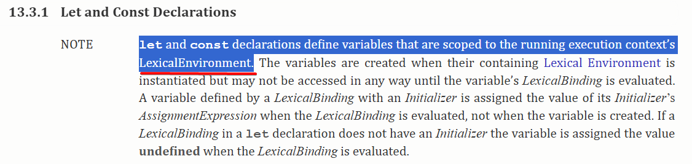

# JS Basics

[TOC]


## 01-Basic Syntax of Js

### 1.1 Where do you write JS?

> `<script>` can be written in head or body.

1. Inline Js
- rarely used.
- `<div onclick="alert("Hello World");">Click Me.</div>`  (Not recommended)
- `<a onclick="javascript:;">Disable Page Refresh</a>` (Occasionally, it is still used.)

2. Internal Js
- write within `<script>`
- `type` attribute refers to the type of script represented by the element.
  - Browsers converts the text content to Js and run.
  - Mainstream browsers only understand supported MIME type in the `type` attribute.
  - In HTML, `type` is optional (Default to `text/javascript` MIME Type)
  - to know more about `type` attribute: https://stackoverflow.com/questions/37440687/understanding-the-type-attribute-in-a-script-tag
```html
<!-- with type attribute -->
<script type="text/javascript">
    alert("Hello world");
</script>

<!-- ignore type -->
<script>
    alert("Hello world");
</script>

<!-- Invalid MIME Type - the js code will be treated as plain text. -->
<script type="text/notjavascript">
    <!-- Treat as plain text. -->
    alert("Hello world");
</script>
```

3. External Js
- write in a separate js file and import via `src` attribute of `<script>`.
- when using external js to load js file, writing internal js in the `<script>` will not work.

> External Js is commonly used.
> **Advantages:**
> - separation of concerns: keep JS separate from HTML.
> - reuse across multiple pages.
> - easy to maintain.
> - browsers cache js files, meaning they only need to be downloaded once. Future visits loads the files from cache instead of requesting it again, improve page load time. (HTTP)
> > **Extra: Cache Busting Knowledge:**
> > 1. Query String Cache Busting
> > - file name remains the same but adding the query string.
> > - when the query string changes, the browser will treat it as a different resource, and request the latest version.
> > `<script src="./demo.js?a=VbSKlS"></script>`
> > 2. Build Tools with Content Hash
> > - adding hash (based on its file content) to file name during build process.
> > - when the file content changes, a new hash is generated and the browser will request latest version.
> > `<script src="./svcjisWHUIjsak.js"></script>`
> > **Note**: If HTML is cached, it will still reference the old js filenames, preventing it from requesting new versions. Ensure HTML is not cached or implement proper cache control.
> **Disadvantage**
> - slightly increase the number of HTTP requests, but this is negligible due to the cache benefits.

> Note: Js is often used with HTML, but it can also run independently in various environment.

### 1.2 JS Comments

- single-line comment `//`
  - `Ctrl + /`
- multiline comment `/* */`
  - `Alt + Shift + a`

### 1.3 Important Notes on Javascript

1. Js is Case-sensitive

```js
alert("Hello"); // Correct
Alert("Hello"); // Wrong - it will not run.

```

2. Statements must use English characters, but strings can contain any characters.

3. End each statement with a semicolon `;`.
   - improve performance (Parsers will not need to add `;` for the code)
   - avoid errors / bugs when minifying (multiple statements on a line must be properly separated by `;`).
   - note: 
     - there's case when browsers insert `;` incorrectly.

4. Js will ignore spaces and new lines.  
   - note:
     - `""` or `''` can only be single line.
     - template string support multiline.
   - usage: use spaces and new lines properly to format your code.

### 1.4 Input & Output Statement
- alert
  - show a popup window / dialog box.
  - will block the subsequent code execution until you click confirm.
  - usage: debugging. (rare)
- console.log
- prompt
  - show a popup window for user to enter input.
  - will block the subsequent code execution.
  - use a variable to store the user input from prompt.

## 02-Variables & Literals

### 2.1 The Relationship among HDD, RAM & CPU

#### 2.1.1 Functions of HDD, RAM & CPU
1. **Hard Disk Drive (HDD)**: 
  - long-term / permanent storage of data and application.
  - speed: slow
  - data retains even no power is supplied.
2. **Random-Access memory (RAM) / Memory**: 
  - connect HDD & CPU.
  - short-term / temporary storage of data and application.
    - data that is read from HDD.
    - temp data comes from CPU, to be used next or stored in HDD.
  - speed: fast (100 times compared to HDD)
  - data lost when no supplying power.
3. **Central Processing Unit (CPU)**: 
  - give instruction
  - speed: fast (100 times compared to HDD)
  - data processing and computation.

#### 2.1.2 How Do They Work?

when we run application (Microsoft Excel):
1. CPU receives our instruction, and tells HDD to send the application to Memory.
2. CPU tells Memory to store the application there.
3. CPU runs the application when it is present in Memory already.
4. CPU will get and store temp data from Memory during processing.

#### 2.1.3 Why Do We Need Memory?

- CPU processes data very fast, but the access speed of HDD is very slow (even SSDs are slower in comparison).
- This huge speed difference wastes CPU processing power, and causes lag.
- Memory stores data using electrical charges, thus achieving instant access speed.
- Memory operates at a speed that matches the CPU processing power, eliminating the latency issue.

> When we open an application (Microsoft Excel), it takes time because the system reads data from HDD and loads data to memory.
> When the application is opened, there's no latency because CPU retrieves and stores temporary data to Memory.
> When we saved our work, the process becomes slow again, because the data must be transferred from Memory back to HDD, which takes time.


### 2.2 What are Variables

Analogy: variables are boxes used to store something (data).

Definition: A piece of memory allocated for the application to store data.


```js
var a = 10;
var b = "Wei Xin";
```
### 2.3 Declare Variables

- via `var` keyword.
```js
// a is a customized variable name.
// after declaring a variable with var,
// our computer will allocate a piece of memory, used to store data.
var a;
```
- assign value with `=`.
```js
a = "Wei Xin";

```
- access the data stored in the variable via the variable name.
```js
console.log(a);

```

> JS: 
> - How to store data to memory?
> - How to read data from memory?
> - How to operate data in memory?
> - How to release data from memory (Garbage Collection)? 
>   - debounce & throttle reduce memory usage.

### 2.4 Initialize Variables

- declare and assign value to variable in the meantime.

```js
var name = "Wei Xin";

```
### 2.5 Update Variable Value

Reassign value to a variable causes the previous value to be replaced in memory.

```js
/* Same scope */
/* Latter one replaces the previous one. */
var name = "Wei Xin";
/* Reassign value to a variable. */
name = "Hian Gee";

console.log(name); // Output: Hian Gee

/* 

  // This is working, but not recommended.
  // when reassigning, we do not declare.
  // Because of this, we can deem the following code as a mistake.

  var name = "Wei Xin";
  var name = "Hian Gee";
  console.log(name);  Output: Hian Gee

*/
```

> When reassigning a variable, we do not declare it again with var.
### 2.6 Declare Multiple Variables

Separate each variable with comma `,`.

1. Declare first before assign

```js
var x, y, z;

x = 1;
y = 2;
z = 3;

console.log(x, y, z);
```

2. Declare and Assign

```js
var x = 1, y = 2, z = 3;
console.log(x, y, z);

```

3. Assign and leave it unassigned during declaration process (Rare)

```js
var a, // Left unassigned
  b = 1,
  c = 3;
```
### 2.7 Special Cases of Variables

1. declare variable without assigning value, default to `undefined`.
> - it is related to variable hoisting.
> - usage: check if a variable is assigned successfully through the presence of `undefined`.
2. directly assign value without declaration, it is always becoming global variable.
- not recommended.
> One of the Js features.
> All global variables becomes members of window object.
> we can access it like this: `window.a`
3. directly use a non-existing variable.
- throw error.

### 2.8 Naming Variables (Identifiers)

when naming a variable, we must follow some rules of thumbs.

identifier: a name given by developers to anything in Js, namely variables, functions, classes, property names, etc.
#### 2.8.1 Syntax Rules for Identifiers

- contains letter, number, underscore `_`, `$`, but the name cannot start with number.

```js
// legal

abc a_b a1 $a

// illegal
8a abc#123 this a-b
```

- case-sensitive, a & A is two different variables.
- do not use `keywords` or `reserved words` as variable names.

#### 2.8.2 Keywords & Reserved Words

`keywords`: related to JS syntax.

`reserved words`: words that are kept aside for future versions. Some are reserved only in strict mode.

> Do not use any of those in the naming.

#### 2.8.3 Summary
1. contains only letters (A-Za-z), numbers (0-9), underscore (`_`) dollar (`$`), but cannot begin with number.
2. case sensitve
3. meaningful
4. no keywords / reserved words

### 2.9 Identifier Naming Convention

#### 2.9.1 camelCase (Recommended)

- the first letter of the first word is lowercased. The remaining words' first letter is capitalized.

```js
// myFirstName
// myStudentCount
// getBoxColor
// navList
```
> do not recommend all lowercased (e.g., myfirstname). Although it is not wrong, but it is not very readable.
> camelCase is recommended as some inherent JS features (e.g., array methods) are named this way.
#### 2.9.2 C Language Style

- all words are lowercased, and separate each word with underscore `_`.

```js
// my_first_name
// my_student_count

```

#### 2.9.3 Hungarian Notation
- identifier = type + description (e.g)

```js
iMyStudentCount /* i as integer (type) + myStudentCoujnt (description) */

```
> good to know but rarely used.

### 2.10 Literals
> Literals: https://developer.mozilla.org/en-US/docs/Glossary/Literal

- fixed values that would never change in js.
- e.g., 10, 'hello', true.
- we assign literals to variables.

```js
// Values like 1, "Hello", "Good" are literals.
// The variable A can be either 1, "Hello", "Good", etc.
var A = 1;
var A = "Hello";
var A = "Good";
```

> In real project, we usually use variables to store literals.
> some literals are super long to write.
> sometimes, it is used in multiple places, e.g., 100 places requires this literal.
> it is hard to write it 100 times, remember or even maintain.
> Store them in variables is better for maintenance.

### 2.11 Review

Applications:
- receive and output user prompt.
- exchange variable values.

### 2.12 Debugging & REPL Environment

#### 2.12.1 Common Errors
1. Uncaught SyntaxError
- e.g., write the wrong syntax, mix Chinese symbols with English ones, etc.
- VScode can detect and show the error while you are writing the code.


2. Uncaught ReferenceError
- when the variable is not defined / found. 
> - Always test your code in the browser console when you write JS.
> - aving bugs in your program is a common thing.
> - Learn to find and fix the bugs are an important skill to master.

#### 2.12.2 REPL

- REPL (Read-Eval-Print Loop)
  - define and run variables, functions, objects, etc.
  - browser console is a REPL environment.
  - used to test expressions and statements.

```js

^ ---> read ---> eval ---> print --->
|                                  |
|                                  |
<---------------Loop---------------v

```
> You can test your code in REPL without console.log method by typing and pressing enter your expression.

## 03-Data Types & Type Conversion

### 3.1 Introduction

#### 3.1.1 Why Do We Categorize Data into Different Types?

- Each data type has its own properties and behaviors.
- We cannot use the same way to treat all data.
- We need to handle different data types in different ways.

```js
// How do Js knows 1 + 1 results in 2 and '1' + '1' results in '11'?
// How the data is handled based on data types.

var a = 1 + 1; // Addition
var b = '1' + '1'; // String concatenation
console.log(a, b); // 2, '11'

```

> Compiler / Interpreter understands the data types and knows how to handle them.

#### 3.1.2 Data Types

- here refers to the type of literals.
- the variable type will be determined by the value assigned to it (JS is a Dynamic Type Language)

**Primitive Data Types**

- String
- Number
- Boolean
- Null
- Undefined
- Symbol (ES6)
- BigInt (ES6)

**Reference Data Types**

- Object

#### 3.1.3 Variable Types

- variable types are determined by the types of values they stored.

```js
var num = 1; // num type is Number.

var str = "Hello"; // str type is String.

```

> JS is a **dynamic typed language**, in which variables are not associated with any specific types. 
> Do not need to declare the type of variables beforehand.
> During code execution, JS engine will determine the variable type based on the value assigned to the right of the equal `=` sign.
> Once finished execution, the variable type is confirmed.

> **Static typed language**: variables are associated with specific types. e.g., Java, C++, C#.


```js
/* Variable can be any types at any moment. */

var a = 1; // a is Number type.

a = "Hello"; // a is String type.

a = true; // a is Boolean type.

```

#### 3.1.4 Typeof Operator

- `typeof` operator is used to determine the data type.
- check the type of variable or literal (value). 
- two forms: 
  - `typeof a`
  - `typeof(a)` -> use for expression like `2 + '2'`.
  - where a is a variable or literal.
- result is a `string`.
```js
/* Literal */
console.log(typeof 1); // `number`

/* Variable */
var a = 1;
console.log(typeof a); // `number`
console.log(typeof(a)); // `number`

/* Expression must use typeof with parentheses () */
console.log(typeof(2 + '2')); // `string`

/* Return value type of typeof operator */
console.log(typeof typeof a); // `string`

```

### 3.2 Five Basic Data Types

#### 3.2.1 Number

- all numbers including integers and floating-point numbers (decimal number) are of the number type.
- we can ignore the 0 before decimal point for number < 1 (Not recommended).

##### 3.2.1.1 Numbers with Different Bases
> base converter https://www.rapidtables.com/convert/number/base-converter.html
- commom numeral bases:
  - binary (base 2)
    - starts with `0b`.
    - each digit can only be 0 or 1, carry to the next higher digit when reaching 2.
  - octal (base 8)
    - starts with `0` or `0o`
    - each digit can only be 0-7, carry to the next higher digit when reaching 8.
  - decimal (base 10)
  - hexadecimal (base 16)
    - starts with `0x`
    - each digit can be 0-9 with extra symbols A-F (a-f), carry to the next higher digit when reaching 16.
##### 3.2.1.2 Scientific Notation

- write very large / small numbers.
- e7 = 10^7
- e-7 = 10^-7

##### 3.2.1.3 Min Value & Max Value

- Due to the limitation of memory, JS can not represent all numbers.
- `Number.MIN_VALUE`: the smallest positive numeric value.
- `Number.MAX_VALUE`: the largest positive numeric value.

##### 3.2.1.4 Infinity

> What is the uppest limit / lowest limit for a number to reach Infinity / -Infinity?

- `Infinity`
- `-Infinity`


##### 3.2.1.5 NaN
> https://developer.mozilla.org/en-US/docs/Web/JavaScript/Reference/Global_Objects/NaN
- Not a Number (NaN)
- NaN is a Number type.
- when an operation that's supposed to return a number but couldn't.
  - e.g., 0 / 0, parseInt("Hello"), 'a' - 'b'
- arithmetic operation with NaN results in NaN, unless it is string concatenation.
- NaN is not equal to NaN.

**isNaN()**
- check if a value is not a valid number.
- return true if the value is not a number.
- it involves **type conversion** before evaluation.
  - e.g., a numeric string `'123'` will return false.
  - a non-numeric string `'Hello'` returns true, which is not a number.
    - the implicit type conversion causes the non-numeric values to be converted into NaN, which then results in true.

- it is not used to determine if a value is NaN.

**Number.isNaN() - ES6**
- check if a value is NaN.
- do not force convert argument to a number.
- non-numbers are always false.
- only return true if the value is NaN.

#### 3.2.2 String

##### 3.2.2.1 String Literals

- value enclosed in English single (`''`) / double (`""`) quotation marks is called string.

- use single quotation inside double quotation marks or use double quotation inside single quotation marks is okay.


```js
/* This is recommended. */
console.log('Hello "Wei Xin"'); 

console.log("Hello 'Wei Xin'");

console.log("Hello \"Wei Xin\"");
```

##### 3.2.2.2 Escape Characters `\`

- tell Js this character has other meaning.
- example:
  - `\n`: new line
  - `\\`: backslash
  - `\'`: single quote
  - `\"`: double quote
  - `\t`: tab

> if you want to write special characters that have special meaning in JS in a string, you need to escape them.
> e.g., use "" inside "" you must escape the "" inside "".

##### 3.2.2.3 String Concatenation

- join two strings together with "+".
- string can join with any data type, you will get a string as the result.
- string can works with variables.
  - the quotation marks are matched based on proximity.

```js
var greeting = "Hello" + "World".

var name = "Wei Xin";
var fruit = "Apple";
/* String working with variables. */
/* The matching of quotation is based on proximity. */
var str = name + " likes to eat " + fruit + ".";

var emptyString = "";
```
##### 3.2.2.4 Empty String
empty string = `""` (recommended) or `''`.

```js
var emptyString = "";
```

**Usage**
- type conversion.

```js
var a = 1;
a = a + '';
console.log(typeof a); // string

```

- pre-define the variable to be a string type to avoid error.

```js
/* use of empty string */
var result = "";
for (var i = 0; i < 5; i++) { 
  result = result + parseInt(Math.random() * 10);
}
console.log(result);

/* without empty string */
var result2;
for (var i = 0; i < 5; i ++) {
  result2 += result2 + parseInt(Math.random() * 10);
}
console.log(result2);
```

##### 3.2.2.5 Length
returns the length of the string.

#### 3.2.3 Boolean

> do not enclose boolean value in quotation marks!

- value: `true` or `false`.
- usage: logical reasoning. 

```js
console.log(true); // true
console.log(false); // false

/* Logical Reasoning */
console.log(3 > 2); // true
console.log(1 > 2); // false
```

#### 3.2.4 Null

> typeof null returns "object" though it is itself a basic data type due to historical reasons.
> - In early Js implementations, different objects are represented in binary at a low level .
> - objects were identified by their first three bites which is `000`.
> - null was stored as all zeroes, accidentally matching the pattern for objects.
> - due to this unintended match, `typeof null` mistakenly returns `object`.
> https://medium.com/hacktive-devs/null-is-not-an-object-8faa6d8d0257

- value: `null`
- represents the absence of an object / the variable points to no object.
- usage:
  - initialize with null if the variable is used to store object in the future.
  - destroy object, array, event listener by setting it to null for garbage collection purpose.

```js
var obj = {
  name: "Wei Xin",
  age: 25,
}

// remove the reference to the object in heap memory.
// Note: the {} is still in heap memory, but the variable obj does not point to it anymore.
// Since no variables reference this object anymore, Js treats it as garbage and will be collected by GC and frees up the memory.

obj = null;

```
#### 3.2.5 Undefined

- value: `undefined`
- the default value when declaring an variable without assigning value.
- happens when:
  - variable declared but not assigned a value.
  - assigning value is not successful.

### 3.3 Type Conversion

- Javascript is a **weakly typed language** which means it allows implicit type conversion.

- three types of type conversion:
  - other types to number.
  - other types to string.
  - other types to boolean.

#### 3.3.1 Other Types to Number

##### 3.3.1.1 Number()

- convert a value to a number.
- return NaN if the value cannot be converted.
- case:
  - numbers -> base 10.
  - string
    - empty string -> 0
    - whitespace string -> 0
    - string with number -> base 10
    - string with leading or trailing whitespace -> base 10
    - string with non-number characters e.g., `"20 13"` or `"2020b"` -> NaN

  - `true` -> 1, `false` -> 0.
  - `null` -> 0
  - `[]` -> 0
  - `{}` -> NaN
  - `undefined` -> NaN

```js
Number("123"); // 123
Number(""); // 0


```

##### 3.3.1.2 parseInt()

- convert a string to an integer of specific base.

**Rules**

- starting from the first non-empty character, if the first non-empty character is not a number, `+` or `-`, returns NaN.
- empty string -> NaN too!
- it parses the string from left to right, and stops parsing when it reaches the end of string or meets a non-number character.
- if the string starts with prefix `0x`, the radix is assumed to be base 16.
- otherwise, the radix is base 10.
- note: `0b` or `0o` prefix is not recognized.

**use case:**
- DOM manipulation e.g., `200px` -> `200` removing px unit.
  
```js
parseInt("200px"); // 200
parseInt(""); // NaN
```

#### 3.3.1.3 parseFloat()

- the conversion rules are similar to parseInt.
- converts a string to a floating-point number.
- do not recognize other bases including hexadecimal.

#### 3.3.1.4 unary operator (+-*/)

- convert a value to number by unary operator

```js
typeof +"1"; // "number"
```

#### 3.3.2 Other Types to String

- converts to exact string representation of the value.
- exception: scientific notation / different bases are converted to base 10.
- note: `null` & `undefined` do not have toString method.

##### 3.3.2.1 String()

```js
String(123); // "123"
String(null); // "null"
String(undefined); // "undefined"

```

##### 3.3.2.2 toString()

> undefined & null do not have this method.

- seldom use.

```js
/* 1. Convert to string type. */
true.toString(); // "true"
(123).toString(); // "123"
(0b11).toString(); // "3"


/* 2. Check object type. */
Object.prototype.toString.call(arr) === "[object Array;

/* 3. Return a string of number of specific bases */
(10).toString(2);
(10).toString(16);
```

##### 3.3.3.3 String Concatenation with Empty String ('')

```js
true + ''; // "true"

NaN + ''; // "NaN"

0b10 + ''; // "2"

'' + undefined; // "undefined"
```

#### 3.3.3 Other Types to Boolean

##### 3.3.3.1 Boolean()

falsy values are converted to false:
- false
- `''`
- 0
- null
- NaN
- undefined

```js
Boolean(0); // false
Boolean(""); // false

```

other values are converted to true.

```js
console.log(Boolean(123)); // true
console.log(Boolean("abc")); // true
console.log(Boolean([])); // true
console.log(Boolean({})); // true
console.log(Boolean(" ")); // true
console.log(Boolean(Infinity)); // true
```

### 3.4 Extra


> Javascript is a weakly typed and dynamically typed scripting language.

> JavaScript is an interpreted language with JIT (Just-In-Time) compilation.

#### 3.4.1 Dynamic Typed Language & Static Typed Language

> **dynamic typed language**.
> - variables declared are not associated with any type.
> - Its type is determined by the value assigned to it at runtime.
> - During code execution, it is important to check the data types.
> - e.g., JavaScript, Python, Ruby, PHP.

```js
/* JS */
var a = 2;
typeof a; // 'number'

a = "abc";
typeof a; // 'string'

```

> **static typed language**
> - variables must be declared with a type.
> - e.g., Java, C++, C#, etc.

```java
/* Java */
int a = 1;
float b = 1.68;
String c = "abc";
boolean d = true;
```

#### 3.4.2 Weakly Typed Language & Strongly Typed Language

> - **Weakly Typed Language**
> > support implicit type conversion.
>
> - **Strongly Typed Language**
> do not support implicit type conversion.

```js
var a = '4';
var b = 1;

// Implicit type conversion
// string 4 is converted to number 4 during mathematic operation.

console.log(a - b); // 4 - 1 -> 3
```
#### 3.4.3 What is Scripting Language?

> https://stackoverflow.com/questions/968461/why-is-javascript-called-a-scripting-language

- A language that interprets and executes at runtime.
- In the past, Js was purely interpreted, executing code line by line without prior compilation.
- Js is processed by Javascript engine (interpreter), which originally executes code line by line.
  - Now, modern Js engine uses JIT (Just-In-Time) compilation for better performance.
  - This makes Js a hybrid - an interpreted language with JIT compilation, combining both interpretation and compilation.

#### 3.4.4 Compiled Language & Interpreted Language

- machine cannot understand our code.
- Our code has to be translated into what machine understands.

> **Compiled Language**
> - requires its source to be fully translated into machine code by a compiler before execution.
> - once compiled, the machine can use the machine code directly without the need of compiling again.
> - analogy: a translator translates the whole script for you before you use it for learning.
- most backend languages are compiled languages.
> **Interpreted Language**
> - run through a program line by line and execute each command every time.
> - analogy: a translator stands by your side and translates your script line by line for you.
> - Js is interpreted language but now it is a hybrid language.

#### 3.4.5 Javascript Interpreter

> Rendering Engine: https://developer.mozilla.org/en-US/docs/Glossary/Engine/Rendering
> Javascript Engine: https://developer.mozilla.org/en-US/docs/Glossary/Engine/JavaScript

Two main components of the browsers are:
1. Rendering Engine: parse HTML & CSS e.g., Blink of Chrome (Old version: WebKit)
2. Javascript Engine: an interpreter that parses and interprets Javascript code. Modern Js engine use Just-in-time (JIT) compilation.

> Browsers do not know how to execute Js, it compiles and execute Js code through its built-in JavaScript Engine.
> When executing code, the JavaScript engine initially interprets it line by line, but modern engines use Just-In-Time (JIT) compilation to convert frequently executed code into optimized machine code for better performance, which is then executed by the computer.

## 04-Expressions & Operators

### 4.1 What is Expressions?

> operators: symbols that uses to assign, compare, or doing some arithmetic calculation, etc.
> expression = the combination of one or more operands (number / variables) and operators.
> return value = the final output of the expression.

```js
1 + 5 

// 1 & 5 => operands
// + => operator
// 1 + 5 => expression

```

**Classification of expressions:**

> each type of expression has their corresponding operators.

1. arithmetic expression: `+,-,*,/`
2. assignment expression: `=, +=, -=, *=, /=` etc.
3. relational / comparison expression: `>, <, >=` etc.
4. logical expression: `!, &&, ||`
5. composite expression: the combination of the previous four types.

### 4.2 Arithmetic Expressions

#### 4.2.1 Arithmetic Operators
| Arithmetic Operators | Description    |
| -------------------- | -------------- |
| +                    | Addition       |
| -                    | Subtraction    |
| *                    | Multiplication |
| /                    | Division       |
| %                    | Remainder      |

> pattern of remainder expression:
> `a % b` where `b > a`, the result will be `a`.
> `3 % 4` -> 3
> `5 % 20` -> 5

> Note: 
> - `a % b` is called "a is divided by b".
> - `Dividend ÷ Divisor = Quotient (with Remainder)`


#### 4.2.2 Operator Precedence

> `()` > `*/%` > `+-`
> increase the precedence of `+-` by `()`

#### 4.2.3 `+` -> Addition & String Concatenation

> `+` in js involves in two operations: addition & string concatenation.
> when both sides of `+` are values other than string, it performs addition. Otherwise, if one or both sides are string, it will concatenate.


#### 4.2.4 Implicit Type Conversion

> - Js automatically converts type for us, which is known as implicit type conversion by calling some corresponding function for the conversion (e.g., `Number()`).
> - when any operands involved in an arithmetic operation are not number type, Js will automatically converts the operand to number type before arithmetic operation.

> important notes:
> - any value + NaN -> NaN, except string due to string concatenation.
> - if either side of the `+` operator is a **string** then it will be string concatenation instead!

#### 4.2.5 Explicit Type Conversion

> - explicitly / manually call the function like `Number()`, `parseInt`, `parseFloat` to convert a value to a specific type (in this case, number type).

#### 4.2.6 Special Use Case of Unary Operator `+` & `-`

> similar to the use of Number() to convert a value into number type.
> it can also be used to convert string of different base number to number (in base 10 form) as well.
> e.g., `+'0b10' -> 2`
> remember in some cases when using `-` to convert a value to number, the value will have a negative sign (`-`).
> e.g., -true, -false, -null => -1, -0, -0 separately.

#### 4.2.7 Floating Point Precision Problem

> Js floating point number is not precise during calculation.
> note: the floating point provided by a persono is correct, but the problem **occurs when you use it in calculation**.

```js
/* Precision Problem */
0.1 * 0.2; // 0.020000000000000004
0.07 * 100; // 7.000000000000001
0.1 + 0.2; // 0.30000000000000004

/* Problem in comparison */
var a = 0.1 + 0.3;
console.log(a == 0.3); // false

```

**Why?**

> In JavaScript, numbers are implemented in double-precision 64-bit binary format IEEE 754.
> This is the cause of some floating point number losing some precision.


**Solution to deal with floating-point precision problem:**

> - do not use floating point to do calculation!
> - use `toFixed()` to keep a specific number of decimal places after calculation if needed.
> - return value of `toFixed()` is **string**
> - round up at 5.

### 4.3 Assignment Expressions

> used to assign values to a variable.

| Operators          | Description                                                                                                                                      |
| ------------------ | ------------------------------------------------------------------------------------------------------------------------------------------------ |
| =                  | assignment                                                                                                                                       |
| +=, -=, *=, /=, %= | compound assignment operator (addition assignment, subtraction assignment, multiplication assignment, division assignment, remainder assignment) |
| ++                 | increment                                                                                                                                        |
| --                 | decrement                                                                                                                                        |

#### 4.3.1 Assignment Operator `=`

> assign value on the right-hand side of the `=` to a variable.
> this value is also the return value of the assignment operation.
> we can do continuous assignment based on this property

```js
var a = 2; // 2
var a = 2 + 4 / 2; // 4
var c;

/* Assignment produces a return value. */
console.log((c = 1 * 5)); // 5

/* Continuous Assignment */
var x, y, z;
x = y = z = 14 + 2;
console.log(x, y, z); // 16 16 16
```
#### 4.3.2 Compound Assignment Operators

> calculate on the basis of the original value.
> this is concise to write, it will not improve performance.

```js
var a = 1;
a += 5; // a = a + 5;
console.log(a); // 6
var b = 2;
b -= 1; // b = b - 1;
console.log(b); // 5
var c = 4;
c %= 3; // c = c % 3;
console.log(c); // 1
```

#### 4.3.3 Increment `++` / Decrement `--`

> `++` increase 1 on its operand.
> `--` decrease 1 on its operand.

```js
var i = 1;
i++; // equivalent to i = i + 1;
console.log(i); // 2
var j = 2;
j--; // equivalent to j = j - 1;
console.log(j); // 1
```

> the operand must be a variable.

```js
console.log(++5); // Uncaught SyntaxError: Invalid left-hand side expression in prefix operation
console.log(--5); // Uncaught SyntaxError: Invalid left-hand side expression in prefix operation

/* There's no variable there to receive the value. */

```

**Difference between `++a` & `a++`**

> Pre-increment `++a` means self increment before assignment.
> Post-increment `a++` means assignment before self increment.

```js
/* Difference between ++a & a++ */
var a = 1;
var b = a++; // a = a + 1 (a++ assign value firbefore increment)
console.log(a, b); // 1 2

var a = 1;
var b = ++a; // a = a + 1 (increment first, before assigning value)
console.log(a, b); // 2 2

```
**Difference between `--a` & `a--`**

> Pre-decrement `--a` means self-decrement before assignment.
> Post-decrement `a--` means assignment before self-decrement.


**Important Note:**
> - write increment on a separate line, pre / post-increment makes no difference.
```js

var a = 10;
++a; 
console.log(a); // 11

var a = 10;
a++;
console.log(a); // 11

```
> - write increment on the same line as the output, pre / post increment matters.
```js
var a = 10;
console.log(++a); // 11 (increase first, then print)


var a = 10;
console.log(a++); // 10 (print first, then increase)
```

### 4.4 Relational / Comparison Expressions

| Operator | Description                                        |
| -------- | -------------------------------------------------- |
| `>`      | greater than                                       |
| `<`      | less than                                          |
| `>=`     | greater than or equal                              |
| `<=`     | less than or equal                                 |
| `==`     | equal                                              |
| `!=`     | not equal                                          |
| `===`    | strict equal (compare value & type)                |
| `!==`    | strict not equal (result is the opposite of `===`) |

> their return value is boolean type (`true` or `false`).

#### 4.4.1 `>`, `<`, `>=`, `<=`

> - compare the relative size of two values.
> - involves implicit type conversion.

##### 4.4.1.1 When either side are string, boolean, null, undefined

> implicitly invokes Number() to convert the value into number type before comparison.

##### 4.4.1.2 When both side are strings 

> - do not involve implicit type conversion.
> - compare Unicode character by character until it finds the different. If the first character is identical, it will continue with the next pair of characters.
> check unicode of a character at https://unicodelookup.com/.
> A~Z 65 ~ 90
> a~z 97 ~ 122
> 0~9 48 ~ 57

```js
'abc' < 'b'; // true ('a' < `b`)

'11' < '5'; // true ('1' < '5')

'abc' < 'acd'; // true ('b' < 'c')

```
#### 4.4.2 No Support of Chained Comparison

> In JavaScript, the evaluation starts from left to right, one comparison at a time.

```js
/*
  -> from left to right
  -> one comparison at a time
  -> converts to number type if necessary when both side of the comparison operator are not string. 
  -> 1 < 3 < 2 => true < 2 => 1 < 2 => true
*/

console.log(1 < 3 < 2); //  true -> but mathematically speaking, it is wrong.

/* 
  Math:
    -> 3 > 1 => true
    -> 3 < 2 => false
    so, 1 < 3 < 2 is false.

  we should use the logical operator we will learn later to implement this chained comparison.
*/

console.log(3 > 1 && 3 < 2); // false - this is correct.

```
#### 4.4.2 `==`, `!=`

> - `==`: check if two values are equal.
> - `!=`:check if two values are not equal.
> - these two operators do not take into account the data type.
> - involves implicit type conversion, internally invokes Number().
> - Special case: null can only loosely equal to `itself` or `undefined`, otherwise, it is false.

#### 4.4.3 `===` , `!==`

> - `===`: strict equality
> - `!==`: strict inequality 
> - take into both value and data type into consideration.
> - do not involve type conversion.


#### 4.4.4 Special Case Summary

```js
undefined == null; // true
undefined === null; // false

null == ""; // false

/* NaN is not equal to itself! */
NaN == NaN; // false
NaN === NaN; // false
NaN != NaN; // true
NaN !== NaN; // true
```

#### 4.4.5 Difference Between `=`, `==`, `===`

> - `=`: assign value
> - `==`: compare value.
> - `===`: compare value and type.

### 4.5 Logical Expressions

| Operators | Description    |
| --------- | -------------- |
| `!`       | NOT (Negation) |
| `&&`      | AND            |
| `\|\|`    | OR             |

#### 4.5.1 NOT `!`
> - used to negate a value (true -> false, false -> true)
> - it is a unary operator, it can only has one operand.
> - operand can be any type.
> - involve implicit type conversion, internally invokes Boolean() to get the boolean value before negation.
> return value must be boolean type.

**Double Negation**
> convert a value to boolean.

```js
!!3; // true (!false => true)
!!undefined; // false (!true => false)
```

**Conversion to Boolean type:**
> 1. call Boolean()
> 2. use double negation (`!!`)

#### 4.5.2 AND `&&`

> - check the values on both sides of `&&` and returns the first falsy value, or if none, the last truthy value.
> - it is a short-circuit operator - it stops evaluating once it finds a falsy value.

**Short Circuit Operation**

> - if the first operand is falsy, it is returned immediately without checking the second operand.
> - if the first operand is truthy, the second operand is evaluated and returned as is.
> operands can be expressions, values, functions, objects, any data types.

**Note:**
> If a value can be converted to true, the value is so-called truthy. If a value can be converted to false, the value is so-called falsy.

**Memorization**: 
> `A && B`: returns the first falsy value., or the last truthy value if both are truthy.
> - If A is falsy, returns A.
> - If A is truthy, return B as is (whether B is truthy or falsy)..

##### 4.5.2.1 Check the range of a number

```js
var a = 10;
/* 5 < a < 12 */
console.log(a > 5 && a < 12);
/* 5 < a < 8 */
console.log(a > 5 && a < 8);

var b;
b = a > 5 && a < 12;
console.log(b);
b = a > 5 && a + 2;
console.log(b);

```

##### 4.5.2.2 Check if a value is NaN

```js
// Method 1: check if it is a value that is number type and not a number.
// Note: isNaN() not only returns true for NaN, but other data type that is not a number as well.
var x = NaN;
var _isNaN = typeof x === "number" && isNaN(x);

// Method 2: NaN is not equal to itself!
var _isNaN2 = x !== x;
console.log(_isNaN); // true
console.log(_isNaN2); // true

```

#### 4.5.3 OR `||`

> - checks the values on both sides of `||` and returns the first truthy value, or if none, return the last falsy value.
> - it is a short-circuit operator - it follows short-circuit evaluation in logical OR operations.

**Short Circuit Operation**
> - if the first operand is truthy, it is returned immediately without checking the second operand.
> - if the first operand is falsy, the second operand is evaluated and returned.
> operands can be expression, value, function, object, any data types.

**Memorization**: 
> `A || B`: returns the first truthy value.
> - If A is truthy, returns A.
> - If A is falsy, return B as is (whether B is truthy or falsy).

#### 4.5.4 Logical Operator Precedence 

> `!` > `&&` > `||`
> when meet `&&` or `||` we must consider short-circuiting, by evaluating the operand on the left hand side of the `&&` and `||`.

```js
/* 
1 && false || !"" && 5
Step 1 NOT: 1 && false || true && 5
Step 2 AND: false || 5
Step 3 OR: 5
*/
1 && false || !"" && 5; // (1 && false) || (true && 5) => false || 5 => 5

// It is great to use parentheses for readability and maintainability
(1 && false) || (!"" && 5);
```
### 4.6 Composite Expressions

precedence from top to bottom:
- parentheses ()
- unary `++` `--`
- NOT `!`
- Arithmetic operators
- Comparison Operators
- Logical Operators `&&` `||`
- Assignment Operators

> - same precedence, evaluate from left to right.
> - use parentheses to raise the precedence & readability.

```js
var a = 10;
// a = 11 => a = 12
// 10 && 11 < 11 => false || a ++ => 11
var b = (a++ && a < 11) || a ++;
// 13 && 12 + 2 => 14
var c = a + 1 && a + 2; 
console.log(b, c, a); // 11 14 12
```
#### 4.6.1 Precedence of All Operators

> The operators at the top has more priority over those beneath them.

- `()`
- `++`, `--`
- `!`, `~`, `+`, `-`, `typeof`, `void`, `delete` (unary operators: requires only one operands)
- `%`, `*`, `/`
- `+`, `-` (binary operators: requires two operands)
- `<<`, `>>`, `>>>`
- `<`, `<=`, `>`, `>=`
- `&`
- `^`
- `|`
- `&&`
- `||`
- `?:`
- `=`, `+=`, `-=`, `*=`, `/=`, `%=`, `<<=`, `>>=`, `>>>=`, `&=`
- `,`

> Be careful of the short circuit of `&&` / `||`.
> Also, `++a`, `a++`, `--a`, `a--`.

#### 4.6.2 Ternary Operator

> requires three operands
> more like a concise version of `if ... else` statement.
> have return value.

```js
conditional expression ? expression 1 : expression2;

```
1. evaluate conditional expression.
2. if true, execute expression 1 and return the final output.
3. if false, execute expression 2 and return the final output.

```js

2 > 1 ? 1 + 1 : 2 + 3;

```

> Important:
> - Sometimes, we do not need to use a variable to receive the return value.
> - we care about what to do when a condition met.

```js
var a = 2;
a > 1 ? alert(a + " is greater than 1."): alert(a," is not greater than 1.");

/* Although alert got a return value of undefined, it is not useful here. */
```

**Use Case: Padding 0**

```js
// 2020 5 5 (no padding zeroes)
// 2020 05 05 (what we want)

```

### 4.7 Bitwise Operators

> Source: https://developer.mozilla.org/en-US/docs/Web/JavaScript/Reference/Operators
> Bitwise operators can only work with 32-bits integer!
> - JavaScript stores numbers as 32-bit signed integers internally for most bitwise operations.


#### 4.7.1 Conversion of +ve Base 10 to Binary

> How do you determine the place values (hundreds, tens, ones) of a number (e.g., 153)?
> - divide the number by 10.

```js
// dividend = quotient * divisor + remainder 
// dividend / divisor = quotient when remainder = 0;

// 153 / 10 = 15, remainder 3
// 15 / 10 = 1, remainder 5
// 1 / 10 = 0, remainder 1

// Reading the remainders from bottom to top, each represents hundreds, tens, ones place of 153.
```

**Conversion of Base 10 to Binary:**
> - divide the number by 2.

```js
/* 1. What is the binary form of 5？ */

// 5 / 2 = 2， remainder = 1
// 2 / 2 = 1, remainder = 0
// 1 / 2 = 0, remainder = 1 

// Reading the remainders from bottom to top, which is 101.


/* 2. What is the binary form of 10? */

// 10 / 2 = 5, remainder = 0
// 5 / 2 = 2, remainder = 1
// 2 / 2 = 1, remainder = 0
// 1 / 2 = 0, remainder = 1

// So, the binary form of 10 is 1010.
```

> For other bases, it is similar.

#### 4.7.2 Conversion of Binary to Base 10

> if a specific bit in a binary number is 0, then that bit contributes 0.
> if it is 1, its value will be determined by the place value (power of 2).

```js
// 5 in 32-bit binary representation:
// 5 = 00000000 00000000 00000000 00000101

// Counting from the right (starting at the least significant bit):
// b0: first bit (2^0)
// b1: second bit (2^1)
// b2: third bit (2^2)

// Formula:
// Decimal = b2 * 2^2 + b1 * 2^1 + b0 * 2^0
// Calculation: 1 * 2^2 + 0 * 2^1 + 1 * 2^0 = 4 + 0 + 1 = 5

/* 1. Convert 1010 (binary) to decimal */
// 1010 = 1 * 2^3 + 0 * 2^2 + 1 * 2^1 + 0 * 2^0
//      = 8 + 0 + 2 + 0
//      = 10

/* 2. Convert 11101 (binary) to decimal */
// 11101 = 1 * 2^4 + 1 * 2^3 + 1 * 2^2 + 0 * 2^1 + 1 * 2^0
//       = 16 + 8 + 4 + 0 + 1
//       = 29
```

#### 4.7.3 Conversion of Negative Base 10 to Binary

> **Importance:**
> only works with bitwise operations and right shift (>>) in JavaScript.

> Negative number is stored in Two's complement representation.
> Steps:
> 1. Convert the absolute value of the number to binary.
> 2. Invert each bit (0 → 1 &  1 → 0) to get the one's complement.
> 3. The inverted binary + 1 to get the two's complement.

```js
// Step 1: Convert absolute value (5) to binary
// 5 in binary (32-bit): 
// 00000000 00000000 00000000 00000101

// Step 2: Take the One’s Complement (invert all bits)
// 11111111 11111111 11111111 11111010 

// Step 3: Add 1 to get the Two’s Complement
// 11111111 11111111 11111111 11111011 (This is how -5 is stored)


/* Just for validation only: */
/* Is ob11111111111111111111111111111011 converted to -5? */

var str = ob11111111111111111111111111111011; // Js binary prefixes with 0b.
console.log(str >> 0); // -5 - yes it is!
```
#### 4.7.4 How to Differentiate Positive and Negative Binary Numbers?

> bitwise operators (`~` `&` `|` `<<` `>>`) always treat number as signed 32-bit integers.
> > - the only exception is `>>>` (unsigned right shift) 
> > - `>>>` forces unsigned interpretation (treating the number as a 32-bit unsigned integer).
> 
> **Signed Bit (Most Significant bit, MSB)**: 
> - the 32nd bit , representing the sign of a number.
> - 0 → +ve
> - 1 → -ve
> +ve number: stored directly in binary.
> -ve number: stored in two's complement representation.

```js
/* Only works if you are using signed right shift (>>) */
// two's complement  : 0b11111111111111111111111111111101
// first's complement: 0b11111111111111111111111111111100
// binary            : 0b00000000000000000000000000000011
// -3

/* Using unsigned right shift (>>>) */
// 4294967293

var num1 = 0b11111111111111111111111111111101; // Negative -3
/* Convert binary to decimal: */
console.log(num1 >> 0);  // -3 (interpretation as a signed 32-bit integer)
console.log(num1 >>> 0); // 4294967293 (Unsigned interpretation, treated as positive)

var num2 = 0b01111111111111111111111111111101; // Positive
var num3 = 0b10000000000000000000000000000001; // Negative
var num4 = 0b00000000000000000000000000011001; // Positive

/* If getting a binary in which the 32nd bit is 1, convert it to binary by subtracting 1 from the binary and then inverting all bits. */

```
#### 4.7.5 The Basic of Bitwise Operators

- ECMAScript stores all numbers in IEEE 754 64-bit floating-point format.
- Bitwise operation works with 32-bits signed number.
  - converts to 32 bit before computation.
  - converts back to 64 bits at the end.
- extremely fast.

| Operator | Description          |
| -------- | -------------------- |
| `&`      | Bitwise AND          |
| `\|`     | Bitwise OR           |
| `~`      | Bitwise NOT          |
| `^`      | Bitwise XOR          |
| `>>`     | Right Shift          |
| `>>>`    | Unsigned Right Shift |
| `<<`     | Left Shift           |

> Before performing bitwise operation, the string representation of number will be converted to number type first.

#### 4.7.5.1 Bitwise AND Operator (&)

> `A & B`
> - convert operand A and B to 32 bits binary.
> - compare bit by bit.
> 
> when both bits are 1, the result is 1.
> Otherwise, the result is 0.

**Truth Table**
| First Bit | Second Bit | Result |
| --------- | ---------- | ------ |
| 1         | 1          | 1      |
| 1         | 0          | 0      |
| 0         | 1          | 0      |
| 0         | 0          | 0      |

```js
var result = 5 & 3;

// Convert to 32 bits and compare.

// 5 => 00000000 00000000 00000000 00000101
// 3 => 00000000 00000000 00000000 00000011 &
//      -------------------------------------
//   => 00000000 00000000 00000000 00000001
//   => 1
console.log(result); // 1

```

**Check Odd & Even (Parity)**

- if A & 1 == 1, A is odd.
- if A & 1 == 0, A is even.

```js
/* 
  - The other 31 bits are going to compare themselves with zero and get zero.
  - The final output is determined by the first bit.
*/

// 5 => 00000000 00000000 00000000 00000101
// 1 => 00000000 00000000 00000000 00000001 &
//      -------------------------------------
//   => 00000000 00000000 00000000 00000001
//   => 1 (odd)

5 & 1 == 1; // odd

// 4 => 00000000 00000000 00000000 00000100
// 1 => 00000000 00000000 00000000 00000001 &
//      -------------------------------------
//   => 00000000 00000000 00000000 00000000
//   => 0 (even)

4 & 1 == 0; // even

```

> **Logic Behind:**
> ... + b3 * 2^3 + b2 * 2^2 + b1 * 2^1 + b0 * <i style="color: red; font-weight: bold;">2^0</i>
> - It is the first bit that determine whether a number is odd or even.
> - The other bits are already even as they are the multiple of two.
> - **Conclusion**: if the first bit is `0`, it is `even`. If it is `1`, it is `odd`.

#### 4.7.5.2 Bitwise OR Operator (|)

> `A | B`
> - when both bits are 0 gets 0. Otherwise gets 1.

| First Bit | Second Bit | Result |
| --------- | ---------- | ------ |
| 1         | 1          | 1      |
| 1         | 0          | 1      |
| 0         | 1          | 1      |
| 0         | 0          | 0      |

```js
// Convert to 32 bits and compare.

// 5 => 00000000 00000000 00000000 00000101
// 3 => 00000000 00000000 00000000 00000011 |
//      -------------------------------------
//   => 00000000 00000000 00000000 00000111
//   => 7
var result = 5 | 3；// 7
```

**Get integer part of a floating point number:**

> number | 0 = number (int)
> Any number | 0 will always get the integer part of the number back.

```js
// Note: any number | 0 will get back the integer part of number.
// 5 => 00000000 00000000 00000000 00000101
// 0 => 00000000 00000000 00000000 00000000 &
//      -------------------------------------
//   => 00000000 00000000 00000000 00000101
//   => 5
console.log(num | 0); // 5
console.timeEnd("2");

var num2 = -5.457;
console.log(num2 | 0); // -5

```

**Combine bit patterns**
- combine rgb color before converting to hex.
- combine different permissions flags.
- etc.
```js
// r << 16 00000000 00000010 00000000 00000000 
// g << 8  00000000 00000000 00100001 00000000 
// b       00000000 00000000 00000000 00110111  | (Bitwise OR)
//         -----------------------------------
//         00000000 00000010 00100001 00110111

```

#### 4.7.5.3 Bitwise NOT Operator (~)

> `~A`
> - a unary operator, only have one operand.
> - invert bit (1 -> 0, 0 -> 1)
> - final output: inverted number (+ve / -ve) - 1


| Bit | Result |
| --- | ------ |
| 1   | 0      |
| 0   | 1      |

```js
var num1 = 5;

// 5 => 00000000 00000000 00000000 00000101 ~
//      11111111 11111111 11111111 11111010 (You can a two's complement!)
//      -------------------------------------
//      How can you convert two's complement back to decimal?
//   => Step1: 11111111 11111111 11111111 11111010 (subtract 1, remember the MSB is 1, it is negative.)
//   => Step2: 11111111 11111111 11111111 11111001 (invert bit)
//   =>        00000000 00000000 00000000 00000110
//   => 6
//   => -6 (Because the the most significant bit of the two's complement is 1!)
console.log(~num1); // -6

```

**Get integer (Discard Decimal):**
`~~x = ~(-x-1) = -(-x-1)-1 = x + 1 - 1 = x`

```js
var num1 = 5.432;
console.log(~~num1); // 5

var num2 = -5.432;
console.log(~~num2); // -5

```

**Negate a number**
`~x + 1`

```js
var a = 5;
console.log(~a + 1);

```


#### 4.7.5.4 Bitwise XOR Operator (^)

> `A ^ B`

> when both bits are different, gets 1. Otherwise, 0.


| First Bit | Second Bit | Result |
| --------- | ---------- | ------ |
| 1         | 1          | 0      |
| 1         | 0          | 1      |
| 0         | 1          | 1      |
| 0         | 0          | 0      |

```js

// Convert to 32 bits and compare.

// 5 => 00000000 00000000 00000000 00000101
// 3 => 00000000 00000000 00000000 00000011 ^
//      -------------------------------------
//   => 00000000 00000000 00000000 00000110
//   => 6
var result = 5 ^ 3; // 6

```
**1. Identity Property**
- `a ^ 0 = a` (int)

```js
var num1 = 5;
console.log(num1 ^ 0); // 5
var num2 = 6.3;
console.log(num2 ^ 0); // 6

```

**2. Self-Inverse Property**
- `a ^ a = 0`
- `a ^ a ^ a = a`: XOR (^) itself twice or even number of times get itself.

```js
5 ^ 5 ^ 5; // 5 - two times ^
5 ^ 5 ^ 5 ^ 5; // 0 - three times ^
```

**3. Commutative Property: Exchange The Values of Two Variables:**
- `a ^ b = b ^ a`
- only work for **number**.
- remember decimal part of a floating number will be truncated.

```js
/* 3. Commutative Property - Exchange integers only! Decimal part is truncating. */
var a = 5;
var b = 10;

a ^= b;
b ^= a;
a ^= b;
      
/* Deduce:
      
  1. a ^= b => a = a ^ b;
     a now stores the result of a ^ b.

  2. b ^= a => b = b ^ a; => b ^ (a ^ b) => (b ^ b) ^ a => 0 ^ a => b = a
    through commutative property and self-inverse property, b gets a.
  
  3. a ^= b => a = a ^ b; => (a ^ b) ^ a => (a ^ a) ^ b = 0 ^ b => a = b
    through commutative property and self-inverse property, a gets b.     
*/
console.log(a, b); // 10 5

```

#### 4.7.5.5 Left Shift (<<)

> `<<`
> shift all the bits to the left.
> the bits that exceeds 32nd bit will be truncated.
> the bits on the right will be padding with zeroes.

```js
// 5:       |00000000 00000000 00000000 00000101
//     00000|00000000 00000000 00000000 101xxxxx      (Truncate the bits exceeds the 32nd bit)
//          |00000000 00000000 00000000 10100000 (Padding with zeroes)
//  => 1 * 2^7 + 1 * 2^5 = 160
console.log(5 << 5); // 160

// -5:       |00000000 00000000 00000000 00000101
//           |11111111 11111111 11111111 11111010
//           |11111111 11111111 11111111 11111011
//      11111|11111111 11111111 11111111 011xxxxx (Truncate the bits exceeds the 32nd bit)
//           |11111111 11111111 11111111 01100000 (Padding x with zeroes)
//           ------------------------------------ (You get the two's complement, and the MSB is 1 which is negative.)
//           |11111111 11111111 11111111 01011111 subtract 1
//           |00000000 00000000 00000000 10100000 invert
//   => 1 * 2^7 + 1 * 2^5 = 160 
//   => -160
console.log(-5 << 5); // -160

```
> After left shift, if the leftmost bit is 1, it is negative. If 0, it is positive.

```js
console.log(-1073741827 << 1); // 2147483642
```

#### 4.7.5.6 Right Shift (>>)

> `>>`
> Signed right shift.
> shift all the bits to the right, keeping the sign (+ve / -ve).
> The empty bits on the left of the sign bit is padded with the value of the signed bit.

```js
// 160: |00000000 00000000 00000000 10100000|
//      |xxxxx000 00000000 00000000 00000101|00000 (Truncate)
//      |00000000 00000000 00000000 00000101|      (Padding x with the value of signed bit, which is 0 )
//  => 1 * 2^2 + 1 * 2^0 = 5
console.log(160 >> 5); // 5

// -5 : |00000000 00000000 00000000 00000101|
//    : |11111111 11111111 11111111 11111010| (Invert)
//    : |11111111 11111111 11111111 11111011| (Add 1)
//    : |xxxxx111 11111111 11111111 11111111|11011 (Truncate) 
//    : |11111111 11111111 11111111 11111111|      (Padding x with the value of signed bit which is 1) 
//      -------------------------------------
//    (Convert Negative Binary to Base 10)
//    : |11111111 11111111 11111111 11111110| (Subtract 1)
//    : |00000000 00000000 00000000 00000001| (Invert)
//  => 1 * 2^0 = 1
//  => -1 (Due to the signed bit 1 which is negative.)
console.log(-5 >> 5); // -1
```


#### 4.7.5.7 Unsigned Right Shift (>>>)

> `>>>`
> shift all 32 bits to the right.
> the empty bit to the left of the 32nd bit will be padding with zero.
> - do not consider sign.
>
> +ve number: `>>>` same as `>>` as both of them padding left side with zeroes.
> -ve number: Difference! The 32nd bit is not a sign bit anymore!

```js
// 55:        |00000000 00000000 00000000 00110111|
//   :        |xxxxx000 00000000 00000000 00000001|10111 (Truncate)
//   :        |00000000 00000000 00000000 00000001|      (Padding 0)
//  1 * 2^0 = 1

console.log(55 >>> 5); // 1

/* Negative number becomes positive after unsigned right shift. */
// -55:        |00000000 00000000 00000000 00110111|
//             |11111111 11111111 11111111 11001000| (Invert)
//             |11111111 11111111 11111111 11001001| (Add 1)
//             |xxxxx111 11111111 11111111 11111110|01001 (Truncate)
//             |00000111 11111111 11111111 11111110|      (Padding 0)
//              -----------------------------------
//  => 134217726 (calculator)
console.log(-55 >>> 5); // 134217726 - it becomes positive number!

```
> Negative number becomes positive after the unsigned right shift.

### 4.8 Applications of Bitwise Operators

#### 4.8.1 Random Function

> `Math.random()`
> - output >= 0 AND < 1

```js
// [0, 1)
Math.random();

// [0 - 5]
Math.floor(Math.random() * 6); 

// [7-16]
// 16 - 7 = 9 (The range of Math.random()) => 0 - 9
// 10 (to get 0 - 9 after Math.floor)
console.log(7 + Math.floor(Math.random() * 10));

// Customize your range: a + Math.floor(Math.random() * (b - a + 1))
var min = 2;
var max = 10;
var random = min + Math.floor(Math.random() * (max - min + 1));
console.log(random);

// Use of bitwise (| & >>) to get int
// [5-10]
console.log((Math.random() * 6) >> 0 + 5)

/* Use parseInt */
// [5-10]
console.log(parseInt(Math.random() * 6) + 5);
```

#### 4.8.2 Generate Random Color

```js

/* RGB */
// Range of RGB 0 - 255
var min = 0;
var max = 255;

// Random number [0, 255]
var random = min + ((Math.random() * (max - min + 1)) >> 0);
var r = random;
var g = random;
var b = random;

// String concatenation to get rgb(r,g,b) string
console.log("rgb(" + r + "," + g + "," + b + ")");

/* HEX */
// [0, fffff]
var randomHex = "#" + Math.round(Math.random() * 0xffffff).toString(16).padStart(6, "0");

/* Take the first 6 decimal places of the Math.random result */
var randomHex = "#" + Math.random().toString(16).substring(2, 8);
```

#### 4.8.3 RGB -> HEX Color

##### 4.8.3.1 Relationship between RGB & HEX

> Hexadecimal (Base 16)
> - 0 1 2 3 4 5 6 7 8 9 a b c d e f
> Convert base 16 to base 10: + ... + b2 * 16^2 + b1 * 16^1 + b0 * 16^0

```js
/* Relationship */
// rgb(r, g, b) --> #rrggbb
// base-10  --> base-16 (hexadecimal)
// r (0-255) --> rr 0-FF
// g (0-255) --> gg 0-FF
// b (0-255) --> bb 0-FF

/* Example: */
// rgb(50, 11, 20) --> #320b14
// r --> rr (50 --> 32)
// g --> gg (11 --> b)
// b --> bb (20 --> 14)

// rgb(0,0,255) --> #0000ff (#00f)

// rgb(7, 200, 150) --> #07C896
```

> Machine converts rgb to hex via decimal -> binary -> hex at the lowest level.

```js
//             R        G        B    
//           0-255    0-255    0-255         rgb(0, 3, 255)
// 00000000 00000000 00000011 11111111         binary
//            0-FF     0-FF     0-FF         #0003ff
```

```js
// rgb (rgb(2,33,55)) -> hex
// Binary:
// 00000000 00000000 00000000 00000010 2 << 16
// 00000000 00000000 00000000 00100001 33 << 8
// 00000000 00000000 00000000 00110111 55
//                  | left shift
//                  V
// 00000000 00000010 00000000 00000000 
// 00000000 00000000 00100001 00000000 
// 00000000 00000000 00000000 00110111  | (Bitwise OR)
// -----------------------------------
// 00000000 00000010 00100001 00110111 => 139575 hex

var rgb = `rgb(2,33,55)`;
var rgbArr = rgb.split(/[^\d]+/); /* REGEX */


var r = rgbArr[1]; // "2"
var g = rgbArr[2]; // "33"
var b = rgbArr[3]; // "55"

var color = (r << 16) | (g << 8) | b;
var _color = color.toString(16);
// If the length of _color is less than 6, padding zero in front.
_color = "#" + _color.padStart(6, "0");
console.log(_color); // #022105
```

#### 4.8.4 HEX Color -> RGB

> use bitwise operator, it will automatically convert the hex number to 32 bit binary.

1. `>>` 16 gets red.
2. `>>` 8 & 0xff gets green
3. &0xff gets blue

> &0xff is used to make sure the bits beyond the first 8 bits are all zeroes.

```js
// hex (#02233b) -> rgb 
// Binary of #02233b:
// 00000000 00000010 00100011 00111011
//                  | Right Shift
//                  V
// r: 00000000 00000000 00000000 00000010  
// --------------------------------------
// g: 00000000 00000000 00000010 00100011 & 0xff
//    00000000 00000000 00000000 11111111
// ======================================
// => 00000000 00000000 00000000 00100011
// --------------------------------------
// b: 00000000 00000010 00100011 00111011 & 0xff
//    00000000 00000000 00000000 11111111
// ======================================
// => 00000000 00000000 00100000 00111011
//    -----------------------------------

// #02233b
var hex = "#02233b";
// replace returns a new string.
hex = hex.replace("#", "0x");
var r = hex >> 16;
// & 0xff is used to make sure the bit beyond 8bits are 0.
var g = (hex >> 8) & 0xff;
var b = hex & 0xff;
var rgb = "rgb(" + r + "," + g + "," + b + ")";
console.log(rgb);

```
## 05-Control Flow

### 5.1 If Statement

> conditional statement / selection statement.
> if condition is truthy, the code inside `{}` (code block) is executed.
> - condition can be any value or expressions.
> - condition will be evaluted by converting to Boolean() internally by JS.

#### 5.1.1 if statement (Single Alternative)
```js
/* Basic if statement. */
if (condition) {
  // Run if condition is true.
  // Code...
}

// Code after if statement...

```

> we can simplify the writing of if statement as one-liner.
> - works only when there's only one line of code in the code block `{}`!

```js
if (true) console.log("This is true.");

```

#### 5.1.2 if-else statement (Double Alternative)

```js
if (condition) {
  // run when the condition is truthy.
} else {
  // run when the condition is falsy.
}
 
```

#### 5.1.3 if-else if statement (Multiple Alternatives)

```js
if (condition1) {
  // run when condition1 is truthy.
} else if (condition2) {
  // run when condition1 is falsy and condition2 is truthy.
} else if (condition3) {
  // run when condition1 and condition2 is falsy, and condition3 is truthy.
} else {
  // run when the above conditions are falsy
}
```

#### 5.1.4 Nested If statements

> JS allows nested if statements.
> Generally, we should not allow nesting more than 2 layers for better readability.

```js
if (condition) {
  // run when condition1 is truthy.
  // Nested if statement is allowed.
  if (condition) {

  } else {
    
  }
} else {
  // run when the above conditions are falsy.
  // Nested if statement is allowed.
  if (condition) {

  } else {

  }
}
```

### 5.2 Switch

> strictly compare expression / variable with val of each case.
> - no type conversion when compared.
> default is not mandatory.

```js
switch (expression / variable) {
  case val1:
    // statement
    break;
  case val2:
    // statement
    break;
  default:
    // statement
    break;
}

// without default
switch (expression / variable) {
  case val1:
    // statement
    break;
  case val2:
    // statement
    break;
}
```

#### 5.2.1 Break
> `break` is used to break out the switch statement early, preventing the code from executing the subsequent case blocks.

**Without Break:**
> This causes a fall-through when a case is matched, meaning that all the cases after the matched one will be deemed matched and executed, until it meets a `break` keyword.

#### 5.2.2 Multiple Cases Sharing a Code Block

> when you want to categorize a variable into different cases.

```js
switch (dayOfWeek) {
  /* Category 1 */
  case 1:
  case 2:
  case 3:
  case 4:
  case 5:
    console.log("Weekday");
    break;

  /* Category 2 */
  case 0:
  case 6:
    console.log("Weekend");
}
```

#### 5.2.3 Switch Expression as Boolean

```js
var a = Number(prompt("Enter your age: "));
// When expression of switch is a boolean type.
// when the case matches the true (expression) of switch.
switch (true) {
  case a >= 18: 
    console.log("Adult");
    break;
  // You can add more cases.
  default:
    console.log("Teenager");
    break;
}

```

#### 5.2.4 Nested Switch Statement

```js
switch() {
  case val1:
    // code
    break;
  case val2:
    // code
    switch() {
      case val1:
        // code
        break;
        //
    }
    break;
    // ...
}
```

### 5.3 For
> a for loop consisted of three optional expressions.
> `initialization`: declare and initialize a loop control variable.
> `condition`: an expression evaluated before each loop iteration.
> `afterthought`: execute at the end of each loop iteration (increment / decrement / expression)

```js
for (initialization; condition; afterthought) {
  statement;
}
```


#### 5.3.1 Nested For Loop

> recommend maximum 2 nestings.

```js
for (var i = 0; i < 5; i ++) {
  // loop body
  for (var j = 0; j < 5; j ++) {
    // loop body
  }
}

```
> outer for loop: control rows
> inner for loop: control columns

#### 5.3.2 Application


### 5.4 While

> Tip: Usually, while loop can achieve what a single for loop can do.

```js
while(condition) {

}
```


> while loop: suitable when you know the result.
> for loop: suitable when you know the range.

```js
// Cases when the for loop is not suitable.
// We don't know how many iterations to do
// for (var i = 0; i < ?; i++) {
// }

// We know the result
while (i ** 2 < 23450) {
  n++;
}
```

### 5.5 Do While

> post-test loop: do first and then see whether the condition is met or not.
> run at least once.

```js
do {
  // loop body
} while(condition)
```

### 5.6 Break, Continue, Label

> work with loop to control the flow.

#### 5.6.1 Break
> use to break out of the current loop.
> when it is used inside the inner loop, it breaks out the inner loop, not the outer loop.


#### 5.6.2 Continue

> terminate current iteration.


#### 5.6.3 Labeled Statement

> How do you break out of the outer loop when you use break in the inner loop?

> we can label loop with identifier.
> use `break` / `continue` to break out the labeled loop.

```js
// label: identifier
// statement: code block
label: statement

// Example:
outer: for (var i = 0; i < 10; i ++) {}
```

## 06-Array & Array API

Primitive Data Types: String, Number, Boolean, Undefined, Null, Bigint, Symbol

Reference Data Types: Object, Array, Function, ...

### 6.1 Basics of Array

- An ordered collection/ list of items.
- every programming language has built-in arrays.

> Using array:
> - relationship between values becomes clear.
> - easy to manage and operate.


```js
// Not reasonable. Relationship between each variable is not clear. Cumbersome to handle and operate.
var a0 = 99, a2 = 98, a3 = 90, a4 = 96, a5 = 80;

// An array of score.
var score = [99, 98, 90, 96, 80];

```

#### 6.1.1 Creating an Array

1. through `array literal`.

```js
var arr = []; // []
var arr = [1, 2, 3]; // [1, 2, 3]
```

2. through `constructor`.

```js
var arr = new Array(5); // [empty x 5]
var arr = new Array(5, "2"); // [5, "2"]
var arr = new Array('5', 1, true, undefined); // ['5', 1, true, undefined]
```
> one argument that is number, it refers to array length.
> one or more arguments, they are array items.

#### 6.1.2 Accessing Array Items

- index starts with 0.

```js
// Accessing item at particular index.
arr[index];

```
#### 6.1.3 Length

> - the number of items in an array.
> - the index of the last item is `length - 1`.

#### 6.1.4 Modify Values of Array Items

```js
// Modifying the value of item at a particular index.
arr[index] = newValue;

// Skipping indices creates empty slots.
arr[5] = 5;
console.log(arr); // [1, 2, 3, 'I changed!', 5]

// Assigning value to a distant index expands the array and introduces empty slots.
arr[10] = 10;
console.log(arr); // [1, 2, 3, 'I changed!', empty, 5, empty × 4, 10]

```

> How do you add a new item to the end of the array?
>`arr[arr.length] = newValue;`

#### 6.1.5 Precautions

1. Accessing non-existent index returns undefined.

```js
var arr = [1, 2, 3, 4];
console.log(arr[10]); // undefined
```

2. Accessing empty slot returns undefined.

```js
var arr = [1, , 2, 3];
console.log(arr[1]); // undefined
```
> Note: Empty is different than undefined!

3. Difference of the following arrays:

```js
// Standard
var arr1 = [1, 2, 3];
console.log(arr1); // [1, 2, 3]

// Trailing comma (No effect)
var arr2 = [1,2,3,];
console.log(arr1);  // [1, 2, 3]

// Creating a sparse array.
var arr3 = [1, 2, 3, ,];
console.log(arr1);  // [1, 2, 3, empty]
```

> A sparse array is an array containing empty slots.

4. Changing arr.length will affect the array.

```js
var arr = [1, 2, 3, 4, 5];
// Clearing array
arr.length = 0;
console.log(arr); // []

// Add empty slots
var arr2 = [1, 2, 3, 4, 5];
arr2.length = 10;
console.log(arr2); // [1, 2, 3, 4, 5, empty * 5]

// Remove items
var arr3 = [1, 2, 3, 4, 5];
arr3.length = 3;
console.log(arr3); // [1, 2, 3]

```

#### 6.1.6 Traversal in Array

> process of accessing each element / item of an array sequentially.
> to perform some operations.

#### 6.1.7 2D Array

```js
var arr = [
  [1, 2, 3],
  [4, 5, 6],
  [7, 8, 9]
];

// Accessing 2D Array

arr[i]; // Accessing each item of the outer array.
arr[i][j]; // Accessing each item of the inner array.


// 2D Array Traversal
for (var i = 0; i < arr.length; i ++) {
  for (var j = 0; j < arr[i].length; j ++) {
    console.log(arr[i][j]);
  }
}

```
#### 6.1.8 Array Type Checking

> typeof has its limitation.
> typeof [] -> 'object'
> typeof {} -> 'object'
> `Array.isArray(arr)` is a reliable way to check the type of array.
> it works with array instance coming from another realm e.g., iframe.

```js
var arr = [1, 2, 3];
Array.isArray(arr); // true

arr instanceof Array; // true -> Note: if the Array is coming from other realm like iframe, it returns false.

```
#### 6.1.9 Applications

> **reverse**
> - starts from arr.length - 1
> - method 1:
> - var newArr = [];
> - `newArr[newArr.length] = item`
> - method 2 (without newArr)
> - swapping
>

> **max**
> - `var max = arr[0]`
> - compare max with other items

> **delete**
> - the item following the deleted item is moving one index forwards.
> - remove the last slot by `arr.length - 1`
> - starts the outer loop iteration again from the index where the last delete was.
> - **note:** If possible, do not delete items from an array as it could be a O(n^2) operations.

> **Extra:**
> the methods that we encapsulated based on Js is based on our understanding of the its concept.
> - native code can directly monify the memory, but the ones we created using Js do not have the abilities.
> - It is better to use the built-in methods provided rather than using the one we encapsulated.

### 6.2 Primitive vs Reference Data Types

> code snippet 1
```js
var a = 10;
var b = a;
a = 20;
console.log(a); // 20
console.log(b); // 10
```
> code snippet 2

```js
var arr1 = [1, 2, 3, 4];
var arr2 = arr1; // storing the reference of arr1
arr1[0] = "A";
console.log(arr1[0]); // 'A'
console.log(arr2[0]); // 'A'
```
> This is due to how primitive and reference data types are stored in memory.

#### 6.2.1 The Storage of Primitive Data Types

> stores in stack.


#### 6.2.2 The Storage of Reference Data Types

> involves stack memory and heap memory.
> stack memory: store the memory address.
> heap memory: store the actual data.


> note: 
> - variable b stores the same address as variable a, which leads to same data in heap memory.

#### 6.2.3 Summary

> stack memory
> - fixed size, determined during compiled time, and is allocated during runtime.
> - store primitive data types or the heap addresses of reference data types.
> - access by value: read the data directly from stack.
> - small memory space, higher execution efficiency due to contiguous allocation (continuous space in memory).
> - ordered storage, follows First In Last Out principle.

> heap memory
> - dynamic size, decided during run time.
> - store the reference data type.
> - access by reference: read / retrieve the address from stack and look up the actual data in the heap.
> - large memory space, slower execution efficiency.
> - unordered storage, it can be obtained based on a reference / address.

> Analogy:
> - stack memory is like a drawer (very small).
> - heap memory is like a store (very big).
> - we can find things quickly in small space (stack), harder in large space (heap). => execution efficiency.

| Comparison                                                  | Primitive                              | Reference                                     |
| ----------------------------------------------------------- | -------------------------------------- | --------------------------------------------- |
| Where is the data stored?                                   | stack                                  | heap                                          |
| What does the variable hold?                                | value                                  | address                                       |
| What happens when assigning a variable to another variable? | copy value                             | copy reference                                |
| What are the storage size?                                  | small (primitive data size is smaller) | large (reference data type is larger in size) |

#### 6.2.4 Deep Copy and Shallow Copy

> Question: How could we copy a reference type, and the copied version is independent of the original one?

> Shallow copy: copy the first layer. When encounter reference types, copy its reference / heap address.
> Deep copy: copy all layers, including inner reference data types.

> Deep copy requires recursion.

## 07-Function

> grouping multiple statements that performs a specific task (encapsulation of statements).
> define once, use multiple times.
> benefit: reduce redundancy, improve readability.


> In Js,
> - functions are objects.
> - functions are reference data types.


### 7.1 Function Declaration

> `functionName` refers to identifier, naming similar to how you name a variable.
> `parameters` refers to a list of parameters, each is separated by a comma. Without parameters, parantheses are still required.


```js
function functionName(parameters) {
  // function body (statements)
}

// Function Declaration
function greeting() {
  console.log("Hello World!");
}

// Function Call - when you are trying to debug, you need to put the breakpoint at function call, not the function declaration.
greeting();

```


> Tip: 
> - Js will not execute the function declaration until the function is called.
> - Put breakpoint at function call when debugging.


### 7.2 Function Expression

```js
var identifier = function () {
  // function body
  
};

```
### 7.3 Type Checking

> typeof fn returns `function`.


```js
function fn () {
  console.log("A func");
}

typeof fn; // 'function'


```

### 7.4 Function Parameters

#### 7.4.1 Parameters & Arguments

> parameters: defined within the function declaration. 
> arguments: provided when we call the function.

> parameters acts as placeholders and are initialized with the values of arguments passed.
> their relationship follows a one-to-one correspondence to ensure the correct order.

> parameters can be any types.
> when certain values inside the function body are not fixed, and are usually determined by the user, we use parameters and provide the values via arguments.
```js
// function identifier(parameter1, parameter2, parameter3) {
//   // function body
// }

// identifier(argument1, argument2, argument3);

function sum(a, b) {
  console.log(a + b);
}

sum(1, 2);

// when calling a function with 1 and 2 as arguments
// It is similar to defining variable a and b inside the function and initialize them with the arguments' values.
// function sum(a, b) {
//   var a = 1;
//   var b = 2;
//   console.log(a + b);
// }

// var identifier = function(parameter1, parameter2) {
//   // function body
// }

// identifier(argument1, argument2);
var sum = function(a, b) {
  console.log(a + b);
}

```

**The Effect of The Number of Arguments and Parameters: **
> 1. arguments > parameters
> - nothing.
> 2. arguments = parameters
> - nothing.
> 3. arguments < parameters
> - might get unexpected result / errors (not necessary throw errors).
> - the parameter without corresponding argument will be `undefined`.

```JS
function sum(a, b) {
  console.log(a + b);
}

// When arguments = parameters
console.log(sum(3, 2)); // 5

// When arguments > parameters
console.log(sum(3, 2, 4, 5, 6)); // 5 (the extra arguments are not used.)

// When arguments < parameters 
console.log(sum(3)); // NaN (unexpected result!)

// Similar to:
// function sum(a, b) {
//   var a = 3;
//   var b; // undefined
//   console.log(a + b);
// }

```

#### 7.4.2 Default Value

> when you want to avoid problem when not providing an argument during function call.
> assign values to parameters during function definition.
> when we do not pass corresponding arguments, the parameters will use the default values instead.
> usually, default value is primitive type, but you can also use array, object, function, anything as the default value.
> 

```js
function sum(a = 0, b = 0) {
  console.log(a + b);
}

function sum(a, b = 0) {
  console.log(a + b);
}

function sum(a = 0, b) {
  console.log(a + b);
}

function func(a = {}, b) {

}

function func(a = [], b) {
  
}

function sum(a = function() {}, b) {
  
}
```

**Alternative:**

```js
function sum(a, b) {
  a = a || 0;
  b = b || 0;
  console.log(a + b);
}

// For better readability:
function func(a, b) {
  // function as default value is a bit bulky, it is good to write inside the function body.
  a = a || function() {};
}
```

#### 7.4.3 Arguments Object

> a built-in array-like object in function.
> - an object, do not have array methods.
> - has length property.
> - access arguments via index, index starts at 0.
> represents the arguments the function receives.
> example: arguments, NodeList, HTMLCollection, DOMTokenList, ...

> string is not technically an array-like object but it does shows array-like behaviours through implicit boxing.

```js
function func() {
  console.log(arguments);
}
```

**Convert arguments object to array**

> concept: 
> - creating an empty array and copy the arguments to the empty array. 
> - the arguments object remains unchanged.

- for loop
- slice() / concat()
- Array.from()
- Array.apply()

#### 7.4.5 Return Values of a Function

> end the function execution and return a specified value.
> default: undefined.

> the code appears on the next line of the return statement will not be executed.

```js
function sum(a, b) {
  return a + b
}

function max(a, b) {
  if (a > b) return a;
  return b;
}
```

#### 7.4.6 Functions Passed as Arguments

> function parameters can be of any type. 
> A lot of built-in APIs (functions that encapsulate specific logics) have one or more parameters that accept functions as arguments.
> **fn2 without parameters**

```js
function fn(a) {
  a(); // a accepts a function as an argument.
}

function fn2() {
  // statements.
}

fn(fn2);

```

> **fn2 with parameters**

```js
function fn(a) {
  a(1, 2); // a accepts a function as an argument.
}

function fn2(a, b) {
  // statements.
}

fn(fn2);

```

> **Common Mistake**
> supplying arguments while passing functions as arguments is not possible.
> the arguments can only be passed when the function is actually called within another function body.

```js
function fn(a) {
  a();
}

function fn2(a, b) {
  // statements
}

// Common mistake.
// fn2(1, 2) is calling fn2, return value of the fn2 will be passed as an argument to fn!
fn(fn2(1, 2)); // Uncaught TypeError: a is not a function -> undefined is not a function.
```

> Tip: When several functions share most of the same logic but differ in small parts, we can encapsulate these differences into another function and pass it as an argument.

### 7.5 Immediately-Invoked Function Expression (IIFE)

> - Js function runs as soon as it's defined.
> - an expression, because parentheses turns a function declaration into a function expression.

```js
(function () {
  console.log("IIFE");
})();

/* Alternative: */
//   (function () {
//     console.log("IIFE");
//   }());
```

> - there's more than one way to turn a function declaration into an expression.

```js
+function() {
  console.log("IIFE");
}

-function() [
  console.log("IIFE");
]

delete function() {
  console.log("IIFE");
}

!function() {
  console.log("IIFE");
}
```

#### 7.5.1 Use of IIFE

##### 7.5.1.1 Value Assignment from Complex Calculation

> - when you want to get a value from a function only once and never use later, you can use IIFE. 

```js
/* Pick random color */
 var color = (function () {
  var colors = ["pink", "red", "blue", "green"];
  var i = Math.floor(Math.random() * colors.length);
  return colors[i];
})();

/* Check title */
var age = 18;
var gender = "male";
var title = (function () {
  if (age < 18) {
    return "teenager";
  } else {
    if (gender === "male") {
      return "Uncle";
    } else if (gender === "female") {
      return "Aunty";
    }
  }
})();
```

##### 7.5.1.2 Turn Global Variable to Local Variable

> - involves closure.

```js
var arr = [];
for (var i = 0; i < 5; i++) {
  // IIFE
  (function (i) {
    // var i = ? based on i passed.
    arr.push(function () {
      // forming a closure
      // this fn uses i from the ou function
      console.log(i + 1);
    });
  })(i);
}
```

## 08-Scope & Variable Hoisting

### 8.1 Scopes

> Scopes: <https://developer.mozilla.org/en-US/docs/Glossary/Scope>
> Closure: <https://developer.mozilla.org/en-US/docs/Web/JavaScript/Guide/Closures>

#### 8.1.1 Types of Scope

> types:
>
> 1. Global Scope
> 2. Function Scope
> 3. Block Scope (ES6+)

#### 8.1.2 Scope Chain Lookup

> Remember: Outside cannot access Inside.
>
> - Js cannot access local variables from global scope (Error!).
> - Js can access global variables from function / local scope.
> **Scope Chain Lookup**
> when functions are nested within each other, it leads to nesting of function scopes.
> When a variable is referenced within the inner function, Js first look for the variable in the inner function's scope (local).
> If it is not found, the lookup process moves outwards, searching each outer scope, until it reaches the global scope.
> If the variable is not found in the global scope, it will throw Reference Error.
> The lookup process forms a chain of scopes (it is called the scope chain lookup).

#### 8.1.3 Shadowing Effect

> If the variable defined within the function body (local variable) has the same name as the variable in the global scope (global variable), the local variable will shadow / override the global variable.

#### 8.1.4 Parameters are Local Variables.

```js
var a = 10;
function fn(a) { 
  // var a;
  console.log(a);
}

fn(8); // 8
fn(); // undefined
```

#### 8.1.5 Special Global Variable

> When Js is not in strict mode, any variable declared without using var will become a global variable.
> It becomes a property of the window object (in browser).

```js
function fn(a = 2) {
  // with parameter, a is local variable.
  // var a = 2;
  a = 4; // a = 4;
  console.log(a, window.a); // 4 undefined
}
fn();

function fn2() {
  a = 9; // window.a = 9;
  console.log(a, window.a); // 9 9
}
fn2();

```

#### 8.1.6 Strict Mode

> invoking strict mode for script.

```js
"use strict"

```

> invoking strict mode for a function.

```js

function fn() {
  "use strict";
  // statements
}
```

> In strict mode,
>
> - variable must be declared with var, let, const.
>   - variable without declaration keywords throws Reference Errors.
>   - variable without declaration keywords will not become a property of the window object.
> - no duplicated parameters.
> - no with statement.
> - this inside functions is undefined.
> - this inside functions do not convert to object if passing primitive as thisArg via `function.prototype.call(thisArgs)` / `function.prototype.apply(thisArgs, [])`
>   - this in function will not become window object when not explicitly set.
>   - null & undefined no longer becomes window object.
>   - primitive (string, number, boolean) no longer becomes wrapper object.

#### 8.1.7 Static Scoping & Dynamic Scoping

> static scoping (aka lexical scoping): the scope is determined and fixed before runtime, based on its location in the source code.
> dynamic scoping: the scope is determined during runtime.
> Js uses lexical scoping.
> Tip: You must differentiate passing an argument to a function vs the variable lookup during function execution!

```js
var a = 3;
var b = 4;
function fn(a) {
  // var a;
  // a = 3;
  function fn2(b) {
    // var b;
    // b = 4
    var b = 2; // b = 2
    console.log(a); // 3
    fn3(b); // passing 2 as arguement from var b. Note: passing argument and the lookup process of variable during function execution isdifferent.
    fn3(); // undefined
    fn4(); // 4
  }
  function fn3(b) {
    // var b;
    console.log(b);
  }
  function fn4() {
    console.log(b);
  }
  fn2(b); // passing 4 from global
}
fn(a);

// 3
// 2
// undefined
// 4 - note: fn4 is in the scope of fn, not fn2. So it will look variable b from the global scope instead of from fn2.
```

### 8.2 Hoisting

Before Js is executed, there will be a precompilation process.

Hoisting occurs until the top of the current scope.

#### 8.2.1 Variable Hoisting & Function Hoisting

> **Variable Hoisting**
>
> - variable declaration using var will be moved to the top of > the script.
> - the value assignment is not hoisted.
> - the hoisted variable declaration will have a default value > of `undefined`.
>
> **Function Hoisting**
>
> - function declaration will be moved to the top of the script.
> - function declaration & function expression is different.

#### 8.2.2 Function Declaration VS Function Expression

```js
// only var a is hoisted.
var a = function() {}
// the entire function body is hoisted.
function b() {}

```

#### 8.2.3 Function Hoisting > Variable Hoisting

> **Two functions with the same name**
>
> - the latter one overrides the previous one.
>
> **Function and Variable has the same name**
>
> - function declaration has a higher priority.

## 09 JS Execution
> ECMAScript: https://tc39.es/ecma262/
> preparser: https://v8.dev/blog/preparser

**Before JS Execution (Creation Phase / Pre-execution Phase / Compilation Phase):**
> 1. Parsing (Lexical Analysis + Syntax Checking)
> > tokenizing and create Abstract Syntax Tree (AST).
> > throw early syntax error if necessary.
> 2. Creation of Execution Context
> > - prepare / set up an environment, including the creation of variable object, scope, ....
> > - hoisting happens during **creation of variable object** (Our focus).
> 3. Bytecode Generation.
> > - convert JavaScript into bytecode (a form of intermediate representation between source code and machine code) from AST that the JavaScript engine can understand and execute at runtime.
> > - Js interpreter executes bytecode in a sequential, instruction-by-instruction (line by line) manner.
> > - the evolution of JS engine introduces Just-in-time (JIT) compilation.
> > > - when the Js engine detects a fragment of bytecode that is frequently executed, it is considered 'hot code'.
> > > - the JIT compiler intervenes and converts this bytecode into machine code to improve performance.

> **process:**
```js
// Global:
// preparsing of whole script (global + function declarations only, not function bodies)
//   -> creation of global execution context
//   -> compilation of global bytecode
//   -> execution of global code
//     (functions are lazily parsed when called)

// Function:
// full parsing (only when the function is called)
//   -> creation of function execution context
//   -> compilation of function bytecode
//   -> execution of function code
```

**Summary:**
| Stage           | Features                                                                 | Key Event                                                                                          |
| --------------- | ------------------------------------------------------------------------ | -------------------------------------------------------------------------------------------------- |
| Creation Phase  | Do not execute code, only handling declaration of function and variables | - create execution context <br/> - create a variable object <br/> - function and variable hoisting |
| Execution Phase | Execute code                                                             | - variable assignment <br/> - invoke function <br/> - manage call stack                            |


### 9.1 What is a Execution Context?

> - Js execution contexts: https://developer.mozilla.org/en-US/docs/Web/API/HTML_DOM_API/Microtask_guide/In_depth#javascript_execution_contexts
> - Scope is the current execution context. https://developer.mozilla.org/en-US/docs/Glossary/Scope

> - Execution context: a runtime environment for a fragment of Js Code to run.

#### 9.1.1 Global Execution Context

> - the execution context to run the main body of the code, that is, any code that exists outside of a Js function.
> - There is only one global execution context.
> - The global execution context is dumped / destroyed when the whole page is closed, otherwise, the data is stored inside memory.

```js
var a = 1;
var b = 2;
function sum(a, b) {
  console.log(a + b);
}
```

> - note: when there's multiple scripts in a html page, all scripts shares the same global execution context.

> - when writing variables in the global context, it might increase the memory usage, because the variables are not destroyed until the page is closed.

#### 9.1.2 Function Execution Context

> - When a function is called, the function body is fully parsed and compiled, and then creates a function execution context.
> - Generally, when a function is done, the function execution context is destroyed.
> - Use case: Reduce memory usage.

#### 9.1.3 Eval Execution Context

> - only created in strict mode.
>   - similar to the eval code is put inside another function.
> - eval is banned due to the security concerns - opens to injection attack / trojan.

### 9.2 Execution Context Stack / Call Stack

#### 9.2.1 Stack

> - a linear data structure.
> - LIFO principle: last in first out.

#### 9.2.2 Call Stack Explained
> https://developer.mozilla.org/en-US/docs/Web/JavaScript/Reference/Execution_model#agent_execution_model

> - call stack: manages and switches between execution contexts by pushing and popping the stack frames (execution context).
> - when the page is first loaded, the global execution context is created and push to the stack (based on ECMAScript Specification, this is occurring before JS execution).
>   - the bottom of the stack is always the global execution context.
> - when a function is called, the function execution context is created and pushed to the call stack.
> - when the function is done, it will be popping out of the stack.
> - the global execution context will not be popped out of the stack, until the page is closed.

```js
function fn() {
  fn2();
  function fn2() {
    fn3();
    function fn3(){}
  }
}

fn();
```

**Closer Look:**


> - step 13: script execution after preparation of execution context, pushing to call stack, and hoisting of variables and functions.


#### 9.2.3 Stack Overflow

> - there's a size limit for call stack.
> - different browsers allocate different memory for call stack.
> - stackover flow happens when the limit is exceeded, which means the memory allocated for the call stack is fully used.
> - Js will throw error: `Uncaught RangeError: Maximum call stack size exceeded`.
> - common when we perform operations in recursion.
> - the size of the function body - the amount of code you wrote inside a function - affects the size of each stack frame pushing to the call stack.

```js
var i = 0;
function a() {
  i ++;
  if (i < size) { // when we know the size, we can stop recursion before the stack overflow occurs.
    a();
  }
}
a();

// to know what is the global variable i value, you need to wrap a() inside try-catch.
// try {
//   a();
// } catch {
//   console.log(i);
// }
```
### 9.3 The Components of a Execution Context


#### 9.3.1 Variable Environment
> - related to variable hoisting and function hoisting.
> - Variable Object (VO) exists in this environment.
> - any variable declared using var or functions are stored in VO.
> - VO is inaccessible, but we can directly access its members.

> note: inspecting VO in dev tool.


##### 9.3.1.1 Variable Environment of Global Execution Context

> - VO of global execution context refers to globalThis.
>   - browser: window
>   - nodejs: global
>   - we can access the global VO.
>     - we can access `window` object in browsers.
> - VO of global execution context can be said as Global Object (GO)

##### 9.3.1.1 Variable Environment of Function Execution Context

> - VO of function execution context is called Activation Object (AO).
> - VO is inaccessible.
> - AO contains arguments, this, variable & function declaration becomes the member of AO (refers to hoisting).

##### 9.3.1.1 Variable Environment of Eval Execution Context

> - eval can convert string into executable JS codes.
> - because of the security concerns like the injection attack, eval is not recommended.
> - so we do not discuss here.

#### 9.3.2 The Process of Creating a Variable Object

> 1. Create a AO object. `AO = {}`
> 2. Initialize arguments `A0 = { arguments: {0: 1, length: 1}}`
> 3. Handle parameters and arguments `A0 = { arguments: {0: 1, length: 1, ...}, a:1}`
> > - map parameters and their corresponding arguments and make them as the properties of AO.
> > - add property `parameter: argument`
> > - add property `parameter: undefined` if argument is not passed.
> 4. Handle function declaration `A0 = { arguments: {0: 1, length: 1, ...}, a:1, num: function(){}}`
> >  - The latter replaces the former if the function declarations have the same names.
> 5. Handle variable declaration inside function body `A0 = { arguments: {0: 1, length: 1, ...}, a:1, num: function(){}, x: undefined, y: undefined}`
> > - if the variable declaration has the same name as the function declaration, it won't override the function declaration.
> > - add property `variableName: undefined`


> note: 
> - VO has this, but we don't mention here.
> - Recall hoisting, function hoisting is priotized over variable hoisting.
> - when we are trying to see arguments / some uncalled functions, we need to use it in order to see them.

```js

// 1. When the page is loaded, and the parser reaches the <script> tag, it starts preparsing.
// 2. Create the global execution context:
//    - The global variable object is `window` in browsers.
//    - During preparsing, function declarations and variable declarations are hoisted:
//      -> window.sum = undefined
//      -> window.fn = function fn(a) {...}
// 3. Global code is executed top to bottom:
//    -> window.sum = 1
// 4. When `fn(1)` is called:
//    -> A new function execution context is created.

var sum = 1;
function fn(a) {
  // 1. Create function execution context.
  // 2. Create an Activation Object (AO):
  //    -> AO = {}

  // 3. Initialize AO with `arguments` object:
  //    -> AO.arguments = { 0: 1, length: 1 }

  // 4. Map parameters to arguments:
  //    -> AO.a = 1

  // 5. Process function declarations:
  //    -> AO.num = function num() {}

  // 6. Process variable declarations:
  //    -> AO.b = undefined
  //    -> AO.c = undefined (note: `c` is declared via `var`, even though it's a functiexpression)
  var b = 2;
  function num() {}
  var c = function () {}; // this is not function declaration, this is function expression.
  b = 3;

  // window.d = 4 - when the code reaches here, it add d to window.
  d = 4; // ! No `var`/`let`/`const` → Implicit global variable (non-strict mode only!)
}
fn(1);

// When the code inside the function body runs,
// all variable/function assignments happen from top to bottom — during **execution phase**.
// Note: if the variable cannot find its variable within the function body, it will look it up along the scope chain until Global scope.

```
#### 9.3.2 Scope Chain (outer)

> the mechanism and actual structure in Javascript for looking up variables.

> - each function has an internal `[[scope]]` property that stores references to the outer **lexical environments** of its enclosing execution contexts, forming the scope chain.
> - the `[[scope]]` is set when the function is defined.
> - a variable from an outer scope is only recorded if it is actually referenced in the inner function.
>   - this is how closures work, the referenced outer variables are included as Closure in `[[scope]]`.
> - globalThis - it is already the outermost scope (global) so any function has access to it.
> - since the lookup process follows a chain structure, this mechanism is referred to as scope chain lookup.

**Visualization on dev tool:**


> - scope is determined before runtime.
> - before fn2 is executed, the values fn2 is going to use are already recorded.
> - it only records the value it is going to use, not all the values!
>   - this improve the lookup process efficiency because it doesn't need to search through all the other values.
> - currently it is undefined, because the assignment of values are not yet done.

**Visualization of the lookup process:**


> - the lookup process starts at current execution context's lexical environment, then current variable environment.
> - the lookup process proceeds to the outer scope (outer execution context).
> - until global scope.
> - if not found ,throw `Uncaught ReferenceError: xxx is not defined`

#### 9.3.3 Lexical Environment
> https://262.ecma-international.org/6.0/#sec-let-and-const-declarations


> - variable declared with let / const (ES6) is put inside lexical environment.

> Note: closure is related to lexical environment.

#### 9.3.4 this

> - `this` is already discussed in Object.

### 9.4 Closures

> A function that remembers variables in the lexical environment of its outer scope.
> closure = function + its outer lexical environment
> A function is created during function creation time (function definition)

**What closures solve / benefit?**
> - make variable lookup easy.
> - imagine there's 1000+ variables in the outer function, lookup process takes a long time.
> - closure only stores what is needed, lookup process becomes much easier.


#### 9.4.1 Accessing Variables from Outer Scope
> - the underlying principle of how inner function has access to the variables from the other scopes is due to `closures`.
> - the closure is destroyed immediately once the fn execution is done.

```js
function fn() {
  var a = 1;
  var b = 2;
  function fn2() {
      // fn2 can find variable a because it has form a closure { a : 1 }.
      // it has access to the variable a very easily.
      // instead of finding a from all the other variables defined in fn.
    console.log(a);
  }
  fn2();
}
fn();

```


> - look at the closure. a is stored there.
>   - JS engine will create a Closure object internally (not an object in the traditional sense, but a record on the scope chain), storing the variable a and its value.
> - good for variable lookup.


#### 9.4.2 Case 2: Inner Functions was Returned and Stored (Practical Closure).

> - when an inner function is returned and stored in another variable, and that inner function uses variables from its outer scope.
> - the closure is not destroyed, and is kept in memory for later use.
> - the inner function only forms a closure with outer functions when the inner function uses variables from the outer scope.
```js
// GO
// var fn3, fn
      
function fn() {
  // var a
  // var b 
  // fn2
  var a = 1;
  var b = 2;
  function fn2() {
    console.log(a); // use the outer variable a, forming a closure.
    fn3();
    function fn3() {
      // Note: the closure is already determined before execution.
      // since fn3 uses fn2 and fn variables
      // there are two closures
      // closure fn2 { c = 3 }
      // closure fn { b = 2 }
      console.log(b, c);

      // note: if fn3 only uses fn variable, then it only forms closure with fn, not fn2.
      // comment out below and comment the above code and see.
      // closure fn { b = 2 }
      // console.log(b);
    } 
  }
  return fn2;
}

var fn3 = fn(); // fn2 - the closure is kept.
fn3(); // 1

```


#### 9.4.3 The Relationship between Closures and Scope Chain

> - when an inner function accesses variables from its outer function(s), it forms a closure.
> - the closure object contains the outer function's variables that the inner function uses.
> - the inner function's internal `[[scope]]` property contains a reference to this closure object.
> - the scope chain lookup works by searching for variables in the current scope. If not found, it continues looking up through the `[[scope]]` chain, ultimately reaching to the global object if necessary.

```js
// fn3[[scope]] = [fn2 Closure{ a : 1 }, fn1 Closure{ b : 2 },  window]
//                           0                    1                2
//                each is the reference / address to the memory.
// the actual Closure / object is stored in heap memory.
```
#### 9.4.5 The Use Case of Closures

> - memory / persistent state

```js
/* Check temperature based on standard temperature */
function createCheckTemp(standardTemperature) {
  return function checkTemp(n) {
    return !(n > standardTemperature);
  };
}
```

> - emulate private variables

```js
function createCalculator() {
  var val = 0;
  return {
    add() {
      val++;
    },
    minus() {
      val--;
    },
    divide() {
      val /= 2;
    },
    multiply() {
      val *= 2;
    },
    clear() {
      val = 0;
    },
    show() {
      console.log(val);
    },
  };
}

// Each method has [[scope]] containing closure storing val from their outer scope.
```


## 10 Memory Management & Garbage Collection (GC)

### 10.1 What is Garbage Collection (GC)?

> - garbage: data that is not needed anymore (now and future).
> > - data that the developer will still use in the future and currently occupy some memory space is not considered a garbage.  
> - JS engine uses a form of automatic memory management called garbage collection and monitors memory allocation and free up memory space that is not needed anymore.

> The hardest part / problem of GC is determining when the allocated memory is no longer needed.
> - there's cases where JS engine can't identify as a garbage.


### 10.2 Garbage Collection Strategies

#### 10.2.1 Reference Counting Algorithm

> determine if an object still have any references.


> - an oldschool garbage collection algorithm.
> - modern JS engines do not use this anymore.
> - track the number of reference points to a particular object.
> - when the track reference count is 0, the object is collectible.

**Problem:**
> object containing circular reference is never collectible by GC.


#### 10.2.2 Mark and Sweep Algorithm

> determine if an object is still reachable.

> - modern browsers are shipped with this algorithm.

> - root is the global object.
> - GC finds all the object that are referenced from these root (reachable) and all unreachable object.

> using the circular reference example, when the fn execution is done, both obj1 & obj2 are not reachable from global object, therefore they are garbaged collected, despite whether there are circular reference or not.

#### 10.2.3 Manually Mark As Garbage

> - set global variable to null to break the reference.
>   - when there's no reference to the actual obj in heap memory, garbage collector will collect the garbage soon.
> - avoid setting global variable if not necessary.

### 10.3 Closures 

> - memory leak: a type of resource leak that occurs when a computer program incorrectly manages memory allocations in a way that memory which is no longer needed is not released by the garbage collector.

**Will closure cause memory leak?**
> - No, if the closure is intentional and serves a specific purpose. For example, keeping local variables in memory via a closure to solve a particular problem — this is expected behavior and not a leak.
> - Yes, if the closure is created unintentionally or misused — especially when it holds references to large or unnecessary variables, and those references are never cleared. This kind of closure can lead to unexpected memory leaks.

**Difference between Memory Leak & Out of Memory**
> - memory leak: a condition where the allocated memory is not freed up even though it's no longer needed. Over time, the accumulation can cause the memory usage to grow continuously.
> - out of memory: an undesired state when there's no enough available memory for a program to allocate, which can cause crashes or failures. (e.g., stack overflow)

## 11 Error Handling

### 11.1 Errors

> - common errors:
>   - SyntaxError
>   - TypeError
>   - ReferenceError
>   - RangeError
>   - URIError
>   - EvalError
>   - InternalError
>   - etc

> **Note**: We can construct instances of these errors using their constructors.
> - https://developer.mozilla.org/en-US/docs/Web/JavaScript/Reference/Global_Objects/Error


**URI, URL, URN**


> - Uniform Resource Identifier (IC Card - contains both Name and Address): a unique sequence of characters that identifies resource on the web, includes both URN and URL.
> > - https://www.weixin.com/project/index.html
> - Uniform Resource Location (Address): a specific type of URI that tells you location of a resource on the web.
> > - https://www.weixin.com/project/index.html (Same as URI)
> - Uniform Resource Name (Name)：a specific type of URI that provides a unique name for a resource.
> > - project/index.html

#### 11.2 `throw`

`throw expression`

> - let you throw a user-defined exception.
> - the statement after throw statement is not executed.
> - pass control to the catch block. If catch block is not there, the program might crash.

```js
// Not recommeded
throw 123;
throw "message"; 

// Recommended - always throw an instance of an Error / Error subclass.
throw new Error("message");
throw new TypeError("message");
```

### 11.3 `try...catch`

> - let you handle errors during code execution to prevent crash if something goes wrong.

```js
/* 1. Full form */
try {
  // tryStatements
  // the statement to be executed that might throws an error.
} catch (exceptionVar) { // exceptionVar or e is optional
  // catchStatements
  // execute only if an exception is thrown in the try block.
} finally {
  // finallyStatements
  // execute before control flow exits the try...catch...finally construct.
  // execute regardless of whether an exception was thrown or caught.
}

/* 2. Without exceptionVar */
try {

} catch {

} finally {

}

/* 3. Without finally */

try {

} catch {

}

/* 4. Without catch */

try {

} finally {

}
```


> try / catch / finally must be written in block

```js
try doSomething(); // SyntaxError
catch (e) console.log(e);
```


### 11.3.1 try block

> - when an exeception is thrown in the try block, the code after the line of code is not executed anymore and handle the control to catch block.

### 11.3.2 catch block

> - when an exception is thrown in the try block, catch block is executed.
> - catch block's exceptionVar will receive an object (exception value) containing information about the error thrown.
> - the binding is writable.
> - the exceptionVar is optional, you can omit if you don't use it.
```js
try {
  throw "This is not an error object!";
} catch (e) {
  if (!(e instanceof Error)) {
    // exception binding is writable
    e = new Error(e); // Normalize the exception value to make sure it is an Error object.
  }
  console.log(e.message);
}
```

> **note**: exception binding: an association of an identifier with a value.

#### 11.3.3 finally block
> - control flow enters finally block in the following ways:
> > - after execution in try block is done without errors.
> > - after execution in catch block is done.
> > - immediately before the execution of a control flow statement (return, throw, break, continue) in the try / catch block that would exit the block.

```js
function fn() {
  try {
    // statements
    return 1; // Before return statement of the try block, the control flow will enter the finally block.
  } finally {
    // statements
    return 2; // When the finally block is executed, and then a return statement is met, the value is returned instead.
  }
}
console.log(fn()); // 2
```

> **Importance**: It is a bad idea to have control flow statement in the finally block.
> - e.g., if there are return statements in the try block and finally block, the finally block return value is returned instead.
> - use for cleanup code.

```js
openFile();
try {
  writeFile(data);
} finally {
  closeFile(); // always close the resource regardless of there's error thrown or not.
}
```

#### 11.3.4 Conditional Catch Block

> - combine try...catch block with if...else if...else structure.

```js
try {
  myRoutine();
} catch(e) {
  if (e instanceof TypeError) {

  } else if (e instanceof RangeError) {

  } else if (e instanceof EvalError) {

  } else {
    logMyErrors(e);
  }
}
```

> use case: catch a small subset of expected errors, and rethrow the error in other cases:

```js
var arr = [1, 2, 3];
try {
  arr.length = -1; // throw RangeError
} catch(e) {
  if (e instanceof RangeError) {
    console.log(e.message);
    // statement to handle this very common expected error
  } else {
    throw e; // re-throw the error as it is (without changing) - I don't know how to handle this, let outer catch to handle it.
  }
}

```

#### 11.3.5 Nested try Blocks

```js
try {
  try {
    throw new Error("oops");
  } catch (e) {
    console.log("inner", e.message);
    throw e;
  } finally {
    console.log("finally");
  }
} catch (e) {
  console.log("outer", e.message)
}

// inner oops
// finally
// outer oops
```

#### 11.3.6 Error Bubbling

> - If an inner error is not handled within the function where it occurs, it will bubble up through the call stack, passing through outer functions, until it reaches the global scope or is caught by a catch block.


## 12 How Assignment Works: Left-Hand Side vs Right-Hand Side