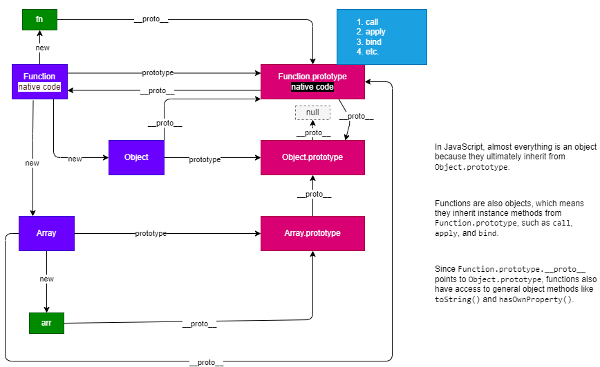

# ObjectS
[TOC]
## 01 Understanding Objects

> Everything in JS are objects. 
> Object = properties (its features) + methods (what it can do).
> In JS, objects are a collection of unordered key:value pairs.

> Why do we need objects?
> - storing information of an object (e.g., phone, user) using a variable or an array is difficult and not relevant 
> - object provides a better structure to store these information as key-value pair in one place, and we could know what each value is based on key.

```js
// Variables - we need to define many variables to store related message of the user.
var name = "Too Wei Xin";
var age = 25;
var status = "Unemployed";

// Array - although it can gather all the information of the user in one place, but it is difficult to guess what each item really is
var person = ["Too Wei Xin", 25, "Unemployed"];

// Object - with object, the structure is clearer.
var user = {
    name: "Too Wei Xin",
    age: 25,
    status: "Unemployed",
    sleep() {
        console.log("I like sleeping");
    },
    "to-Eat"(){
        console.log("Eat what?")
    }
}
```

> object values can be any type (e.g., function)
> object method is actually function storing inside object.

### 1.1 Creating Objects

> - object literals / object initializer {}
> - new Object()
> - Object.create()
> - constructor function / class

```js
var obj = {
    key: value,
    key: value,
}

var obj = {};
```
> Naming convention of Keys:
> - if object key follows the JS naming convention for identifier, it do not need to be quoted.
> - otherwise, you need a quote "" or ''.

```js
var name = "myName";
var user = {
    [name]:"Too Wei Xin",
    ["age"]: 25,
    "to-Sleep"() { 
        console.log("To Sleep");
    },
    #private() {
        console.log("I have a secret");
    },
    $bank(){
        console.log("How much gold I have in my vault?");
    }
    
}
```

### 1.2 Object Basic Operations

#### 1.2.1 Accessing Properties

> - property accessor: https://developer.mozilla.org/en-US/docs/Web/JavaScript/Reference/Operators/Property_accessors

- `obj.prop`
- `obj["prop"]`
- `obj[variable]`

> - if the property you access doesn't exist, it returns `undefined`.

#### 1.2.2 Adding / Modifying Properties

-`obj.prop = newValue`
-`obj["prop"] = newValue`
-`obj[variable] = newValue`

> - if the prop doesn't exist, it adds new property with value supplied.
> - if the prop already exists, it modifies the property values.

```js
var count = "TravelCount";
var user = {
    name: "Too",
    age: 25,
    
}

// Modifying property values
user.name = "Koh";
user.age = 30;
user[count]++;
user[count]+= 3;

// Adding properties
user.status = "single";
user.career = "frontend";
```

#### 1.2.3 Calling Methods

- `obj.prop()`
- `obj["prop"]()`
- `obj[variable]()`

> - e.g., Math.random() where random is a method of Math object.

#### 1.2.4 Object Traversal

> - for...in ... loop
> - it traverses through each key of the object.
> - traverses only the key that is not Symbol type.
> - note: for...in... can get properties you defined on the prototype!


```js
var s = Symbol("Symbol Property");

var phone = {
  brand: "Apple",
  [s]: "5.6",
  color: "Black",
  weight: "100g",
  quality: "Aluminium",
  call: function () {
    console.log("Call");
  },
  playGame: function () {
    console.log("Play");
  },
  "to-Eat"() {
    console.log("Eat what?");
  },
};

for (var key in phone) {
  console.log(key);
}

// brand  <- note: s is not printed! For ... in ... loop traverses through non-symbol keys.
// color
// weight
// quality
// call
// playGame
// to-Eat

```

> - array is also an object, each index is actually key!

```js
var scores = [99, 80, 25, 30];
for (var index in scores) {
  console.log(index, scores[index]);
}
// 0 99
// 1 80
// 2 25
// 3 30
```

### 1.3 Copying Objects

> - object is reference type.
> - it is accessed by reference.

**Shallow Copy**

> - use for...in... loop
> - add each object key value pair to the new object. `newObject[key] = obj[key]`

**Deep Copy**

> - clone every layers, including the nested reference data type.
> - copiedObj looks like obj but they are two independent objects!
> - consider array and object, other types like set, map will be added later.

```js
function deepCopy(obj, deep = true) {
  var res;
  if (obj === null) return;
  if (Array.isArray(obj)) {
    res = [];
    if (deep) {
      for (var i = 0; i < obj.length; i++) {
        res.push(deepCopy(obj[i], deep));
      }
    } else {
      return obj.slice();
    }
  } else if (typeof obj === "object") {
    res = {};
    for (var k in obj) {
      if (deep) {
        res[k] = deepCopy(obj[k], deep);
      } else {
        res[k] = obj[k];
      }
    }
  } else {
    // if obj is primitive or functions
    return obj;
  }
  return res;
}
```

### 1.4 This

> `this`: the execution context a piece of code (e.g., function body) is supposed to run.
> `this` is determined by how a function is invoked, not where it is defined.
> Tips: this refers to whoever calls the functions / methods.
>   - in global context, `this` refers to `window` object in browser environment.
> example scenarios: 
>   - invoke as a standalone function,  this refers to `window` object (non-strict mode) / `undefined` (strict) 
>   - invoke function as a method of an object, `this` points to that object.
>   - `Function.prototype.apply()` and `Function.prototype.call()` can change this for a particular call.
>   - `Function.prototype.bind()` can create a function whose this binding doesn't change.
>   - Function call as a constructor.

#### 1.4.1 Case 1: Invoking a Standalone Function

> - `fn()` is `window.fn()` so `this` refers to window.

```js
// Global Context
function fn() {
  //   "use strict";
  console.log(this);
}

// when the fn is in non-strict mode, it is similar to global.fn() this points to global.
// when the fn is in strict mode, this refers to undefined.
fn();


// IIFE - this refers to  global. In strict mode, it is undefined.
(function () {
  // "use strict";
  console.log(this);
})();
```

#### 1.4.2 Case 2: Invoking Function as a Method of an Object

> - `this` refers to the `object` who calls the method.

```js
var person = {
  name: "Too Wei Xin",
  sleep() {
    console.log(this);
  },
};

person.sleep(); // { name: 'Too Wei Xin', sleep: [Function: sleep] } this refers to person

// Caveat:
var sleep = person.sleep; // assign the reference of sleep function to sleep variable.
sleep(); // this refers to global. (it is similar to global.sleep()) it is global who calls sleep now, not object anymore.

// Array - index is key for array.
var arr = [
  1,
  2,
  3,
  function () {
    console.log(this);
  },  
];

arr[3](); // this refers to arr.

// Caveat again!
var fn = arr[3];
fn(); // this refers to global.

```

#### 1.4.3 Case 3: Change this Using `Call` / `Apply`

> - call / apply is similar to function call `fn()` except you pass thisArgs as the first argument.

> - when a function is invoked using call or apply with a thisArgs, it is similar to thisArgs.fn() where thisArgs could refers to an object.
> temporarily treat this inside fn as thisArgs.

```js
Function.prototype.call(thisArgs, ...args)
Function.prototype.apply(thisArgs, argsArr)

// fn.call(obj, arg1, arg2, arg3) is similar to obj.call(arg1, arg2, arg3)
```


> Caveats:
> - when thisArgs === null / undefined, it becomes window object in browser.
> - if thisArgs is primitive, the primitive is converted to object `Object(primitive)`.

#### 1.4.4 Case 4: Bind

> - similar to call / apply
> - return a bounding function binding to thisArgs and initial arguments.

```js
Function.prototype.bind(thisArgs, ...args)
// fn.bind(obj, arg1, arg2, arg3) returns a new function that is bound to obj and contains initial arguments.
// newFn() is similar to obj.newFn(arg1, arg2, arg3)
```

> note: 
> - if the bounding function is used as a constructor with new keyword, the construction will prepare its own this context, ignoring the thisArgs of bind.

## 02 Constructor


### 2.1 Factory Methods
> - create a bunch of similar object of a particular class (e.g., person)
> - Mary, Too Wei Xin, Lau Jing Yi...


**Design Pattern: Factory Method**

```js
// Factory Method
function createPerson(name, age, sex) {
  var person = {};
  person.name = name;
  person.age = age;
  person.sex = sex;
  person.sayHello = function () {
    console.log("Hello, I am " + this.name);
  };
  return person;
}

var wilson = createPerson("Wilson", 25, "male");
```

### 2.2 Constructor

**Constructor**

> - when a function is called with `new`, it is treated as a constructor, and return an instance.
> - use: create and initialize an instance.
> - PascalCase as the naming convention (First letter is capitalized). Note: camelCase is not throwing error, but not recommended.
> - instance's `instance.__proto__` / `instance[[prototype]]` points to Constructor's prototype `Constructor.prototype`
```js
function Person(name, age, sex) {
  // Internal Mechanism:
  // 1. var obj = {}
  // 2. obj.__proto__ = Person.prototype （when Person.prototype is an object, otherwise, it is default to Object.prototype.
  // 3. this = obj;
  // 4. execute codes in function body, resembles adding new property to obj.
  // 5. return obj 
  this.name = name;
  this.age = age;
  this.sex = sex;
  this.sayHello = function () {
    console.log("Hello, I am " + this.name);
  };
  console.log(this); // if calling without new, this refers to window / global
}

var twx = new Person('twx', 25, 'male'); // it is like twx = this (internal) = obj (internal)
```

**Problem:**

> - methods inside constructor will be created for each instance, creating some memory overhead, but these methods actually do the same thing.

```js
function Person(name) {
  this.name = name;
  this.sayHello() {
    console.log("Hello it is ", this.name);
  }
}

```

> - put methods as global function, but it pollutes the global scope because the method is only used for object.

```js
function Person(name) {
  this.name = name;
  // define method inside constructor might create extra overheads.
}

// We define it as a global function.
function sayHello() {
  console.log("Hello it is ", this.name);
}

const wilson = new Person("wilson");
sayHello.call(wilson);

const too = new Person("too");
sayHello.call(too);
```

> solution: put on Constructor.prototype!

## 03 Class and Instances

### 3.1 Understanding Class and Instances
> - class: category / blueprint / template that defines a type of object - can be broad / specific. 
> - instance: specific example on a particular category. 

| Class  | Instance                             |
| ------ | ------------------------------------ |
| Person | wilson, jingyi, weixin               |
| Dog    | husky, bulldog                       |
| Apple  | green apple, red apple               |
| Bag    | weixin's bag, your bag, wilson's bag |


### 3.2 Class and Instance in Js

> - class is used to define the properties and methods an instance will have, but it doesn't intialize it with values, unless there's default values or user passes arguments as values to these properties.
> - constructor is similar to class in this sense (ES6+ introduces class syntax)

> - instance is an object (JS object)

> - Calling constructor with new keyword, it instantiates an instance / object of that class / constructor.
> - Object instantiation: The process of creating an instance of a particular class.


```js
function Ball(r, color, opacity, x, y) {
  this.radius = r;
  this.diameter = r * 2;
  this.color = color;
  this.opacity = opacity;
  this.x = x;
  this.y = y;
  this.init = function () {
    // initialization: put it on the dom.
    // this.dom add a new property dom to the ball instances.
    this.dom = document.createElement("div"); // in memory
    // set styles on div
    this.dom.style.width = this.diameter + "px";
    this.dom.style.height = this.diameter + "px";
    this.dom.style.borderRadius = this.radius + "px";
    this.dom.style.backgroundColor = this.color;
    this.dom.style.opacity = this.opacity;
    this.dom.style.position = "absolute";
    this.dom.style.left = this.x + "px";
    this.dom.style.top = this.y + "px";
    document.body.appendChild(this.dom); // insert div into dom
  };
  this.move = function () {
    this.dom.style.left = this.x + 250 + "px";
    this.dom.style.top = this.y + 250 + "px";
  };
  this.changeColor = function () {
    this.dom.style.backgroundColor = "skyblue";
  };
}

var pink = new Ball(100, "pink", 0.5, 100, 100);
var blue = new Ball(200, "blue", 0.8, 200, 200);
var green = new Ball(1000, "green", 1, 300, 300);
pink.init();
blue.init();
green.init();

```

> JS is object-based language unlike class-based languages like Java / C++.
> Class syntax introduced in ES6+ is a syntactic sugar allows JS developers to use class-based approach like other OOP languages.
> Under the hood, classes in Js are still implemented based on prototype (prototype chain).


### Object(val) Constructor

> note: Almost all objects in JS is constructed using Object constructor.

> if val is `undefined` / `null` / not passed, it returns an object.
> if val is primitive, it returns the wrapper object of the primitive.
> if val is an object, it returns the object (e.g., {} / []).

```js
new Object(val)
```

**Wrapper Object**

> - this explains why we could access property / methods from primitive type.
> - the primitive data is wrapped with a temporary wrapper object when accessing properties or call methods on them.
> - this wrapper object contains different methods for us to operate on the data.

```js
var str = "abc";
str.charAt(0); // Why is this possible？

// Note: Under the hood, it is like this
// var strObj = new Object(str);
```

> use case: when you want to receive an argument that is object type, you can use Object to convert the argument received.

## 04 Prototype and Prototype Chain

### 4.1 What is Prototype?


> - prototype is a property on all function, but it is only becoming useful if you invoke functions as constructors with `new`.
> - Fn.prototype holds an object that acts like a shared room - a place where you can define common properties and methods.
> - Every instance created using the constructor Fn will have internal access to Fn.prototype via `__proto__` property.
> The existence of prototype allows all instances to share similar behaviours (properties / methods) without needing each instance to carry its own copy.
> - Fn.prototype contains a property named constructor, pointing back to the constructor.

```js
function Person(name) {
  this.name = name;
}

// Define common properties / methods on Person.prototype
Person.prototype.sayHello = function () {
  console.log("Hello I am", this.name);
};
Person.prototype.nationality = "Malaysia";

var ljy = new Person("ljy");
// Accessing those properties / methods from instance.
ljy.sayHello();
console.log(ljy.nationality); // Malaysia

```

### 4.2 Prototype Chain Lookup


> - when accessing a property or calling a method, js will look for the property / method from the object itself.
> - if the property / method exists, then it will use what it has. (Shadowing)
> - if the property / method doesn't exist, then it will look it up along the prototype chain.
> - The lookup proceeds until the end of the chain and returns `undefined` if not found.
> - so that is why when we access a property that doesn't exist, it returns `undefined`.


> **Note:**
> - All objects have access to `Object.prototype`.
> - `Object.prototype.__proto__` is null.
> - All constructors (e.g., Object, Array, Test, etc.) are instances created by Function Constructor.
> - All prototypes are objects except `Function.prototype` which is a function.
> - `Function.__proto__ === Function.prototype` means both points to Function prototype.
> - `Function.prototype.__proto__ === Object.prototype` means Function.prototype inherits from Object.prototype.
> - `Function.__proto__.__proto__ === Object.prototype` means Function inherits from Object.prototype.

> Note:
> - toString of Array supposedly inherits from Object.prototype. However, it has been overriden by some object in Js, such as Array.


### 4.3 `hasOwnProperty`

> check if an object has a specific property that is not inherited.

```js
obj.hasOwnProperty(key)

```

### 4.4 `in` operator

> check if an object has a specific property or property that is inherited from its prototype chain.


```js
key in obj

```


### 4.5 `instanceof`

> check if the prototype of the constructor is present anywhere along the prototype chain of the object.

```js
obj instanceof constructor
```
**Caveat: Constructor from Different Realm:**

> - constructors from another realm (iframe) are not identical to the current realm's constructors.
> - realm: an environment that has its own global object & built-in object.

```html
<iframe
  src="https://www.openstreetmap.org/export/embed.html?bbox=-0.004017949104309083%2C51.47612752641776%2C0.00030577182769775396%2C51.478569861898606&amp;layer=mapnik" frameborder="0"
></iframe>
<script>
  var iframeArray = window.frames[0].Array;
  console.log(iframeArray === Array); // false
  var arr = [1, 2, 3];
  console.log(arr instanceof Array); // true
  console.log(arr instanceof iframeArray); // false 
</script>
```

## 05 Convert Array-Like Object to Array

```js
function sum(a, b, c) {
  /* Use call! */
  var arr = Array.prototype.slice.call(arguments); // arguments.slice
  console.log(arr);
}

```


## 06 Object.prototype.toString()

> - returns a string representing this object.
> - `[object type]`
> - However, most objects has overriden this method.
> - to use it, you need to use `call`!
> - use case: checking type.


```js
// Using this is returning the same result [object Object].
Object.prototype.toString(1); // '[object Object]'
Object.prototype.toString(true); // '[object Object]'
Object.prototype.toString({}); // '[object Object]'
Object.prototype.toString([]); // '[object Object]'

console.log(Object.prototype.toString.call(1)); // [object Number]
console.log(Object.prototype.toString.call(true)); //[object Boolean]
console.log(Object.prototype.toString.call({})); // [object Object]
console.log(Object.prototype.toString.call([])); // [object Array]
```


**What are the methods to check types?**

| Methods                            | Description                                                                                       |
| ---------------------------------- | ------------------------------------------------------------------------------------------------- |
| `typeof`                           | check types for primitive & function <br/> array, null, object returns object                     |
| `Array.isArray(val)`               | only check array                                                                                  |
| `Object.prototype.toString.call()` | check any types.                                                                                  |
| `obj instanceof constructor`       | check instances of particular constructor/ class.                                                 |
| `fn.prototype.constructor === fn`  | check if an instance is created by the constructor. <br/> not safe, constructor can be rewritten. |
| `Object.prototype.toString.call()` | check any types.                                                                                  |

**What are the methods to check property of an object?**
| Methods                   | Description                                                                   |
| ------------------------- | ----------------------------------------------------------------------------- |
| `key/symbol in obj`       | check property exists on obj and its prototype chain   .                      |
| `obj.hasOwnProperty(key)` | check property that only exists on the obj and not inherited from prototypes. |

## 07 Implementation

### 7.1 Implementation of Call

> concept: f`n.call(thisArgs)` means treating fn as the method of thisArgs `thisArgs[key] = fn`

```js
var obj = {}
function myFn() {}
// Call: change the this of myFn to obj.
// internally, we want to achieve obj.myFn() so we want to make myFn to be the method of the obj.
// Q1: What is this inside call? myFn.call() so this inside call refers to the function itself.
// Q2: How do we make myFn to be the property of obj? obj[key] = myFn
// Q3: What is key? A random identifier that is unique and not conflicted with the property name of the obj.
myFn.call(obj);
```

> implementation of call:
> 1. Function.prototype._call = function(context) {}
> 2. check if this is not a function, throw error.
> 3. convert null / undefiend to globalThis
> 4. convert primitive to wrapper object
> 5. create a unique key
> 6. `context[key] = this`
> 7. `var res = context[key](？？？)` + passing argument dynamically
> 8. `delete context[key]`
> 9. return res


important points:
- generate unique key
  - ES6: Symbol.
  - ES5: Math.random + Date.now
- dynamic argument passing
  - ES6: Spread operator
  - ES5: Function constructor

### 7.2 Implementation of Apply

> implementation of apply:
> similar to call, except the arguments are passed in the form of an array.

### 7.3 Implementation of Bind

> implementation of bind:
> var args = []
> var fn = this;
> looping through arguments starting at index 1.
> define inner boundingFn
> - var restArgs = []
> - looping through arguments starting at index 0.
> - var finalArgs = args.concat(restArgs)
> - checking if the boundingFn called with new (this instanceof boundingFn / new.target)
>   - ES6: return new fn(...finalArgs);
>   - ES5: mimicking how new Constructor working under the hood
>     - var instance = Object.create(fn.prototype)
>     - var res = fn.apply(instance, finalArgs)
>     - checking if the res is an object type and is not null (user-defined return value), return res
>     - return instance 
> - otherwise, return fn.apply(context, finalArgs)
> return boundingFn

## 08 Object Advanced

### 8.1 `Object.defineProperty(obj, prop, descriptor)`


> - defines a new property directly on an object, or modifies an existing property on an object, and returns the object.
> - two main types of descriptor: data descriptor & accessor descriptor (getter-setter pair).

**Keys Shared between Data Descriptor and Accessor Descriptor:**
| key            | description                                                                                                                                                                                                                                                                                                                                                                                  | default |
| -------------- | -------------------------------------------------------------------------------------------------------------------------------------------------------------------------------------------------------------------------------------------------------------------------------------------------------------------------------------------------------------------------------------------- | ------- |
| `enumerable`   | Determines whether the property shows up during enumeration (e.g. `for...in`, `Object.keys`).                                                                                                                                                                                                                                                                                                | `false` |
| `configurable` | - If `false`:<br>   1. The property **cannot be deleted** using `delete`.<br>   2. You **cannot redefine the property descriptor** (like changing `enumerable`, `configurable`, switching between data/accessor property, etc.).<br>   3. **Exception**: If it’s a **data property** with `writable: true`, its **value can still be changed**, and you can still set `writable` to `false`. | `false` |

> - When you try to change the descritor of a non-configurable property, it throws error.
> - Uncaught TypeError: Cannot redefine property: name at Object.defineProperty (<anonymous>)

**Data Descriptor**

> - data property: a property defined by Object.defineProperty where the descriptor is a data descriptor.
> - or the one defined by the traditional method `obj.x = y`

| key        | description                                                 |             |
| ---------- | ----------------------------------------------------------- | ----------- |
| `value`    | value associated with the property.                         | `undefined` |
| `writable` | whether the value can be changed by an assignment operator. | `false`     |

> - use case: define a constant value.

**Accessor Descriptor**

> - accessor property: a property defined by Object.defineProperty where the descriptor is a accessor descriptor.
> - when accessing or setting a property value, 
> > - we may want to do additional complex computation before getting the value.
> > - we may want some other property value to change too.


| key   | description                                                                                             | default     |
| ----- | ------------------------------------------------------------------------------------------------------- | ----------- |
| `get` | a function invoked when accessing a property value.                                                     | `undefined` |
| `set` | a function invoked when setting a property value. <br/> It has a parameter receiving the value you set. | `undefined` |

> - note: the default values mentioned here only works for the property defined by this method. 
> - if you use the var obj = {key1: value1, key2: value2} the default will be the opposite. 


```js
var obj = {
  a: 1,
  b: 2,
};

obj.c;

Object.defineProperty(obj, "name", {
  value: "twx",
});
console.log(Object.getOwnPropertyDescriptor(obj, "a"));
console.log(Object.getOwnPropertyDescriptor(obj, "name"));  
console.log(Object.getOwnPropertyDescriptor(obj, "c"));
// {value: 1, writable: true, enumerable: true, configurable: true}
// {value: 'twx', writable: false, enumerable: false, configurable: false}
// undefined

```

### 8.2 Object.getOwnPropertyDescriptor(obj, prop)

> - return the descriptor of a specific property of an object.

### 8.3 Object.defineProperties(obj, props)

> - plural form of Object.defineProperties.

```js
Object.defineProperties(obj, {
  name: {
    value: "twx",
    writable: true,
    configurable: true,
  },
  age: {
    value: 25,
    writable: true,
    configurable: true,
  },
  sex: {
    get: function () {
      console.log("get");
    },
    set: function () {
      console.log("set");
    },
  },
});

```

### 8.4 Object.getOwnPropertyDescriptors(obj)

> - returns an object containing all own property descriptors of a given object.

### 8.5 Application: Data-driven Page Update

> - Vue2: Object.defineProperty
> - Vue3: Proxy


### 8.6 Public & Private Property

> - from the perspective of constructor or class.

#### 8.6.1 Public Properties and Public Methods

> - public property / method is also known as instance property / instance method.
> - accessible by all the instances of the constructor / class.
> - usually, public methods is written on the prototype of the constructor.

#### 8.6.2 Private Properties and Private Methods

> - private properties / methods are only accessible inside the constructor function.
> - privileged method: a public method that has access to the internal private properties and private methods.
> - in JavaScript, there's no concept of private property and private method. 
> - To make property or method private, we need to use the concept of closure.
> - naming convention: `_name`

```js
function Price() {
  // private property: we do not want people to directly access this property.
  var _price = 0;
  // private method
  function _computed() {
    return _price > 0 ? "$" + _price : "FREE";
  }
  // privileged method: we do not want to expose the private property, and we may need additional handling.
  this.getPrice = function () {
    return _computed(); // access to the private method
  };
  this.setPrice = function (value) {
    // additional handling.
    if (typeof value !== "number")
      throw new Error("Please provide a number.");
    _price = value; // access to private property
  };
}

```

> **When do we use private property?**
> - 1. this property can only be accessible inside the constructor, and we cannot modify it from outside.
> - 2. we cannot directly modify the property, we need additional handling especially during reading or setting its values. We might expose related getter and setter for people to use outside.

## 09 Inheritance

> - inheritance: passing down properties and methods from Parent Class to Child Class, so that Child Class can reuse the existing code in Parent Class, and build upon the features (start with existing features and add more).
> reusable, maintainable, allow code sharing.
> key: Child class inherits all the public / instance properties and methods, and beyond that, Child class can also add its own properties and methods.

> analogy: parent and children, teacher and replacer teacher.

### 9.1 Method 1: Prototype Chain Inheritance / Prototype Inheritance

> we set the prototype of Child constructor to be an instance of the Parent Constructor.
> `Child.prototype = new Parent()`
> - drawback 1: you cannot pass arguments to the instance properties of Parent Constructor.
> - solution: Overriding property in Child Constructor.
> - drawback 2: If there's a reference data type in Parent Class, it is shared among instances (Not ideal).

```js
function People(name, age, sex) {
  this.name = name;
  this.age = age;
  this.sex = sex;
}
People.prototype.sayHello = function () {
  console.log("Hello, I am", this.name);
};
People.prototype.sleep = function () {
  console.log("Hello, I like sleeping");
};

function Student(name, age, sex, studentId, school) {
  this.studentId = studentId;
  this.school = school;

  // Overriding
  this.name = name;
  this.age = age;
  this.sex = sex;
}

// Modify the Student.prototype
// Important to note the order here.
// To ensure the instance method on Student.prototype works.
// console.log(Student.prototype.constructor);
Student.prototype = new People(); // instance of People
Student.prototype.study = function () {
  console.log("study");
};
Student.prototype.exam = function () {
  console.log("exam");
};
```


### 9.2 Method 2: Classical Inheritance / Object Masquerading / Constructor Borrowing

> - calling the Parent constructor inside Child constructor with `Parent.call(this, param1, param2, ...)` or `Parent.apply(this,[param1, param2,...])`
> - solve the drawback faced in Method 1.
> - drawback: the instance method on the prototype of the Parent Consturctor is not inherited.

```js
function People(name, age, sex) {
  this.name = name;
  this.age = age;
  this.sex = sex;
}

People.prototype.sayHello = function () {
  console.log("hello");
};

function Student(name, age, sex, id, school) {
  // this.name = name;
  // this.age = age;
  // this.sex = sex;
  People.call(this, name, age, sex); // this is calling constructor as regular function.
  this.id = id;
  this.school = school;
}

var student = new Student("twx", 25, "male", "0001", "smktp");
console.log(student);
```

### 9.3 Method 3： Combination Inheritance / Pseudo-Classical Inheritance

> - combination of method 1 (inherit instance methods on the Parent constructor's prototype) & method 2 (inherit instance property).
> - drawback 1: calling Parent constructor twice.  
> - drawback 2: the lost of Child.prototype.constructor (been replaced by Parent constructor).

```js
function People(name, age, sex) {
  this.name = name;
  this.age = age;
  this.sex = sex;
  this.arr = [1, 2, 3];
}

People.prototype.sayHello = function () {
  console.log("hello " + this.name);
};

function Student(name, age, sex, id, school) {
  // this.name = name;
  // this.age = age;
  // this.sex = sex;
  People.call(this, name, age, sex); // this is calling constructor as regular function. (Method 2)
  this.id = id;
  this.school = school;
}

Student.prototype = new People(); // (Method 2)
Student.prototype.exam = function () {
  console.log("exam", this.school);
};
```

### 9.4 Prototypal Inheritance

> - create an new object built upon an existing object.
> - focus on object.
> - have nothing to do with constructor / class.
> - use case: when there's no need to create objects via a constructor, but we need objects to share properties or methods.
> > - e.g., objB wants to have some things from objA.
> - caveat: beware of working with reference data type from the prototype, it is shared.
```js
// Recommended.
// Before Object.create came out
function createObject(o) {
  function Fn(){}
  Fn.prototype= o;
  return new Fn();
}

function createObjectVer2(o) {
  var newObj = new Object();
  // break the link to Object.prototype
  newObj.__proto__ = o; // but since o has Object.prototype, so it still has access to methods on Object.prototype
  return newObj;
}

var obj1 = {
  a: 1,
  b: [1, 2, 3],
  sum: function () {
    console.log("sum");
  },
};

var newObj = createObject(obj1);

// note: the reference data of obj1 is shared.
newObj.b = []; // if you want to avoid this, you need to override it by defining a new reference data to that property.
```

#### 9.4.1 `Object.create(prototype, [propertiesObject])`

> - prototype: an object type / null
> - propertiesObject is an object of properties and their property descriptor.
> problem with wrapper object:

```js
// Problem with Wrapper Object:
var num1 = Object.create(new Object(2.33));
console.log(num1);
console.log(num1.__proto__.__proto__); // There's methods of Number type!

// But it is not useful here.
//   console.log(num1.toFixed(2)); // Uncaught TypeError: Number.prototype.toFixed requires that 'this' be a Number at Number.toFixed
// Reason: num1 here is an object, not a number!!!
```

### 9.5 Parasitic Inheritance

> - a pattern where we create a new object based on an existing object, and enhance it with new features.
> - kind of similar to Object.create(obj, propertiesObject), but with more flexibility.
> - e.g., add preset methods, add conditionals, etc.
> - use case: when creating a new object without thinking of class / constructor (type).
> - caveat: the added methods are not sharable. each obj has its own copies.
```js

function enhanceObject(o) {
  // enhance
  var newObj = Object.create(o);
  newObj.sum = function () {
    console.log("sum");
  }
  return newObj;
}

```


### 9.6 Parasitic Combination Inheritance Pattern (Important)

> - an inheritance pattern that combine both constructor borrowing and prototype chaining.
> - problem to be solved:
> > - avoid double calling of Parent constructor.
> > - prevent Child.prototype.constructor being overwritten.
> - Step 1: inherits property via constructor borrowing.
> > - calling Parent constructor in Child constructor.
> - Step 2: set up prototype chain.
> > - create an object based on Parent.prototype.
> > - assign it to Child.prototype.
> - fix the Child.prototype.constructor to Child.

```js
function Parent(surname){
  this.surname = surname;
}
function Child(name, surname){
  this.name = name;
  // Step 1: constructor borrowing
  Parent.call(this, surname);
}
// Step 2: Set up prototype chain
inherit(Parent, Child);

function inherit(parent, child){
  child.prototype = Object.create(parent.prototype);
  child.prototype.constructor = child;
}
```


## 10 Type of Objects

| Type             | Description                                                                                                                                                                                                                                                              |
| ---------------- | ------------------------------------------------------------------------------------------------------------------------------------------------------------------------------------------------------------------------------------------------------------------------ |
| built-in objects | - provided by JavaScript itself. <br/> e.g., `Object`, `Array`, `Function`, `String`, `Math`, `Date`, `RegExp`, `Error`, `Global` etc. <br/> - some built-in objects have constructor (Array, Date, RegExp, Error, etc.), some don't (Math, JSON).                       |
| host objects     | - defined by environments. <br/> e.g., in browser, host object includes `Window`, `Document`, `Element`, `Form`, `Image`, etc. <br/> - different browsers can provide same objects, but their implementation may be different, and thus are having compatibility issues. |
| custom objects   | - defined by developers.                                                                                                                                                                                                                                                 |
## 11 Relationship of JS Objects



## 12 Wrapper Objects

> primitive is not an object, but how can we call methods on primitive? e.g., `str.toUpperCase()`.

> - purpose: to provide methods for primitive data types.
> - JS will wrap the primitive in a temporary wrapper object of the corresponding type when attempting to access property and method from a primitive.

```js
var str = "twx";
// 1. create a temporary wrapper object of String type. new String("twx")
// 2. call the method on the wrapper object.
// 3. destroy the wrapper object.
var str2 = str.charAt(1); // similar to new String(str).charAt(1)
```
> **Life Cycle of Wrapper Object**
> cases:
> - 1. create with `new`, it is destroyed when the current execution context is destroyed.
> - 2. create at runtime by JS, it is destroyed once the line of code is executed.

> note: 
> - add a property to the primitive doesn't throw error, but it is not added to the primitive, but to a temporary wrapper object, which is destroyed. this is why you would get undefined when trying to access the property you add.
> - call wrapper class:
> > - with new: convert a primitive to an object of the corresponding type.
> > - without new: type conversion.

### 12.1 Number

> **Static Properties**
> - 

| Property                   | Description                                                                                                                                                                                                                                                    |
| -------------------------- | -------------------------------------------------------------------------------------------------------------------------------------------------------------------------------------------------------------------------------------------------------------- |
| `Number.EPSILON`           | The difference between 1 and the smallest floating point number greater than 1 (≈ 2.220446049250313e-16).                                                                                                                                                      |
| `Number.MAX_SAFE_INTEGER`  | The maximum safe integer in JavaScript (`2^53 - 1`). <br/> • 53 bits of precision = 52 fraction bits + 1 implicit leading bit. <br/> • We subtract 1 because counting starts from 0. <br/> • For example, with 3 bits: `111` = 7, since `2^3 - 1 = 7` (not 8). |
| `Number.MAX_VALUE`         | The largest positive numeric value representable in JavaScript (1.7976931348623157e+308).                                                                                                                                                                      |
| `Number.MIN_SAFE_INTEGER`  | The minimum safe integer in JavaScript (`-2^53 + 1`).                                                                                                                                                                                                          |
| `Number.MIN_VALUE`         | The smallest positive numeric value representable in JavaScript (~5e-324).                                                                                                                                                                                     |
| `Number.NaN`               | Special value representing "Not-a-Number".                                                                                                                                                                                                                     |
| `Number.NEGATIVE_INFINITY` | Special value representing negative infinity.                                                                                                                                                                                                                  |
| `Number.POSITIVE_INFINITY` | Special value representing positive infinity.                                                                                                                                                                                                                  |

```js
// Safety and Range:
// - Safe integers are those that can be represented exactly and compared correctly.

console.log(Number.MIN_SAFE_INTEGER); // -9007199254740991  (-(2^53 - 1))
console.log(Number.MAX_SAFE_INTEGER); //  9007199254740991  (2^53 - 1)

console.log(Number.isSafeInteger(9007199254740991)); // true
console.log(Number.isSafeInteger(9007199254740992)); // false - exceed 2^53 - 1 range.

// Large numbers and adding 1:
// Math.MAX_VALUE is approximately 1.79e+308 (very large)

console.log(Math.MAX_VALUE + 1 === Math.MAX_VALUE); // true

// Adding 1 to such a huge number doesn't change it because 1 is too small to affect it.

// Recommendation:
// Always perform calculations within the safe integer range to avoid precision loss.


```

**Static Methods**
| Method                           | Description                                                                    |
| -------------------------------- | ------------------------------------------------------------------------------ |
| `Number.isFinite(value)`         | Determines whether the passed value is a finite number.                        |
| `Number.isInteger(value)`        | Determines whether the passed value is an integer.                             |
| `Number.isNaN(value)`            | Determines whether the passed value is NaN (Not-a-Number).                     |
| `Number.isSafeInteger(value)`    | Determines whether the passed value is a safe integer (within ±(2^53 -1)).     |
| `Number.parseFloat(string)`      | Parses a string argument and returns a floating point number.                  |
| `Number.parseInt(string, radix)` | Parses a string argument and returns an integer of the specified radix (base). |

**Instance Methods**
| Method                                              | Description                                                                                                                                                                                                |
| --------------------------------------------------- | ---------------------------------------------------------------------------------------------------------------------------------------------------------------------------------------------------------- |
| `Number.prototype.toExponential(fractionDigits)`    | Returns a string representing the number in exponential notation with specified digits.                                                                                                                    |
| `Number.prototype.toFixed(digits)`                  | - Returns a string representing the number with fixed-point notation, rounded to digits decimals. <br/> - The result of toFixed is not always precise e.g., 2.45.toFixed(1) = 2.5 & 2.55.toFixed(1) = 2.5. |
| `Number.prototype.toLocaleString(locales, options)` | Returns a string with a language-sensitive representation of the number.                                                                                                                                   |
| `Number.prototype.toPrecision(precision)`           | Returns a string representing the number to the specified precision.                                                                                                                                       |
| `Number.prototype.toString([radix])`                | Returns a string representing the number in the specified base (radix). <br/> Override Object.prototype.toString                                                                                           |
| `Number.prototype.valueOf()`                        | Returns the primitive numeric value of the Number object.                                                                                                                                                  |


### 12.2 Boolean

| Method                         | Description                                                   |
| ------------------------------ | ------------------------------------------------------------- |
| `Boolean.prototype.toString()` | Converts the Boolean value to a string `"true"` or `"false"`. |
| `Boolean.prototype.valueOf()`  | Returns the primitive Boolean value `true` or `false`.        |


### 12.3 String

**Static Methods**

| Method                   | Description                                              |
| ------------------------ | -------------------------------------------------------- |
| `String.fromCharCode()`  | Creates a string from a sequence of UTF-16 code units.   |
| `String.fromCodePoint()` | Creates a string from a sequence of Unicode code points. |
| `String.raw()`           | Creates a raw string from a template literal.            |


**Instance Methods**

| Method                                 | Description                                                              |
| -------------------------------------- | ------------------------------------------------------------------------ |
| `String.prototype.at()`                | Returns the character at a specified index, supporting negative indices. |
| `String.prototype.charAt()`            | Returns the character at a specified index.                              |
| `String.prototype.charCodeAt()`        | Returns the UTF-16 code unit at a specified index.                       |
| `String.prototype.codePointAt()`       | Returns the Unicode code point at a specified position.                  |
| `String.prototype.concat()`            | Combines the string with one or more strings and returns a new string.   |
| `String.prototype.endsWith()`          | Checks if the string ends with the given substring.                      |
| `String.prototype.includes()`          | Checks if the string contains the given substring.                       |
| `String.prototype.indexOf()`           | Returns the index of the first occurrence of a substring.                |
| `String.prototype.isWellFormed()`      | Checks if the string contains well-formed UTF-16 sequences.              |
| `String.prototype.lastIndexOf()`       | Returns the index of the last occurrence of a substring.                 |
| `String.prototype.localeCompare()`     | Compares two strings according to locale-specific order.                 |
| `String.prototype.normalize()`         | Returns the Unicode Normalization Form of the string.                    |
| `String.prototype.padEnd()`            | Pads the current string at the end with a given string.                  |
| `String.prototype.padStart()`          | Pads the current string at the start with a given string.                |
| `String.prototype.repeat()`            | Returns a new string with a specified number of copies of the string.    |
| `String.prototype.slice()`             | Extracts a section of a string and returns it as a new string.           |
| `String.prototype.split()`             | Splits the string into an array of substrings.                           |
| `String.prototype.startsWith()`        | Checks if the string starts with the given substring.                    |
| `String.prototype.substring()`         | Returns the substring between two indices.                               |
| `String.prototype.toLocaleLowerCase()` | Converts the string to lowercase according to locale.                    |
| `String.prototype.toLocaleUpperCase()` | Converts the string to uppercase according to locale.                    |
| `String.prototype.toLowerCase()`       | Converts the string to lowercase.                                        |
| `String.prototype.toString()`          | Returns the string representation of the String object.                  |
| `String.prototype.toUpperCase()`       | Converts the string to uppercase.                                        |
| `String.prototype.toWellFormed()`      | Returns a well-formed UTF-16 string.                                     |
| `String.prototype.trim()`              | Removes whitespace from both ends of the string.                         |
| `String.prototype.trimEnd()`           | Removes whitespace from the end of the string.                           |
| `String.prototype.trimStart()`         | Removes whitespace from the start of the string.                         |
| `String.prototype.valueOf()`           | Returns the primitive value of the String object.                        |
| `String.prototype[Symbol.iterator]()`  | Returns an iterator for the string’s characters.                         |

**REGEX-related Instance Methods**

| Method                          | Description                                                          |
| ------------------------------- | -------------------------------------------------------------------- |
| `String.prototype.match()`      | Retrieves the matches of a string against a regular expression.      |
| `String.prototype.matchAll()`   | Returns an iterator of all matched substrings against a regex.       |
| `String.prototype.replace()`    | Returns a new string with some or all matches of a pattern replaced. |
| `String.prototype.replaceAll()` | Returns a new string with all matches of a pattern replaced.         |
| `String.prototype.search()`     | Executes a search for a match between the string and a regex.        |


**Instance Property**

| Property | Description                                                     |
| -------- | --------------------------------------------------------------- |
| `length` | Returns the length of the string (number of UTF-16 code units). |


## 13 Math
**Static Methods**

| Property      | Description                                                   |
| ------------- | ------------------------------------------------------------- |
| Math.E        | Euler's number, base of natural logarithms (\~2.718)          |
| Math.LN10     | Natural logarithm of 10 (\~2.303)                             |
| Math.LN2      | Natural logarithm of 2 (\~0.693)                              |
| Math.LOG10E   | Base-10 logarithm of E (\~0.434)                              |
| Math.LOG2E    | Base-2 logarithm of E (\~1.443)                               |
| Math.PI       | Ratio of a circle's circumference to its diameter (\~3.14159) |
| Math.SQRT1\_2 | Square root of 1/2 (\~0.707)                                  |
| Math.SQRT2    | Square root of 2 (\~1.414)                                    |

**Static Methods**

**Randomness**

| Method        | Description                                                                     |
| ------------- | ------------------------------------------------------------------------------- |
| Math.random() | Returns a random floating-point number between 0 (inclusive) and 1 (exclusive). |


**Common Arithmetic**
| Method                   | Description                                                |
| ------------------------ | ---------------------------------------------------------- |
| Math.abs(x)              | Returns the absolute value of x                            |
| Math.cbrt(x)             | Returns the cube root of x                                 |
| Math.exp(x)              | Returns e^x, where e is Euler's number                     |
| Math.expm1(x)            | Returns e^x - 1, optimized for small x                     |
| Math.hypot(...args)      | Returns the square root of the sum of squares of arguments |
| Math.pow(base, exponent) | Returns base raised to the power of exponent               |
| Math.sqrt(x)             | Returns the square root of x                               |

**Rounding**

| Method         | Description                                               |
| -------------- | --------------------------------------------------------- |
| Math.ceil(x)   | Rounds x up to the nearest integer                        |
| Math.floor(x)  | Rounds x down to the nearest integer                      |
| Math.fround(x) | Rounds x to the nearest 32-bit single-precision float     |
| Math.round(x)  | Rounds x to the nearest integer                           |
| Math.trunc(x)  | Returns the integer part of x, removing fractional digits |

```js
/* 
  -6 -5 -4 -3 -2 -1 0 1 2 3 4 5
        
  if fraction:
  1. > 0.5 round to the integer with higher absolute value
  2. === 0.5 round to the direction of +Infinity
  3. < 0.5 round to the integer with lower absolute value

  e.g., -5.49
  - fraction part is < 0.5
  - round to the next lower absolute value
  - -5


  e.g., -5.5
  - fraction part is exactly 0.6
  - round to the direction of +Infinity
  - so it is -5.


  e.g., -5.51
  - fraction part is > 0.5
  - round to the next higher absolute value
  - -6
*/
console.log(Math.round(PI)); // 3
console.log(Math.round(-5.49)); // -5
console.log(Math.round(-5.5)); // -5
console.log(Math.round(-5.51)); // -6

```


**Range**

| Method            | Description                               |
| ----------------- | ----------------------------------------- |
| Math.max(...args) | Returns the largest of the given numbers  |
| Math.min(...args) | Returns the smallest of the given numbers |

**Trigonometry**

| Method           | Description                                |
| ---------------- | ------------------------------------------ |
| Math.acos(x)     | Returns the arccosine of x (in radians)    |
| Math.acosh(x)    | Returns the hyperbolic arccosine of x      |
| Math.asin(x)     | Returns the arcsine of x (in radians)      |
| Math.asinh(x)    | Returns the hyperbolic arcsine of x        |
| Math.atan(x)     | Returns the arctangent of x (in radians)   |
| Math.atan2(y, x) | Returns the arctangent of y/x (in radians) |
| Math.atanh(x)    | Returns the hyperbolic arctangent of x     |
| Math.cos(x)      | Returns the cosine of x (in radians)       |
| Math.cosh(x)     | Returns the hyperbolic cosine of x         |
| Math.sin(x)      | Returns the sine of x (in radians)         |
| Math.sinh(x)     | Returns the hyperbolic sine of x           |
| Math.tan(x)      | Returns the tangent of x (in radians)      |
| Math.tanh(x)     | Returns the hyperbolic tangent of x        |


> Math.atan2(y, x) is useful to get the angle in radian. 
> Application: box rotates following the cursor.

**Logarithm**

| Method        | Description                                                   |
| ------------- | ------------------------------------------------------------- |
| Math.log(x)   | Returns the natural logarithm (base e) of x                   |
| Math.log10(x) | Returns the base-10 logarithm of x                            |
| Math.log1p(x) | Returns the natural logarithm of 1 + x, optimized for small x |
| Math.log2(x)  | Returns the base-2 logarithm of x                             |

**Bitwise**

| Method          | Description                                                                      |
| --------------- | -------------------------------------------------------------------------------- |
| Math.clz32(x)   | Returns the number of leading zero bits in the 32-bit binary representation of x |
| Math.imul(x, y) | Returns the result of a 32-bit integer multiplication of x and y                 |

## 14 Date

> Generally, we use local timezone for development.
> Unless we are dealing with app development involving multiple countries and timezone, then we would consider UTC timezone.


### 14.1 Date Constructor

```js

// 1. Without param: return the current date and time the moment this code runs.
new Date(); 

// 2. first param as timestamp in millisecond since the midnight of 1st Jan 1970 UTC
new Date(integer);

// 3. first param as datestring in YYYY-MM-DDTHH:mm:ss.sssZ format 
// - T is required when specifying time part
// - e.g., "2011-10-10T14:48:00"
// - Z represents time zone offset. Z can also be z, or sign like + / - followed by HH:mm
// - e.g., "2011-10-10T14:48:00.000+09:00"
// - other forms:
// - YYYY-MM
// - YYYY-MM-DD
// - YYYY-MM-DDTHH:mm YYYY-MM-DDTHH:mm
// - YYYY-MM-DDTHH:mm:ss
// - YYYY-MM-DDTHH:mm:ss.sss
// note: passing datestring in the form like YYYY/MM/DD will return the local time (UTC + Offset)
new Date(datestring):

// 4. passing each components as param.
// - year & month is mandatory.
// - year 0 - 99 maps to 1900 - 1999, other value represents the year literally.
// - month is zero-indexed.
// - day defaults to 1 if not passed.
// - time components defautls to 0 if not passed.
new Date(year, monthIndex, [day, hours, minutes, seconds, milliseconds]);

```

> new Date() will help us adjusting the date by carrying over or borrowing values.
> - this can help us to get the total days of any month, and it also takes into account of Leap year.

```js
// note: month is zero-indexed.
// 5 means June
// since we specify the day as 0, it will be adjusting by borrowing 31 days from the month.
// month - 1 = 4, which is May
new Date(2025, 5, 0); // Sat May 31 2025 00:00:00 GMT+0800 (Malaysia Time)

```

### 14.2 Converting Date to String

| Method           | Description                                                                                   |
| ---------------- | --------------------------------------------------------------------------------------------- |
| `toString()`     | return string representation of the date in local timezone (UTC + time offset)                |
| `toUTCString()`  | return string representation of the date in UTC timezone, do not add the time offset.         |
| `toISOString()`  | return UTC string representation of the date in ISO 8601 format `±YYYYYY-MM-DDTHH:mm:ss.sssZ` |
| `toDateString()` | return the date portion string.                                                               |
| `toTimeString()` | return the time portion string.                                                               |

**Based on region setting of the computer:**
> - these methods are similar to the aforementioned methods, but it is based on the user computer region setting, and returns the string representation of date in local timezone.

| Method                                   |
| ---------------------------------------- |
| `toLocaleString(locales, [options])`     |
| `toLocaleDateString(locales, [options])` |
| `toLocaleTimeString(locales, [options])` |

### 14.3 Date Operations on Date Object

| Method            | Description                                                     |
| ----------------- | --------------------------------------------------------------- |
| getFullYear()     | Gets the full year (4 digits), e.g., 2025                       |
| getMonth()        | Gets the month (0–11), where 0 = January                        |
| getDate()         | Gets the day of the month (1–31)                                |
| getHours()        | Gets the hour (0–23)                                            |
| getMinutes()      | Gets the minutes (0–59)                                         |
| getSeconds()      | Gets the seconds (0–59)                                         |
| getMilliseconds() | Gets the milliseconds (0–999)                                   |
| getDay()          | Gets the weekday (0 = Sunday, 6 = Saturday)                     |
| getTime()         | Gets the timestamp (ms since Jan 1, 1970 UTC – Unix Epoch time) |

> note: there's a lot of method with UTC such as `getUTCFullYear`, it returns the same result but according to the universal time (UTC timezone).


### 14.4 Timestamp

> - timestamp: the number of milliseconds elapsed from the beginning of the Unix Epoch time.

| Method                   |                                                                                                                                                    |
| ------------------------ | -------------------------------------------------------------------------------------------------------------------------------------------------- |
| `date.getTime()`         | Returns the timestamp in milliseconds since Jan 1, 1970 (UTC) from a `Date` object                                                                 |
| `date.valueOf()`         | Same as `getTime()` — returns the primitive value (timestamp) of the `Date` object                                                                 |
| `Date.now()`             | Static method that returns the current timestamp without creating a `Date` object                                                                  |
| `Date.parse(datestring)` | Parses a date string and returns the timestamp (format can affect time zone handling) <br/> Examples: `"2025-06-04"` (UTC), `"2025/06/04"` (Local) |


> note: use of unary operator on date object `+date` can also returns timestamp, internally calling valueOf.