# Document Object Model (DOMS)

> - JavaScript = ECMAScript + Web APIs
> - Web APIs = DOM + BOM + other APIs

## 01 Introduction to APIs & Web APIs
[TOC]
### 1.1 APIs
> Application Programming Interface (API): 
> - In programming, API refers to a set of predefined functions / routines exposed by softwares / hardware system, allowing developers and applications to use certain features / services of that system without needing to know the internal implementation.
> - routines: a function / procedure - a block of code that performs a specific task or set of task.
> - interface: a contract of how two things (system / components) interact.

```
// example: Array API provides routines such as push, pop, shift, unshift, etc.

// The interface would describe how to call these routines (e.g., splice), what parameters to pass and what data will be returned.
```

### 1.2 Web APIs

> Web APIs: https://developer.mozilla.org/en-US/docs/Web/API

> Web Application Programming Interface (Web APIs): APIs exposed by the browser to allow developers interact with browser features and control the browser.
> > - Document Object Model (DOM): A web api controlling HTML webpage with JavaScript.
> > - Browser Object Model (BOM): A web api providing tools to interact with browser.
> > > DOM & BOM has been standardized by W3C.

## 02 Document Object Model (DOM)

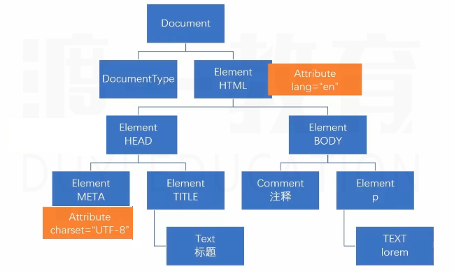


### 2.1 What is DOM?
> - Document: the entire HTML document.
> - Object: elements, attributes contents are converted to objects / nodes.
> - Model: the relationship between all these HTML objects.
> - The whole HTML page is abstracted into DOM tree.
> - JS is used to operate on DOM tree.
> - The smallest unit of DOM is *node*.

### 2.2 Nodes

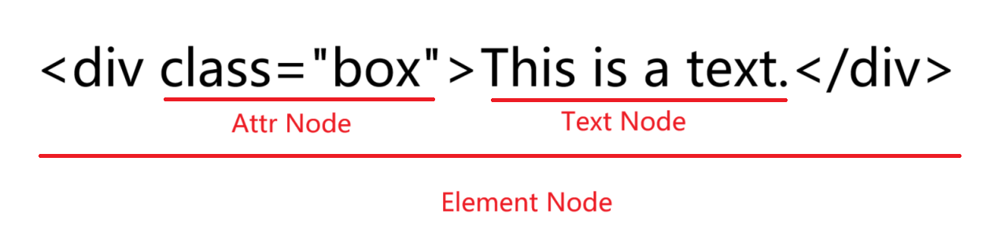

| Types            | Description                                                                                                                                 |
| ---------------- | ------------------------------------------------------------------------------------------------------------------------------------------- |
| Document         | the whole HTML document. The root node of the DOM tree.                                                                                     |
| DocumentType     | represents the `<!DOCTYPE html>` declaration that defines the document type.                                                                |
| Element          | represents the HTML elements e.g., `<html>`, `<p>`, ``, `div`, etc.                                                                    |
| Attr             | represents attributes of elements e.g., `class="title"` or `src="image.jpg"`                                                                |
| Text             | represents actual texts inside an element.                                                                                                  |
| Comment          | represents comments in the document.                                                                                                        |
| DocumentFragment | represents a light-weight, minimal document object that is not part of the real DOM tree. <br/> used for building subtrees for performance. |


### 2.3 Document Object

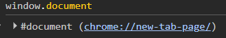

> - `document` represents the whole HTML page.
> - `document` is the instance of `HTMLDocument`, which inherits from `Document`.
> - `document` is a property (global) of the `window` object .

```js
window.document
document
document instanceof HTMLDocument; // true
document instanceof Document; // true
```
> - almost all the features of DOM is put on the document object.
> - accessing nodes is possible through `document`.

### 2.4 Retrieving / Accessing Element Nodes

| method                                        | description                                                                |
| --------------------------------------------- | -------------------------------------------------------------------------- |
| `document.getElementById(id)`                 | return the first element based on id.                                      |
| `document.getElementsByClassName(classNames)` | return an array of element based on class names.                           |
| `document.getElementsByTagName(tagName)`      | return a HTMLCollection (array-like object) of elements based on tag name. |
| `document.querySelector(selectors)`           | return the first element based on selectors.                               |
| ` document.querySelectorAll(selectors)`       | return an array of element based on selectors.                             |
| `document.body `                              | retrieve body element.                                                     |
| `document.documentElement`                    | retrieve html element.                                                     |


#### 2.4.1 Difference between NodeList & HTMLCollection

> - document.getElementsByClassName(classNames) & document.getElementsByTagName(tagName) returns a live HTMLCollection.
> - document.querySelectorAll returns a non-live NodeList
> - HTMLCollection will get updated if the underlying DOM is changed.
> - NodeList is not updated even the DOM is changed.

#### 2.4.2 document.body

> - retrieve body element.

#### 2.4.3 document.documentElement

> - retrieve html element.

#### 2.4.4 document.all (Deprecated)

> - retrieve all elements.
> - alternative: `document.getElementsByTagName("*")` where `*` means universal.
> - note: `document.all` has already been deprecated.

#### 2.4.5 load event

> - fired when the whole page has loaded, including all dependent resources such as stylesheets, scripts, iframes, and images, except those that are loaded lazily.

> - If you place a `<script>` before some DOM elements, the script cannot access those elements because they haven't been parsed or loaded yet

```html
<body>
    <!-- script is placed before elements -->
    <script>
        // Since the elements are not yet available when this script runs,
        // you need to wait for the entire page to load before accessing them.
        window.onload = function() {
            // code to get element
        }
    </script>
    <div></div>
    <div></div>
    <div></div>
    <div></div>
</body>

```
> - Alternative: place the `<script>` at the end of the <body>, after all the DOM elements, so the elements are already available when the script runs.

```html
<body>
    <div></div>
    <div></div>
    <div></div>
    <div></div>
    <!-- Put script at the end of the body -->
    <script>
        // code...
    </script>
</body>
```
### 2.5 Manipulating Element Attributes

#### 2.5.1 Standard W3C Attributes
> HTML standard: https://html.spec.whatwg.org/

> - accessing standard w3c attributes via `element.attribute`.

##### 2.5.1.1 id, alt, title

> - id: do not modify id!
> - alt: used for displaying alternate text for an image when the img is failed loading.
> - title: used for tooltip on `a` tag.

##### 2.5.1.2 src & href

> - src: used to modify img address.
> - href: used to modify the hyperlink address.

##### 2.5.1.3 Form attributes

> - type
> - value
> - checked
> - selected
> - disabled

##### 2.5.2 Custom Attributes

> - attributes defined by us on elements.
> - purpose: store data / information we might use later.

| Method                   | Description                    |
| ------------------------ | ------------------------------ |
| setAttribute(key, value) | add / modify attribute         |
| getAttribute(key)        | get the value of an attribute. |

> note: the key must be valid identifier 

```js
/*  Naming Convention:
    - start with letter
    - after the first letter, you can use
        - digit (0 - 9)
        - hyphen (-)
        - underscore (_)
        - colons (:)
        - period (.)
    - naming starts with digit is invalid.
*/

/* Valid */
box.setAttribute("bb", "custom attribute bb");
box.setAttribute("b-b", "custom attribute b!b");
box.setAttribute("b:b", "custom attribute b!b");
box.setAttribute("b.b", "custom attribute b!b");
box.setAttribute("b_b", "custom attribute b!b");


/* Invalid: */
box.setAttribute("-bb", "custom attribute bb"); // Uncaught InvalidCharacterError: Failed to execute 'setAttribute' on 'Element': '-bb' is not a valid attribute name.
box.setAttribute("b!b", "custom attribute bb"); // Uncaught InvalidCharacterError: Failed to execute 'setAttribute' on 'Element': 'b!b' is not a valid attribute name.
box.setAttribute("123", "ss"); // Uncaught InvalidCharacterError: Failed to execute 'setAttribute' on 'Element': '123' is not a valid attribute name.
```

#### 2.5.2.1 HTML5 Standard Custom Attribute (Data Attribute)

> - standard custom attribute must be prefixed with `data-*`.

##### 2.5.2.1.1 Setting Data Attributes

**Method 1: Writing on the HTML element**

> - `data-*`
> - use kebab-case.

```html
<div id="box" data-item="ball">A box</div>
<div data-birthday-gift="a big feast!">A surprise box.</div>
```

**Method 2: Set the custom attribute via `dataset`**

> - `dataset.attributeName`
> - use camelCase.

```js
var box = document.getElementById("box");
box.dataset.birthdayGift = "a big feast!";
```

**Method 3: `setAttribute(key, value)`**

> - `data-*`
> - use kebab-case.

```js
box.setAttribute("data-birthday-gift", "a big feast!")
```

##### 2.5.2.1.2 Accessing Data Attributes

> - use camelCase.

```html
 
<script>
    var img = document.getElementsByTagName("img")[0];
    console.log(img.dataset.animalType); // animal
</script>
```

**Method 2: `getAttribute(key)`**

> - `data-*`
> - use kebab-case.

```js
/* Alternative: */
console.log(img.getAttribute("data-animal-type")); // animal
```
### 2.6 Manipulating Element Styles

#### 2.6.1 `style` property

> - operate on the element's inline styles.

```js
/* Accessing inline styles */
element.style.propName

/* Modify / add inline styles */
element.style.propName = val;

```

> Note:
> - inline style has higher specificity so it can override the external and internal CSS.
> - it cannot obtain styles written in class.
> - cumbersome if you have more styles to add / modify.


#### 2.6.2 `cssText`

> - set the style attribute of the elements.
> - it will override all the previous inline styles of the element.
> - you can specify more than one style.

```js
/* Set one style */
box.style.cssText = "color: red";

/* Set multiple styles */
box.style.cssText = "color: red; background-color: royalblue; font-size:30px";
```

#### 2.6.3 `className`

```js
/* Accessing the existing class name(s) */
box.className

/* Add class name(s) */
box.className = "className"
box.className = "className1 className2 className3 ..."
```

#### 2.6.4 `setProperty`

```js
box.style.setProperty("prop", "value");
/* specify !important */
box.style.setProperty("prop", "value", "important");

/* Removing !important flag if any */
box.style.setProperty("prop", "value", "");
box.style.setProperty("prop", "value", null);
box.style.setProperty("prop", "value", undefined);
```

#### 2.6.5 `classList`

> - html5 introduces a classList property to each element.
> - classList 
>   - a read-only property that returns a live DOMTokenList collection (array-like object) containing a list of class names set on the element.
>   - provide convenient methods to manipulate class names.
>   - note: in the past, the developers have to some of these methods (add, remove, toggle) on their own.

| Method                        | Description                                                                                                                 |
| ----------------------------- | --------------------------------------------------------------------------------------------------------------------------- |
| `add(...token)`               | add token(s) to the list                                                                                                    |
| `remove(...token)`            | remove specific token(s) from the list                                                                                      |
| `toggle(token, [force])`      | remove an existing token from the list and return false. <br/> add a token if it doesn't exist in the list and returns true |
| `item(index)`                 | returns a token from the list based on index, similar to bracket notation `list[i]`                                         |
| `contains(token)`             | check if a token exists in the list.                                                                                        |
| `replace(oldToken, newToken)` | replace a old token with a new token, and return true if the replacement is successful.                                     |


> Try to implement the above methods.


#### 2.6.7 CSS Styling Method Priority

> reflow: https://developer.mozilla.org/en-US/docs/Glossary/Reflow
> repaint: https://developer.mozilla.org/en-US/docs/Glossary/Repaint

> - className > cssText > style

#### 2.6.8 `window.getComputedStyle(elem, [pseudoElem])`

> - a method on window.
> - return a live CSSStyleDeclaration object containing final styles that applied to the element, after all CSS rules are calculated.
> - auto-update when styles of the element change.
> - read-only.
> - pseudoElem: string of pseudo element (`::after`, `::before`, etc). Null / ommited means real elements.

> - note: in order to get the computed styles, the element must be a part of DOM tree.


#### 2.6.9 DOM Class Inheritance Tree

> tip: starts with instance and accessing its prototype chain via `__proto__`.

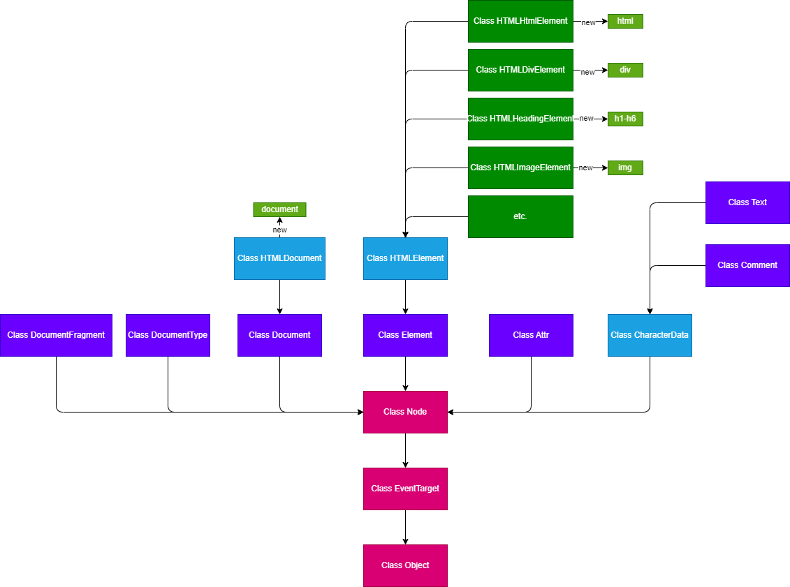

> - <span style="color:purple">purple<span>: specific types of DOM nodes.
> - <span style="color:red">purple<span>: base classes in the DOM hierarchy, which are inherited by almost everything in the DOM tree.

### 2.7 Getting Element Dimension


#### 2.7.1 Offset Properties

> - read-only property.
> - recalculate if update.
> - tip: store the value in a variable before use, given that the stored value is not changed.

| Property     | Description                                                                                                                                             |
| ------------ | ------------------------------------------------------------------------------------------------------------------------------------------------------- |
| offsetWidth  | return a layout width of an element as integer. <br/> `offsetWidth = width + border + padding + [scrollbar]` <br/> in border box, `offsetWidth = width` |
| offsetHeight | return a layout height of an element as integer. <br/> similar to offsetWidth.                                                                          |
| offsetTop    | distance from the current element's `top border` to the `top padding edge` of its `offsetParent                                                         |
| offsetLeft   | distance from the current element's `left border` to the `left padding edge` of its `offsetParent                                                       |
| offsetParent | return a reference to the closest positioned ancestor element.                                                                                          |


##### 2.7.1.1 `offsetWidth` & `offsetHeight`

> - size = width + padding + border
> - size = width (if it is `box-sizing: border-box` - the width / height already includes border.)


##### 2.7.1.2 `offsetParent`

> - return the reference to the nearest positioned ancestor element (position other than `static`).
> - return the reference to the nearest table related element if the current element is `static`.
> - return the reference to the ancestor element having a `different effective zoom` value from the current element.
> - return `null` if:
>   - the current element is `position:fixed`.
> > - the fixed positioned element is relative to viewport, there's no offset parent!
> > - Note: return `body` in Firefox.
>   - the current element is `display: none`.
>   - the current element is `html` / `body` element.

##### 2.7.1.3 `offsetLeft` & `offsetTop`

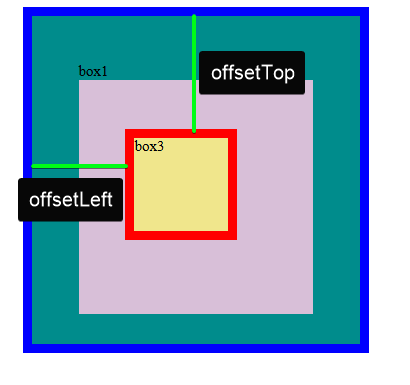

> - return the distance from the current element's `top / left border` to the `top / left padding edge` of its `offsetParent`.

> - setting margin on the current element will affect the offsetTop / offsetLeft. `offsetTop (100px) = top (80px) + margin-top (20px)`
> > - rarely set margin like this.


#### 2.7.2 Client Properties

> read-only property.
> recalculate after each access.

| Properties   | Description                       |
| ------------ | --------------------------------- |
| clientWidth  | content width (width + padding)   |
| clientHeight | content height (height + padding) |

> note: do not include border + margin + scrollbar size

#### 2.7.3 Scroll Properties

> analogy:
> 
> - `scrollable container` (a frame): holds the content and define the visible area.
> - `scrollable content` (a poster): the content that can overflow the container and potentially be scrolled.
> - `visible area`: content area + padding - area that you can see within the container.

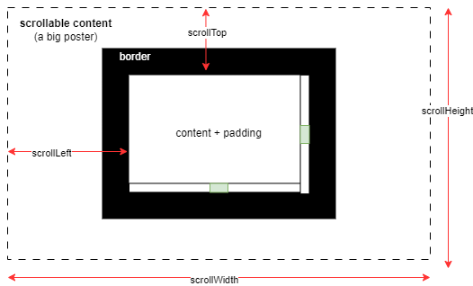

| Properties   | Description                                                                                                                 |
| ------------ | --------------------------------------------------------------------------------------------------------------------------- |
| scrollWidth  | width of element content, including part that overflows and isn't visible on the screen.                                    |
| scrollHeight | height of element content, including part that overflows and isn't visible on the screen.                                   |
| scrollLeft   | how much distance of a scrollable content has been moved inside a container, away from `the left edge of the visible area`. |
| scrollTop    | how much distance of a scrollable content has been moved inside a container, away from `the top edge of the visible area`.  |

##### 2.7.3.1 `scrollWidth` & `scrollHeight`

> - `scrollWidth` & `scrollHeight` are read-only.
> - `scrollWidth` & `scrollHeight` contains part that overflow.
> > - if the content do not overflow, default to `clientWidth` / `clientHeight` (the visible area!). 

##### 2.7.3.2 `scrollLeft` & `scrollTop`

> - get and set the distance (in pixels) of the scrollable content has been moved inside a container, away from the top or left edge of the visible area.
> > - visible area = width + padding (a.k.a client size)
> - value:
> > - writable.
> > - subpixel precise (it could be a decimal number!)
> > - default to `0` if the element is not scrolled at all.
> - `scrollable distance`:
>   - `scrollTopMax = scrollHeight - clientHeight` (affected by horizontal scrollbar)
>   - `scrollLeftMax = scrollWidth - clientWidth` (affected by vertical scrollbar)


> note: the presence of scrollbar makes the clientSize smaller, thus scrollable distance increases by the size of scrollbar. 

##### 2.7.3.3 Scrolling Event 

> - `elem.onscroll` event triggers when the content of a container is being scrolled.
> - inside the event handler, `this` refers to the scrollable container `elem` that has the scrollable content.


```js
elem.onscroll = function() {
    // ...
}
```

#### 2.7.4 Determining Element Dimensions


> - `elem.getBoundingClientRect()` returns a `DOMRect` object.
> - `DOMRect` provides properties related to the following information:
> > - size 
> > - position of an element relative to viewport.  

| Properties | Description                                                            |
| ---------- | ---------------------------------------------------------------------- |
| left , x   | the distance between the viewport's left edge and element's left edge  |
| top, y     | the distance between the viewport's top edge and element's top edge    |
| right      | the distance between the viewport's left edge and element's right edge |
| bottom     | the distance between the viewport's top edge and element's bottom edge |
| width      | width + padding + border                                               |
| height     | height + padding + border                                              |


> - `left`, `right`, `top`, `bottom` is relative to the viewport.

##### 2.7.4.1 Application: isCollided

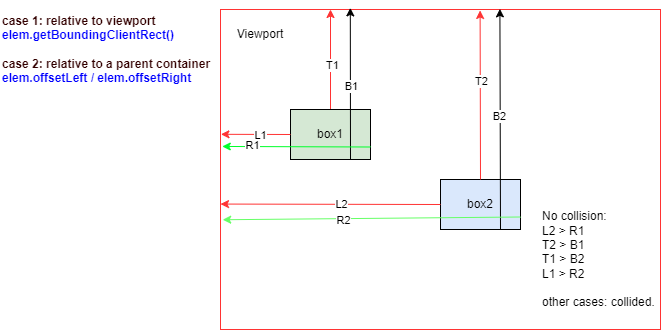

> - if either side of the element touches the other element's side, it is considered collided.
> - consider all the non-overlapping cases and negate.
> > - consider all the overlapping cases is more complex.

##### 2.7.4.2 Application: isElementFullyInViewport 
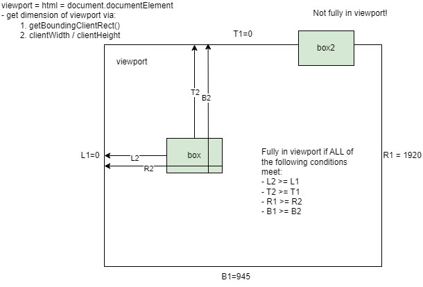

> -  all sides of the element must be located within the viewport.

> - same logic if you want to check if an element is fully contained within a parent (use `offsetLeft` / `offsetTop`).
> > - Usually, we will reset the element position if going beyond the boundary.
> > - e.g., dragging element.


### 2.8 Node Operations

#### 2.8.1 `nodeName`, `nodeType`, `nodeValue`

| Type             | nodeName                                    | nodeType                           | nodeValue   |
| ---------------- | ------------------------------------------- | ---------------------------------- | ----------- |
| Document         | "#document"                                 | `Node.DOCUMENT_NODE (9)`           | `null`      |
| Element          | tag name (e.g., `DIV`)                      | `Node.ELEMENT_NODE (1)`            | `null`      |
| Attr             | attr name                                   | `Node.ATTRIBUTE_NODE (2)`          | the content |
| Text             | "#text"                                     | `Node.TEXT_NODE (3)`               | the content |
| DocumentFragment | "#document-fragment"                        | `Node.DOCUMENT_FRAGMENT_NODE (11)` | `null`      |
| Comment          | "#comment"                                  | `Node.COMMENT_NODE (8)`            | the content |
| DocumentType     | "html" (the value of document.doctype.name) | `Node.DOCUMENT_TYPE_NODE (10)`     | `null`      |
| etc.             | -                                           | -                                  | -           |

> - `node.nodeName`: the name of current node as a string.
> - **node.nodeType**: an integer representing what the node is. (important!)
> > - use to check the node type.
> - `node.nodeValue`: gets or sets the current node value. 
> > - get the content of the node (`Text`, `Comment`, `Attr`) as value.
> > - other node types returns null.
> > > - if the value of nodeValue is `null`, setting it has no effect.

#### 2.8.2 Relationships of Nodes

| Relationship          | Consider All Nodes     | Consider Only Element Nodes   |
| --------------------- | ---------------------- | ----------------------------- |
| child                 | `node.childNodes`      | `node.children`               |
| parent                | `node.parentNode`      | `node.parentElement`          |
| first node            | `node.firstChild`      | `node.firstElementChild`      |
| last node             | `node.lastChild`       | `node.lastElementChild`       |
| previous sibling node | `node.previousSibling` | `node.previousElementSibling` |
| next sibling node     | `node.nextSibling`     | `node.nextElementSibling`     |


> `node.childNodes` might returns textNode because:
> 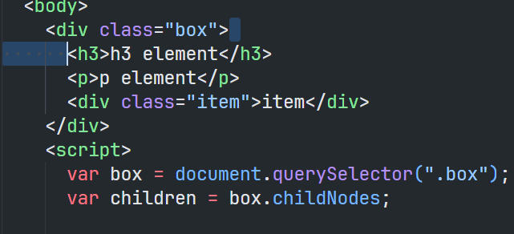
> > - The line breaks and indentation in the HTML create text nodes due to formatting.
> > - Each newline or space between elements becomes a #text node in the DOM.

**Difference between parentNode & parentElement:**
> - parentElement can only obtain parent that is `element`.
> - parentNode can obtain #document / #document-fragment, which is not element.

#### 2.8.3 Node Manipulation
##### 2.8.3.1 Modifying Node Content

> - `elem.innerText`
> - `elem.innerHTML`
> - `node.textContent`

> note: 
>  
> - reading:
> > - `innerHTML` returns the html markup.
> > - `innerText` returns the visible text, and is affected by CSS (e.g., display: none).
> > - `textContent` returns all the text content regardless of CSS styles.
> - writing: 
> > - these three properties could override the existing elements when writing.
> > - when setting a value using `innerHTML`, HTML tags will be parsed and rendered as elements if present.
> - performance: textContent > innerText (causing reflow to ensure up-to-date computed styles ) 

**Extra: Inserting HTML / Element / Text at specific position.**

> - `elem.insertAdjacentHTML(position, text)`
> - `elem.insertAdjacentElement(position, element)`
> - `elem.insertAdjacentText(position, data)`

```html
<!-- beforebegin -->
<p>
  <!-- afterbegin -->
  foo
  <!-- beforeend -->
</p>
<!-- afterend -->
```

> Note: innerHTML & insertAdjacentHTML can introduce security risks, use it with care.


##### 2.8.3.2 Creating & Inserting Nodes

> **Creating Nodes:**

| Method                              | Description                                                                                                                                                    |
| ----------------------------------- | -------------------------------------------------------------------------------------------------------------------------------------------------------------- |
| `document.createElement(tagName)`   | create a new HTML element based on tagName                                                                                                                     |
| `document.createTextNode(text)`     | create a new Text node.                                                                                                                                        |
| `document.createAttribute(attr)`    | create a new attribute node. attr passed will be converted to lowercase.                                                                                       |
| `document.createComment(comment)`   | create a new comment node.                                                                                                                                     |
| `document.createDocumentFragment()` | create a new empty document fragment that are not part of the main DOM tree. You can append elements to it before appending document fragment to the real dom. |

> **Inserting Nodes**

| Method                                      | Description                                                                                                                                                                                                                          |
| ------------------------------------------- | ------------------------------------------------------------------------------------------------------------------------------------------------------------------------------------------------------------------------------------ |
| `node.appendChild(node)`                    | append node as a last child  and return the added node. <br/> if the node is the existing element reference, the existing element is removed and append as the last child. <br/> `an element can only exist at one place at a time.` |
| `node.insertBefore(newNode, referenceNode)` | insert a node before the given reference node. If referenceNode is `null`, the newNode will be inserted as the last child.                                                                                                           |
| `elem.prepend(...node)`                     | insert node(s) or text before the first child.                                                                                                                                                                                       |
| `elem.append(...node)`                      | insert node(s) or texts after the last child.                                                                                                                                                                                        |
| `elem.before(...node)   `                   | insert node(s) or text before the elem as siblings.                                                                                                                                                                                  |
| `elem.after(...node)`                       | insert nodes after the elem  as siblings.                                                                                                                                                                                            |


> Note: use `setAttributeNode` to set the attribute node you created on the target element.

##### 2.8.3.3 `innerHTML` & `document.createElement(tagName)`

> - `document.createElement` > `innerHTML`
> - optimisation of innerHTML: concatenate all elements into a single string using a loop, then set innerHTML once to reduce DOM manipulations.
> - use `innerHTML` for simple or static content update (for better readability).
> - use `createElement` and DOM methods for more complex or dynamic element creation.


##### 2.8.3.4 Security Concern of `innerHTML`

> - innerHTML is vulnerable to `Cross-site scripting (XSS)` attack.
> - do not use innerHTML to insert user-generated content directly.
> - if your page includes forms or inputs that accept user data.
> - hackers could inject malicious scripts as strings.

> Note: 
> 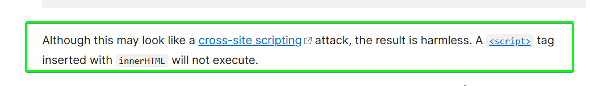
> - Entering `<script>` tags in input may not execute directly when using innerHTML, but there are ways to bypass this protection.
> - e.g., attaching event handler to non-script elements! Once triggered, the attack is reached.

##### 2.8.3.5 Deleting Nodes

| Method                  | Description                                       |
| ----------------------- | ------------------------------------------------- |
| node.removeChild(child) | remove a child node and return the removed child. |
| elem.remove()           | remove the elem from the DOM                      |

```js
elem.innerHTML = ""; // better performance - one dom operation.

```


##### 2.8.3.6 Replacing Nodes
| Method                                | Description                                                                                                                                                                                                                                          |
| ------------------------------------- | ---------------------------------------------------------------------------------------------------------------------------------------------------------------------------------------------------------------------------------------------------- |
| node.replaceChild(newChild, oldChild) | replace an old child node with newChild node within the given node (parent) and return the old child node. <br/> if the newChild already present somewhere in the DOM, it is first removed from that position, and replaced with the old child node. |
| elem.replaceWith(...param)            | replace this elem with a set of nodes or strings (text node).                                                                                                                                                                                        |
| elem.replaceChildren(...param)        | replace the existing children with a new set of children. <br/> if no arguments are provided, it removes the children nodes.                                                                                                                         |

##### 2.8.3.7 Cloning Nodes

`node.cloneNode([deep])`

> - clone this node copying all of its attributes and values, including inline listener.
> - specific deep as true allows the cloning of subtree under current node.
> - event listener added dynamically using Js is not included.
> - e.g., `addEventListener` / `elem.onxxx = function(){}`
> - painted image of `canvas` element is not copied too.

```js
node.cloneNode(); // shallow copy - content / subtree is not cloned.
node.cloneNode(true); // deep copy - content / subtree is cloned.

```

> - **Important**: cloneNode can create element with duplicated id attribute and value!
> - solution: remember to modify the id value of the element before inserting it into the DOM.


#### 2.8.4 Optimisation with `DocumentFragment`

`document.createDocumentFragment()`

> - document fragment is a lightweight, minimal version of document object.
> - it is not part of the real dom (virtual DOM container), existing in memory only.
> - operations done on document fragment will not trigger reflow or repaint.
> - optimisation: append elements to document fragment, before inserting document fragment into the real dom to improve performance.

```js
var ul = document.querySelector(".list");
var docfrag = document.createDocumentFragment();
for (var j = 1; j <= 10000; j++) {
  var li = document.createElement("li");
  li.innerText = j;
  docfrag.appendChild(li);
}
ul.appendChild(docfrag);

```

> - note: when using console.time to time the execution, it might appear slower.
> - however, it does greatly reduce the amount of DOM operations, reducing the amount of reflows and repaints!
> - it would be benefit in more complex dom operations.
> 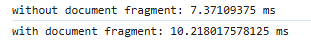