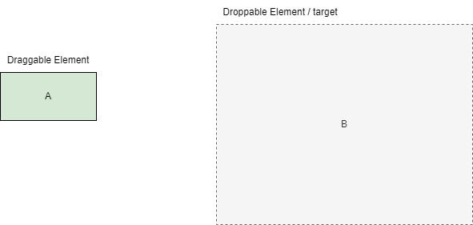

# DOM Events

## 3.1 DOM Events and Listeners 

### 3.1.1 Events

> - something happens when user interacts with the browser.
> - example:
> > - mouseover event: when the cursor hover over the target element
> > - click event: when an element is clicked.
> > - load event: when the page is fully loaded.
> > - unload event: when the user leaves a page e.g., close the browser tab, refresh, redirect to another page.
> > - etc.

### 3.1.2 Event Listening

> - applying to operating system, browsers, and your code (JavaScript).

> - analogy: keeping a dog that sleeps most of the time, waiting for something to happen. When something happens (e.g., a bad guy arrives), the dog wakes up and reacts by barking fiercely at the intruder. How does the dog know to bark? The creator programs the dog to react this way when a specific event occurs.

> - the process of close monitoring for something happens (events), and react accordingly by executing pre-defined instructions / code.

### 3.1.3 Event Registration

> - a process of associating an `event listener` with a specific `event handler` on a particular target element.
> > - event listener: a mechanism that listens for a specific events on the target element.
> > - event handler: callback function that executes in the case of a specific event.
> > - note: event listener & event handler are sometimes used interchangeably.

**Ways of Setting Up an Event Listener with Corresponding Event Handler**

| Method                                                               | Description                                                                    |
| -------------------------------------------------------------------- | ------------------------------------------------------------------------------ |
| `on<event>="..."`                                                    | inline event handler <br/> specify handler in html attribute                   |
| `eventTarget.on<event> = fn`                                         | DOM property <br/> set handler as a property of the DOM element.               |
| `eventTarget.addEventListener(type, listener, options / useCapture)` | standard method. <br/>  allows more than one event handler for the same event. |

#### 3.1.3.1 HTML attribute `on<event>="..."`

> - directly set the handler as a html attribute.
> - html attribute is case-insensitve!

```html

<button onclick="console.log('clicked')">Click</button>
<!-- event: the event object received when click happens. -->
<button onclick="console.log(event)">Click</button>
<!-- this: refers to the button element. -->
<button onclick="console.log(this)">Click</button>

<!-- passing fn -->
<script>
    function fn() {
        console.log("test");
    }
</script>
<!-- remember to use function call.  
 The browser will automatically wrap it inside an anonymous function.
-->
<!-- function() { fn() } -->
<button onclick="fn();">Click</button>

```

#### 3.1.3.2 `eventTarget.on<event> = fn`

> - eventTarget: the actual DOM element where a specific event occurs.
> - `<event>`: event type
> - fn: the event handler - a callback function executes only in the case of a specific event.
> - this method can only register one handler for a particular event type at a time for a particular element.

```js
var btn = document.querySelector(".btn");
btn.onclick = function(){

}

// Alternative:
function click() {

}

btn.onclick = click;

```

#### 3.1.3.3 `eventTarget.addEventListener(type, listener, [options / useCapture])`

> - the standard method of attaching an event listener with a corresponding event handler.
> - useCapture: default to false (bubbling phase)
> - allows registering multiple event handlers for a particular event type at a time!
> - **benefits**:
> > - prevent confusion: avoid putting everything in one big handler.
> > - prevent overriding: avoid conflict with different part of your app / library (third-party) that respond to the same event.

### 3.1.4 Removing Event Listener

**Case 1: DOM Property**

> - set `eventTarget.on<event>` property of DOM to null.

```js
// eventTarget.on<event> = null;
```


**Case 2: addEventListener**
> - https://developer.mozilla.org/en-US/docs/Web/API/EventTarget/removeEventListener#matching_event_listeners_for_removal
> - `eventTarget.removeEventListener(type, listener, [options / useCapture])` is used to remove the listener added by `eventTarget.addEventListener`.
> - All arguments must exactly match the ones used during addEventListener.
> > - event type
> > - fn reference (not an annonymous function!)
> > - useCapture
> - do not pass an annonymous fn as the handler! It can't be removed.
> - when an event happens, one of the listener (like A) decides to remove another listener (like B) before B's turn, B will not run for that event. But you can add it back later if you want.
```js
// eventTarget.removeEventListener(<event>, fn, [options / useCaption])

```
## 3.2 Mouse Event 

> - `this` inside handlers refers to the eventTarget.

| <event>      | Happening when:                                                     |
| ------------ | ------------------------------------------------------------------- |
| `click`      | click an element.                                                   |
| `dblclick`   | double click an element (two consecutive clicks).                   |
| `mouseover`  | enter an element.                                                   |
| `mouseout`   | leave an element.                                                   |
| `mouseenter` | enter an element (no bubbling).                                     |
| `mouseleave` | leave an element (no bubbling).                                     |
| `mousedown`  | press down the mouse button while the pointer is inside an element. |
| `mouseup`    | release the mouse button while the pointer is inside an element.    |
| `mousemove`  | move the pointer while the pointer is inside an element.            |

> - 1 dblclick = 2 click = 2 pairs of mousedown and mouseup.
> - `:hover` is now well-supported and can be a replacement for `mouseover` and `mouseout` if you are doing some simple operations. Note: in more complex operation we still need `mouseover` and `mouseout`.
> - `mousemove` can trigger frequently when a pointer moves inside an element.

## 3.3 Keyboard Event

| <event>  | Happening when:                    |
| -------- | ---------------------------------- |
| keypress | deprecated. Trigger after keydown. |
| keydown  | press a key.                       |
| keyup    | release a key.                     |

> - usually working on document / input element.
> - set `contenteditable` attribute to true on other elements like div.
> - pressing key will trigger keydown / keypress event frequently.

## 3.4 Form Event

| <event> | Happening when:                                                                                                                                                                                             |
| ------- | ----------------------------------------------------------------------------------------------------------------------------------------------------------------------------------------------------------- |
| change  | when the value of form element changes. <br/> user typing: when the changes have been made and the element is out of focused. <br/> user selection: immediately when the selection is made.                 |
| focus   | when an element is focused (when clicked into / tabbed into).                                                                                                                                               |
| blur    | when an element is out of focus (when clicked out / tabbed out).                                                                                                                                            |
| submit  | when a form is submitted.                                                                                                                                                                                   |
| input   | when the user enters an input (typing in the input / checking a checkbox / radio) <br/> trigger every time the value has been changed. (unlike change event the trigger wait until the value is committed.) |

### 3.4.1 Data Query Strategy

#### 3.4.1.1 Deep Recursive Search

> - optimisation: 
> > - depth (n): specify the depth of recursive search. It will reduce unnecessary search in depth.
> > - early return when found, avoid unnecessary iterations.

```js
function find(data, fn, n = 10) {
  if (!Array.isArray(data)) return;
  if (data.length === 0) return;
  var len = data.length;
  for (var i = 0; i < len; i++) {
    // console.log(a++);
    if (fn(data[i], i, data)) {
      // terminating condition
      return data[i].children;
    } else {
      if (data[i].children && n > 0) {
        // if children exists.
        // note: n - 1 will not change the current n.
        // For the next item of the same level, it will work well,
        // There's no need to readjust the n.
        var res = find(data[i].children, fn, n - 1); // receive the result
        if (res) {
          // if there's res
          return res;
        }
      }
    }
  }
  return null;
}

```


#### 3.4.1.2 Hierarchical Query

> - passes id, and find its children.
> - keypoint: understand the find function.

```js
var DEFAULT_LEVELS = ["pid", "cid", "aid"];

var ids1 = { pid: "01" };
var ids2 = { pid: "03", cid: "0302" }; // cid: 0201 do not have children.
var ids3 = { pid: "02", cid: "0201" }; // cid: 0201 do not have children.
var ids4 = { pid: "01", cid: "0103", aid: "010303" }; // note: aid is the deepest layer, no more children.

/**
 * Hierarchical Query
 * @param {Array} data Data to be searched.
 * @param {object} ids ids specifying the scope of searching.
 * @param {Array} levels ids specifying the correct order of searching.
 * @returns {Array | null} returns an array if found, otherwise null. If a found target doesn't have a children, returns an empty array.
 */
function find(data, ids, levels = DEFAULT_LEVELS) {
  var depth = levels.length;
  for (var i = 0; i < depth; i++) {
    var key = levels[i];
    if (!ids.hasOwnProperty(key)) {
      // If there's no current level's id in ids, return current data.
      return data;
    }
    var isFound = false;
    for (var j = 0; j < data.length; j++) {
      var item = data[j];
      if (_match(item, ids, key)) {
        data = item.children || []; // if the children is absent, but the id exists, then return an empty []
        isFound = true;
        break;
      }
    }
    if (!isFound) {
      return null;
    }
  }
  return data;
}

function _match(item, ids, key) {
  return item[key] && item[key] === ids[key];
}

console.log(find(data, ids1));
console.log(find(data, ids2));
console.log(find(data, ids3));
console.log(find(data, ids4));
```


## 3.5 Event Propagation (Event Flow)

> **Phases**
> - three phases: capturing phase -> target phase -> bubbling phase
> > - capturing and bubbling phases have already included the target phase.
> > - target phase: when the event reaches the target element.

> **Methods**
> - `on<event>` method only supports bubbling phase.
> - `addEventListener(<event>, fn, options)` method allows us to catch an event at both capturing and bubbling phases!
> > - `options`: 
> > > - boolean: `true` (capturing phase), `false` (bubbling phase - the default!)
> > > - object: `{ capture: true }` - capturing phase, `{ capture: false }` - bubbling phase (default)
> - when an element has multiple listeners for the same event in the same phase, they are executed in the order in which they were added using `addEventListener`.
> - when an element has two listeners for the same event, one with `{ capture: true }`, one with  `{ capture: false }`， and the event reaches the target element:
> > - the capturing listener is executed first.
> > - the bubbling listener is executed later.

> **Notes:**
> - Generally, we catch event during the bubbling phase the most!
> - Generally, we only capture event at either capturing / bubbling phase.
> - the event propagation is based on DOM structure / hierarchy, not the visual position of the element.
> > - when the child element is visually outside the parent element due to `position: absolute`, the event propagation will still follow the DOM hierarchy.

### 3.5.1 Non-bubbling Events


| `<event>`  |
| ---------- |
| mouseenter |
| mouseleave |
| focus      |
| blur       |
> - non-bubbling event: do not bubble to parent element when an event occurs!.
> - `mouseenter`:
> > - fires **once** when the pointer enters the element or its descendants.
> > - moving between descendants will not re-trigger it on the parent (`mouseover` will trigger in this case).
> - `mouseleave`
> > - fires **once** when the pointer leaves the element and all its descendants. 
> > - moving in or out of the children will not re-trigger it.
> > > - `mouseout` will trigger on these two cases (entering / leaving the children).
> - **once** because the events do not bubble to the parent.


## 3.6 Event Object

> - an object passed automatically to the event handler function.
> - provide information about the event.
> - most properties are shared among event objects of different types.
> - some event objects of a particular event type contains additional properties that are relevant to the event type.

```js
document.addEventListener("click", function(e) {
  console.log(e);
});
```


### 3.6.1 PointerEvent

> https://stackoverflow.com/questions/6073505/what-is-the-difference-between-screenx-y-clientx-y-and-pagex-y

| properties      | description                                                                                                                                                                      |
| --------------- | -------------------------------------------------------------------------------------------------------------------------------------------------------------------------------- |
| `clientX` / `x` | relative to viewport                                                                                                                                                             |
| `clientY` / `y` | relative to viewport                                                                                                                                                             |
| `pageX`         | relative to the left edge of the entire document, including the parts that are scrolled out of view. <br/> `pageX = scroll offset (horizontal) + pointer X position in viewport` |
| `pageY`         | relative to the top edge of the entire document, including the parts that are scrolled out of view. <br/> `pageY = scroll offset (vertical) + pointer Y position in viewport`    |
| `offsetX`       | relative to the padding box of the event target                                                                                                                                  |
| `offsetY`       | relative to the padding box of the event target                                                                                                                                  |
| `screenX`       | relative to the left edge of the physical screen. <br/> if you have only one monitor screen, the screenX at the left edge of your viewport will be 0.                            |
| `screenY`       | relative to the top edge of the physical screen. <br/> `screenY` at the top edge of the viewport will never be 0, there's some distance from the top edge of the screen.         |
| `movementX`     | give the difference in the horizontal position between two mousemove event. <br/> `deltaX = currentX - previousX`                                                                |
| `movementY`     | give the difference in the vertical position between two mousemove event. <br/> `deltaY = currentY - previousY`                                                                  |

> - note: screenX and screenY will take into account the external monitors.

### 3.6.2 KeyboardEvent

| properties | description                                                                                                                                                                           |
| ---------- | ------------------------------------------------------------------------------------------------------------------------------------------------------------------------------------- |
| code       | represents the physical key on the keyboard. <br/>  `1 = Digit1` <br/> `Enter = Enter` <br/> `a = KeyA` regardless of letter case. <br/> etc.                                         |
| key        | returns the value of the key pressed by the user. <br/> Taking into consideration when `shift` is held. <br/> e.g., `shift` + alphabet = capital letter <br/> e.g., `shift` + 1 = `!` |
| charCode   | deprecated.                                                                                                                                                                           |
| keyCode    | deprecated.                                                                                                                                                                           |
| ctrlKey    | returns true if CTRL key is pressed.                                                                                                                                                  |
| altKey     | returns true if alt key is pressed.                                                                                                                                                   |
| shiftKey   | returns true if shift key is pressed.                                                                                                                                                 |


### 3.6.3 `e.preventDefault()`

> - some events have default actions.
> - e.g., clicking a `<a>` element, it will redirect to the location specified on its href attribute.
> - e.g., clicking a `<button type="submit">`, it will submit the form.
> - e.g., clicking a `<input type="checkbox">`, it will check the checkbox.
> - e.g., when holding on the mouse button and drag an ``, the img can be dragged around.
> - e.g., when holding on the mouse button and drag an `<a>`, the text can be dragged around.

> `e.preventDefault()` stops the default behaviours.

> **Notes:**
> - `e.preventDefault()` does not work on event listener with `{ passive: true }` option.
> - `e.preventDefault()` will not stop the event propagation.

### 3.6.4 `e.stopPropagation()` & `e.stopImmediatePropagation()`

> - both are used to stop event propagation.
> - `e.stopPropagation()`: stop the event bubbling. The remaining event handlers of the current element will still execute as normal.
> - `e.stopImmediatePropagation()`: stop the event bubbling, and all the remaining event handlers of the current element from executing.

### 3.6.5 Image Loading Event

| <event> | Description                           |
| ------- | ------------------------------------- |
| `load`  | when an image is successfully loaded. |
| `error` | when an image loading is failed.      |


## 3.7 Event Delegation

> **analogy: parent & children**
> - parent: more experienced and efficient
> - children: lack experience and can make things worst.
> - let the parent handle all the tasks of the children.
> - let the parent watches (add a listener) for any issues (event) caused by the children.
> - when something happens (event), the parent steps in and handle it smartly.

> - a technique where a parent element handles events for its child elements.
> - based on event bubbling.
 

| property      | description                                                                                                            |
| ------------- | ---------------------------------------------------------------------------------------------------------------------- |
| target        | the reference to the object onto which the event was dispatched / triggered. (e.g., the exact element you clicked on!) |
| currentTarget | the element that the event handler has been attached.                                                                  |


> **Note:**
> 
> - we cannot use event delegation on non-bubbling event!
> - e.g., mouseenter, mouseleave, focus, blur, load, etc.

> **Use Cases:**
> 
> - when multiple element of the similar type requires attachment of similar event handler.
> - when we dynamically add new elements / nodes.
> we can let the parent / ancestor element to handle the event.


> **Benefits**
>
> - reduce the number of the similar event handlers.
> - reduce the memory overhead.
> - improve performance.

## 3.8 Wheel Events

| <event>                         | Description                                                                       |
| ------------------------------- | --------------------------------------------------------------------------------- |
| `wheel`                         | `e.deltaY` <br/> supported by modern browsers.                                    |
| `DOMMouseScroll` (non-standard) | `e.detail` <br/> older Firefox version. <br/> must be added by `addEventListener` |
| `mousewheel` (non-standard)     | `e.wheelDelta` <br/>  Webkit & Edge, but not supported by Firefox.                |

> Tip: open different browser to test out the events.

## 3.9 Drag API

> https://developer.mozilla.org/en-US/docs/Web/API/HTML_Drag_and_Drop_API

### 3.9.1 HTML Draggable Attribute

> - `auto`: default browser behaviour: only text selections, images, links can be dragged.
> - `true`: can be dragged.
> - `false`: cannot be dragged.

```html

<!-- Note: you must explicitly specify the value! draggable alone is not working. -->
<div draggable="true" class="box"></div>
```

> Note:
> - draggable = "true" blocks text selection within the element - you can't drag to highlight its inner text directly.
> - but, you can drag-select a range of content including the draggable elements and its surrounding elements.
> - in this case, the draggable element, and its unselected content will still included in the drag operation.

### 3.9.2 Drag & Drop Basic

> - draggable element (drag source) & drop target




### 3.9.3 Drag Events Related to Drag Source

| <event>     | Description                                                                                                                                                                                                                                       |
| ----------- | ------------------------------------------------------------------------------------------------------------------------------------------------------------------------------------------------------------------------------------------------- |
| `dragstart` | The user starts dragging an item.                                                                                                                                                                                                                 |
| `drag`      | - A dragged item (element or text selection) is being dragged (fires repeatedly). <br/> - There's firefox issue when trying to obtain the pageX, pageY, clientX, clientY etc. <br/> - obtain pageX and pageY from dragover event of the document. |
| `dragend`   | A drag operation ends (e.g., releasing the mouse button or pressing Esc).                                                                                                                                                                         |

> - support event bubbling.
> - we can consider throttle on drag.
> **Compatibility Issue:** Firefox cannot get pageX and pageY (probably clientX and clientY, etc) from drag event.

### 3.9.4 Drag Events Related to Drop Target 

| <event>     | Description                                                                  |
| ----------- | ---------------------------------------------------------------------------- |
| `dragenter` | A dragged item enters a valid drop target.                                   |
| `dragleave` | A dragged item leaves a valid drop target.                                   |
| `dragover`  | A dragged item is being dragged over a valid drop target (fires repeatedly). |

> - support event bubbling.
> - we can consider throttle on dragover.
> - note: throttling on dragover may cause some flickering of the cursor.

### 3.9.5 Drop Event

| <event> | Description                                |
| ------- | ------------------------------------------ |
| `drop`  | An item is dropped on a valid drop target. |

> - by default, the only effective drop target is the input element / textarea element, but they only accepts dropping text, link, and image src.
> - other elements are not allowed to have something dropped on them.
> - these elements will not trigger the drop event, despite those elements can trigger `dragenter`, `dragover`, and `dragleave`.

> solution:
> - prevent default in both `dragenter` and `dragover` event handlers!

### 3.9.6 Drop Event Compatibility Issues

> - Issue in FireFox.
> > - dragged element is a link: dropping it to the drop target navigates to the corresponding page.
> > - dragged element is an image: dropping it to the drop target navigates to the image file.
> > - dragged element is a text: dropping it to the drop target may causes invalid URL Error.

> solution:
> - prevent default in drop event handler (only affects the current target).
> - stop propagation in drop event handler - stop drop event bubbling from the current target to the document.
> > - since we do not prevent default in the document level, so the issue might still exist!

```js
dropTarget.addEventListener("drop", function (e) {
    /* Though in my FireFox doesn't have this issue. */
    e.preventDefault(); /* prevent redirection occurs in Firefox. */
    e.stopPropagation(); /* stop this event from bubbling to document that causes the redirection. */
    console.log("drop");
});

```

> note: In my firefox, there's no issue.


### 3.9.7 Data Transfer Object

> - a property on the event object in drag-and-drop related events.
> - hold data during drag and drop.
> - can hold one or more data.
> - can hold one or more data types.
> - designed primary for Drag and Drop API, but also used in some other APIs.

> drag data type: https://developer.mozilla.org/en-US/docs/Web/API/HTML_Drag_and_Drop_API/Recommended_drag_types

| property                                                    | Description                                                                                                                                                                                                                                                                                                                                                                                       |
| ----------------------------------------------------------- | ------------------------------------------------------------------------------------------------------------------------------------------------------------------------------------------------------------------------------------------------------------------------------------------------------------------------------------------------------------------------------------------------- |
| `e.dataTransfer.dropEffect`                                 | - define what the drop target wants to do with the dragged data. <br/> - must be set on `dragover`. </br> - set the cursor appearance on the drop target <br/> - what happens after dropping must be implemented by the developer. <br/> - drop event will only occur if the dropEffect you set is one of the options allowed by the `effectAllowed` <br/> - `none` will not trigger drop effect. |
| `e.dataTransfer.effectAllowed`                              | - define what the drag source allows the drop target to choose from<br/> should be set on `dragstart` <br/> - set the cursor appearance on the drag source.                                                                                                                                                                                                                                       | retrieve drag data for a particular type. |
| `e.dataTransfer.getData(format)`                            |                                                                                                                                                                                                                                                                                                                                                                                                   |
| `e.dataTransfer.setData(format, data)`                      | set the drag data to the specified data and type.                                                                                                                                                                                                                                                                                                                                                 |
| `e.dataTransfer.clearData([format])`                        | - removes the drag data for a given type. <br/> - if format is not passed, or an empty string is passed, it clears all data. <br/> - if the data of a specific format doesn't exist, this method does nothing.                                                                                                                                                                                    |
| `e.dataTransfer.setDragImage(imgElement, xOffset, yOffset)` | - set custom image that will be displayed under the user's cursor while dragging an element. <br/> - this method may show some inconsistency, and sometimes the custom image is not shown.                                                                                                                                                                                                        |


#### 3.9.7.1 dropEffect

| value | description                                                                    |
| ----- | ------------------------------------------------------------------------------ |
| copy  | a copy of the dragged data is made, keep the original data.                    |
| move  | the dragged data is moved to the drop target, the drag source losses the data. |
| link  | a link to the dragged data is established / created at the drop target.        |
| none  | the item may not be dropped. (drop event will not be fired)                    |

#### 3.9.7.2 effectAllowed

| value         | description                                                 |
| ------------- | ----------------------------------------------------------- |
| none          | the item may not be dropped (drop event will not be fired). |
| copy          | permit copy                                                 |
| copyLink      | permit copy and link.                                       |
| copyMove      | permit copy and move.                                       |
| link          | permit link.                                                |
| linkMove      | permit link and move.                                       |
| move          | permit move                                                 |
| all           | all operations are permitted.                               |
| uninitialized | default, similar to all.                                    |
