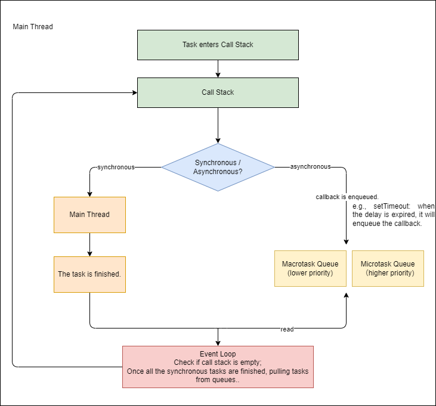
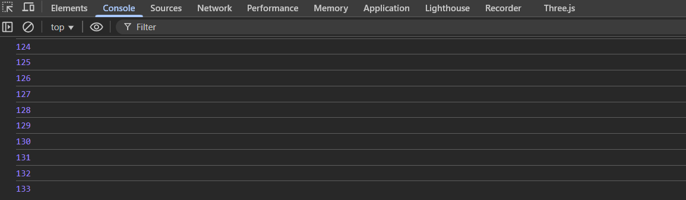
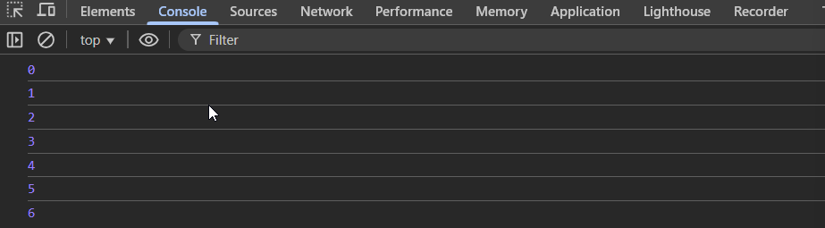

# Browser Object Model (BOM )

## 01 Timer

> note:
> - the delay specified the minimum time after which the callback can be enqueued into the task queue.
> - inaccuracy of timers: 
> > - synchronous code blocks the main threads.
> > - other tasks already in the queue.
> - the execution of the callback depends on:
> > - the call stack is empty: all the synchronous code must finish first. 
> > - task priority in the queue: timer has lower priority than other tasks.
> - the timing of the timer is not handled by the main thread, it is handled by the Web API running in the background.
> > - when `setTimeout` / `setInterval` is executed, the callback will be handled by the Web API, and the timer begins.
> > - once the delay is finished, it will push the callback to the queue.


### 1.1 Intervals

| Method                                                                               | Description                                                                                                                     |
| ------------------------------------------------------------------------------------ | ------------------------------------------------------------------------------------------------------------------------------- |
| `window.setInterval(fn[, delay, ...args])` <br/> `window.setInterval(code[, delay])` | set up a timer that repeatedly calls a fn for a fixed time interval. <br/> returns a unique ID in the form of positive integer. |
| `window.clearInterval(intervalID)`                                                   | cancels a previously set interval timer identified by intervalID.                                                               |

> - when we cancels the timer, the currently executing callback will continue to run to the completion.
> - delay is specified in milliseconds (ms).
> - 1s = 1000ms

### 1.2 Timeouts

| Method                                                                             | Description                                                                                                                 |
| ---------------------------------------------------------------------------------- | --------------------------------------------------------------------------------------------------------------------------- |
| `window.setTimeout(fn[, delay, ...args])` <br/> `window.setTimeout(code[, delay])` | set up a timer which executes fn after a specified delayed time. <br/> returns a unique ID in the form of positive integer. |
| `window.clearTimeout(timeoutID)`                                                   | cancels a previously set timeout timer identified by timeoutID.                                                             |

> - similar to how you use `setInterval` & `clearInterval`.
> - event handler callbacks are always executed before any tasks scheduled by `setTimeout` / `setInterval`.
> > - this explains why we can cancel a timer inside an event handler, even if the timer was scheduled earlier.
> > - this is because its callback hasn't started running yet when the event handler executes.

### 1.3 `this` in Timer Callback

> - `this` refers to global (window in browser).
> - the timer callback is handled by the browser, that's why `this` refers to window (browser).

> **Solutions:**
> 1. Use a wrapper function to call the method.
> 2. Use `fn.bind(this)` to explicitly set this
> 3. Save this in a variable from an outer scope  (e.g., inside an event handler).

### 1.3 Single Thread, Synchronous & Asynchronous

> JavaScript Execution Model: https://developer.mozilla.org/en-US/docs/Web/JavaScript/Reference/Execution_model
> Event Loop: https://www.geeksforgeeks.org/what-is-an-event-loop-in-javascript/


> **Analogy:**
> - Think of thread as a worker who handles all the tasks alone.

> - JS is a single-threaded language.
> - one task is processed at a time.
> - only when the synchronous tasks have been finished, it will execute the asynchronous tasks.
> 
> **Synchronous Execution:**
>  
> - the tasks are executed in order.
> - each task blocks the next until it's finished.
> - problem: while waiting for a task to finish, the program cannot do anything else - even if the CPU is free (waste of time and poor performance).
> > - e.g., the page freezes, as the browser must wait for a image to fully load before continuing due to slow network and big image size.
> - I/O-bound tasks: waits for the response of the external systems and CPU is idle.
> > - e.g., network, disk, database, file reading, etc.
> - CPU-bound tasks: requires intensive computation
> > - e.g., encryption, loops, image processing, complex math, etc.
> 
> **Asynchronous Execution:**
>
> - the task is scheduled to run later (non-blocking).
> - the execution of the next task is not blocked.



> **Types of Queues:**
> - macrotask queue
> - microtask queue 

> **Types of Tasks:**
> - synchronous task
> - asynchronous task: macrotask & microtask.

> - task could contain other type of tasks!

### 1.4 Implementation of Animations Using Timers

> - change of CSS styles at a fixed interval.


#### 1.4.1 Color Changer

#### 1.4.2 Linear Motion

#### 1.4.3 Decelerated Motion

> `step = (target - currentPosition) / n` where n >= 10.
> `step` must be greater than 0.

#### 1.4.4 Time-bound Animation

> target: `[{prop: val, duration, val}, {prop: val, duration, val}]`
> find the max duration as the condition to clear interval.
> use of easingFn to specify how the animation proceed.
> > - linear
> > - bounce
> > - etc.

#### 1.4.5 Implementation of Circular Carousel

> - UI (HTML & CSS)
> - Concept:
> > - an ul element containing li element known as slides sliding in a container element.
> > - clone the first and last li slides. Note: use querySelectorAll to get all lis (it is non-live NodeList, meaning that the cloned ones will not be included!)
> > > - insert the first cloned slide to the end.
> > > - insert the last cloned slide to the beginning.
> > - when transitioning from the last slide to the first slide, we want it to animate first, then we quickly reset the currentIndex.
> > > - purpose: create a visual illusion while making transition from the first slide to last slide or last slide to first slide.
> - Logic:
> > - in the beginning after inserting cloned slides, repositioning the real first slide.
> > - autoplay fn:
> > > - assume the carousel will autoplay in the right direction.
> > > - internally call toNext fn.
> > - toNext fn:
> > > - calculate next
> > > - calculate to (the distance), add 1 to index.
> > > - call timeBoundAnimation fn
> > > - inside onComplete callback: check if next >= totalSlides, it means now it is cloned slide, you need to animate. then set currentIndex to 0
> > - toPrev fn:
> > > - calculate prev
> > > - calculate to (the distance), add 1 to index.
> > > - call timeBoundAnimation fn
> > > - inside onComplete callback: check if prev < 0, it means now it is cloned slide, you need to animate. then set currentIndex to totalSlide - 1
> note: when doing calculation, the cloned slides distance must be considered.

### 1.5 Timer Delay & Frame Dropping Issues


#### 1.5.1 Screen Refresh Rate

> - how often the image on the screen is updated.
> - 60Hz (60fps) refresh rate for most laptop. 
> > - fps stands for frames per second
> > - 60fps means 60 frames per second (1 sec draws 60 times or 1 sec 60 refreshes)
> > - each frame / refresh every `1/60 = 16.67 ms`
> - due to persistance of vision, your brain retains the previous image just long enough for the next image to arrive (about every 16.67ms), so making it smooth and continuous.

#### 1.5.2 How animation works?

> - works by slightly changing the position / appearance of the object every frame (16.67ms).
> - better align with 16.67ms
> - setting < 16.67ms might cause performance overhead.
> > - e.g., every 10ms, change styles
> > - Intermediate changes (those between 10ms and 16.67ms) get accumulated in memory, but none of them will be shown until the next screen refresh.
> > - When the next refresh happens (16.67ms), only the latest change gets applied.
> > - Result: No visual difference, but extra CPU effort is spent updating changes that won’t even be seen.

#### 1.5.3 How `setInterval` and `setTimeout` implements animations?

> timer delay: https://developer.mozilla.org/en-US/docs/Web/API/Window/setTimeout#reasons_for_delays_longer_than_specified

> - the execution time of their callback functions is not guaranteed to be precise.
> - when using `setInterval` or `setTimeout`, the callback is added to the event loop's task queue.
> - callback execution doesn’t happen immediately.
> - it executes only when the main thread is idle (i.e., when all the synchronous code has finished executing, or when previous tasks in the queue are done).

> - the 4ms minimum delay is enforced only when the nesting depth of setTimeout or setInterval calls exceeds 5.
> - different browsers could have different minimum delay.
> - other behaviours looks at the source.

#### 1.5.4 Animation Lagging and Jittering Phenomenon

> - `setInterval` or `setTimeout` can causes delay.
> - refresh rate is dependent on the screen.
> - each device can have different refresh rate.
> - `setInterval` or `setTimeout` can only set a fixed time interval, which might not align with the screen's refresh rate.
> - if the update doesn't align with the screen's refresh rate, some frames can be skipped.

| interval (ms) | setInterval execution | style      | Update                          |
| ------------- | --------------------- | ---------- | ------------------------------- |
| 0             | no                    |            | no                              |
| 10            | yes                   | left = 1px | no                              |
| 16.67         | no                    |            | yes - move img 1px to the left  |
| 20            | yes                   | left = 2px | no                              |
| 30            | yes                   | left = 3px | no                              |
| 33.4          | no                    |            | yes  - move img 3px to the left |

> - note: left = 2px is skipped! 
> - some frames are dropped, causing some lags / jitterings.

> - set 16.67ms to `setInterval` / `setTimeout` might not be guaranteed to execute every 16.67ms due to the delay issue.

### 1.6 `requestAnimationFrame`

> - like CSS3 animation and transition, `requestAnimationFrame` let browser manages the timing when the callback is called.
> - sync the animation with the browser's refresh rate.
> - requests the browser to call a user-supplied callback function before the next repaint.
> - only execute once.
> - implement animation, use recursion.

```js
window.requestAnimationFrame(fn);

function fn(){
    if (condition) {
        window.requestAnimationFrame(fn);
    }
}

```

> **Compatibility:**

```js
window.requestAnimFrame = (function () {
  return (
    window.requestAnimationFrame ||
    window.webkitRequestAnimationFrame ||
    window.mozRequestAnimationFrame ||
    window.oRequestAnimationFrame ||
    window.msRequestAnimationFrame ||
    function (callback) {
      window.setTimeout(callback, 1000 / 60);
    }
  );
})();
```

### 1.7 Implementation of Animations Using JS and CSS

#### 1.7.1 Transition

| `<event>`        | description |
| ---------------- | ----------- |
| transitionstart  |             |
| transitionend    |             |
| transitioncancel |             |
| transitionrun    |             |


#### 1.7.2 Animation

| `<event>`          | description |
| ------------------ | ----------- |
| animationstart     |             |
| animationend       |             |
| animationcancel    |             |
| animationiteration |             |

### 1.8 throttle

> ensure a function is called once every x millisecond, no matter how many times the event is triggered.

> - some events trigger very frequently.
> - e.g., mousemove, mousedown, keydown, scroll, etc.
> - purpose: reduce the frequency a callback is called when the event triggers.
> - we cannot change the frequency of the event from triggering, but we can control the frequency of the event handler (callback) from executing.

> - note: the position you put the callback might have different behaviour. Use it on case by case basic.



> - in case of network request, we want to wait for server response, before sending another request. Using throttle might not be a good idea. The server response time can varies. 

### 1.9 debounce

> - ensure a function is only executed when the specific timing has been reached, otherwise, if you try to invoke the function, the timer will start again.
> - e.g., when an event is triggered while the previous timer is still ongoing, then the timer will restart again.

### 1.10 throttle vs debounce

> **Difference**
> - throttle: ensure the event handler is at least executed with a given delay, regardless of how frequent the event is triggered.
> - debounce: ensure the event handler is only executed after a given delay, otherwise, the timer is restarted.
>
> **Similarities**
> - implement using setTimeout
> - reduce the frequency of event handler from invoking => reduce performance overhead.
>
> **Applications**
> - debounce: search, input validation (form), etc, resize event (waiting for the resize to finish before recalculating the layout)
> - throttle: scroll event (check if the bottom of the page has been reached and load more content), mousemove (e.g., drag), repeated clicks (e.g., to prevent multiple submissions)