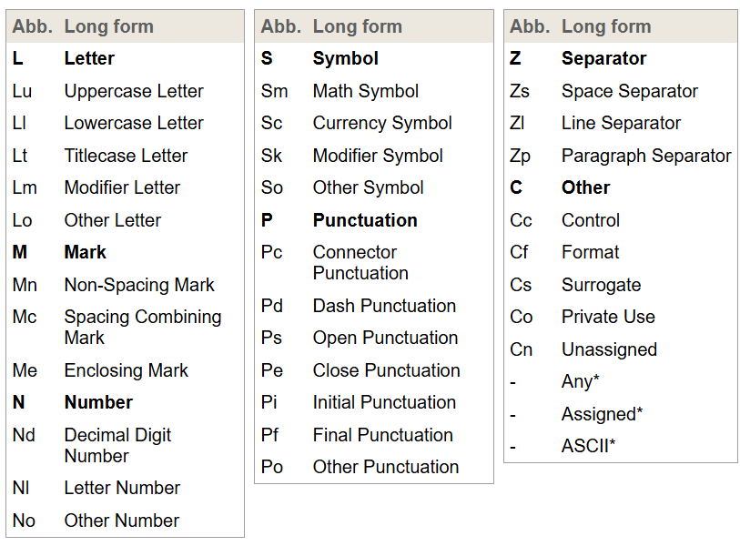
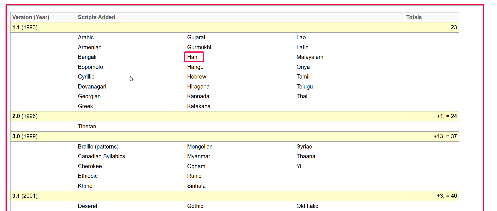
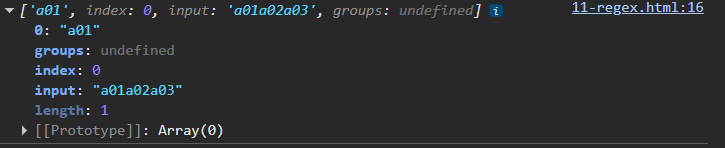
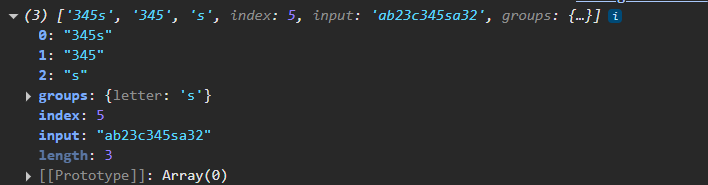

# Regular Expression

> - pattern used to match the character combination in strings.
> - uses: 
> > - searching for a pattern within a string, replacing text with other text. 
> > - validating data in form elements.
> > - etc.

## 01 Create Regular Expression

> https://developer.mozilla.org/en-US/docs/Web/JavaScript/Reference/Regular_expressions#creating_regular_expressions

```js
// Recommend
var reg = /pattern/;

// Use only when literal form is unable to solve a problem.
// e.g., when regex is changing occasionally.
var reg2 = new RegExp("pattern");

```


## 02 Input Boundary Assertion
> https://developer.mozilla.org/en-US/docs/Web/JavaScript/Reference/Regular_expressions/Input_boundary_assertion
- `^` - start of string
- `$` - end of string


```js

// start with m, 5 digits in the middle, end with n
var reg = /^m\d{5}n$/;

// start with s
var reg = /^s/;

// end with s
var reg = /s$/

```

## 03 Character Class Escape
> https://developer.mozilla.org/en-US/docs/Web/JavaScript/Reference/Regular_expressions/Character_class_escape
> - represent a shorthand for common sets of characters, starting with a `\`.
> - uppercase:  represents complement character classes of their lowercase counterpart.

| character | description                                                                             |
| --------- | --------------------------------------------------------------------------------------- |
| `\d`      | match any digit character. <br/> `[0-9]`                                                |
| `\D`      | match any non-digit character (complement character classes) <br/> `[^0-9]`             |
| `\w`      | match any word character <br/> `[a-zA-Z0-9_]`                                           |
| `\W`      | match any non-word character (complement character classes)  <br/> `[^a-zA-Z0-9_]`      |
| `\s`      | match any whitespance, and line terminator character                                    |
| `\S`      | match any non-whitespace, non-line-terminators character (complement character classes) |


## 04 Wildcard `.`
> https://developer.mozilla.org/en-US/docs/Web/JavaScript/Reference/Regular_expressions/Wildcard
> - match any character except line terminators (`\r`, `\n`, `\r\n`, etc).
> - note: line terminators doesn't include space like `\t`, etc.
> - note: to represent literal `.`, use escape character.


```js
var reg = /./; // match any character except line terminators.

// with \, a dot (.) means literal dot.
var reg = /\./;
```

## 05 Character Class, `[...]` & `[^...]`
> https://developer.mozilla.org/en-US/docs/Web/JavaScript/Reference/Regular_expressions/Character_class
> - let you define a set of characters that will `[...]` or will not `[^...]` be matched.
> - these symbols `.*?!/|` do not have special meanings in `[...]`.
> - hypen (-) is the range indicator in `[...]`. To mean hypen literally, `\-` is needed.
> - backward slash (\) is an escape character. To mean backward slash literally, `\\` is needed.

```js
// [...]
// .*?!/| are not special character inside [...], they literally mean what they are.
// - has special meaning in [...]. We need to use \ to make it a literal -.
var reg = /^a[./\-$@|\\]b$/;
var str1 = "a/b";
var str2 = "a-b";
var str3 = "a@b";
var str4 = "a$b";
var str5 = "a.b";
var str6 = "a|b";
var str7 = "a\\b"; // note: \ in string has special meaning. It is an escape character. Not a backward slash
console.log(str1, str2, str3);
console.log(
  reg.test(str1),
  reg.test(str2),
  reg.test(str3),
  reg.test(str4),
  reg.test(str5),
  reg.test(str6),
  reg.test(str7)
); // true true true true true true true

```

| range          | description                                                              |
| -------------- | ------------------------------------------------------------------------ |
| `[0-9]`        | matches any digits between 0 to 9. <br/> similar to `\d`                 |
| `[a-z]`        | matches any letter between a to z.                                       |
| `[A-Z]`        | matches any letter between A to Z.                                       |
| `[A-Za-z]`     | matches any letter between uppercase and lowercase of a to z.            |
| `[A-Za-z0-9]`  | matches any letter between uppercase and lowercase of a to z and 0 to 9. |
| `[A-Za-z0-9_]` | similar to `\w`.                                                         |
| `[1-3]`        | matches any digit between 1 to 3.                                        |
| `[a-g]`        | matches any letter between a to g.                                       |
| `[a-ln-z]`     | matches any letter between a to z excluding m.                           |

> - note: you can put character class escape character inside `[...]`.
> - `[^...]` means negatio - it matches any character not in the set.

| range           | description                                            |
| --------------- | ------------------------------------------------------ |
| `[^0-9]`        | matches any non-digit character. <br/> similar to `\D` |
| `[^a-z]`        | matches any character except lowercase letters.        |
| `[^A-Z]`        | matches any character except uppercase letters.        |
| `[^A-Za-z0-9_]` | matches any non word character <br/> similar to `\W`   |
| `[^123]`        | matches any character except 1, 2 and 3.               |

> - match all characters.
> - `[\s\S]`
> - `[\d\D]`
> - `[\w\W]`

## 06 Quantifiers
> https://developer.mozilla.org/en-US/docs/Web/JavaScript/Reference/Regular_expressions/Quantifier
> - indicate how many times should an item (x) appear in a string.
> - item (x) can not only be a singular character, but also character class, groups, and backreferences too.
> - by default, quantifiers are greedy - try to match as much of the string as possible.

| character | description                                                    |
| --------- | -------------------------------------------------------------- |
| `x*`      | matches x 0 or more times. <br/> `x{0,}`                       |
| `x+`      | matches x 1 or more times. <br/> `x{1,}`                       |
| `x?`      | matches x 0 or 1 times. <br/> `x{0,1}`                         |
| `x{m}`    | matches x m times.                                             |
| `x{m,}`   | matches x at least m times.                                    |
| `x{m,n}`  | matches x at least m times, and at most n times (inclusively). |

### 6.1 Non-Greedy Quantifiers

> to make quantifier non-greedy, add `?` after the quantifier.
> non-greedy: stop as soon as it finds a match (match as few as possible).

| character |
| --------- |
| `x*?`     |
| `x+?`     |
| `x??`     |
| `x{n}?`   |
| `x{n,}?`  |
| `x{n,m}?` |


## 07 Disjunction `|`
> https://developer.mozilla.org/en-US/docs/Web/JavaScript/Reference/Regular_expressions/Disjunction
> - specify one or more alternatives.
> - it has the lowest precedence.
> - usually works with groups `()`.
```js
var reg = /alternative1|alternative2|alternative3/;
var reg = /(alternative1|alternative2|alternative3)/; // use () to group alternative together.

```

## 08 Advanced Search with Flags

> https://developer.mozilla.org/en-US/docs/Web/JavaScript/Guide/Regular_expressions#advanced_searching_with_flags

```js
var reg = /pattern/flags;
var reg = new RegExp(pattern, flags);

// Examples:
var reg = /\w+\s/g;
var reg = new RegExp("\\w+\\s", "g");
```

| Flag | Description                                                                | Corresponding Instance Property |
| ---- | -------------------------------------------------------------------------- | ------------------------------- |
| `g`  | Global search.                                                             | global                          |
| `i`  | Case-insensitive search.                                                   | ignoreCase                      |
| `m`  | Makes `^` and `$` match the start and end of each line.                    | multiline                       |
| `s`  | Allows `.` to match newline characters.                                    | dotAll                          |
| `u`  | "Unicode"; treat a pattern as a sequence of Unicode code points.           | unicode                         |
| `y`  | Sticky search that matches from the current position in the target string. | sticky                          |
| `d`  | Generate indices for substring matches.                                    | hasIndices                      |
| `v`  | An upgrade to the `u` mode with more Unicode features.                     | unicodeSets                     |

### 8.1 u flag

> - make unicode-aware regexp.
> - handle 4 bytes character correctly.

> **bits, bytes, and characters**
>
> - bits: a binary digit - the smallest unit of data in a computer.
> - bytes: 
> > - a larger unit of data storage made up of 8 bits.
> > - 1 byte = 8 bits.
> > - 1 byte can store 1 ASCII character.
> > - 2 bytes can store chinese character.
> - characters: 
> > - represents alphabets, numbers, symbols, etc. 
> > - english letters usually take up 1 byte.
> > - chinese characters usually take up 2 bytes.


> **Unicode Encoding**
> 
> https://www.unicode.org/charts/
> https://www.unicode.org/charts/PDF/U4E00.pdf
> - Unicode assigns a unique code point to every character worldwide.
> - range: 0x000000 to 0x10FFFF
> - code points are usually represented in hexadecimal format.
> - "杜" = 675C
> - chinese characters ranged from 4E00 to 9FFF.
> - Unicode only defines code points, not how it is stored in memory.

> **Types of Unicode Encoding** 
>
> - how it is stored in memory.
> - size are dynamic.
> - `UTF-8` (variable-width encoding): min 1 byte, max 4 bytes. e.g., a letter requires 1 byte, chinese character requires 3 bytes.
> - `UTF-16` (variable-width encoding): min 2 bytes, max 4 bytes. a letter or a chinese character requires 2 bytes. Some requires more.
> - `UTF-32` (fixed-width encoding): 4 bytes for all characters worldwide.
> - note: number after UTF means the smallest unit.

### 8.2 Unicode Character Class Escape \p{...} \P(...)

> - https://unicode.org/reports/tr18/#General_Category_Property
> - matches characters with a specified Unicode property. 
> - look for property from the above website.
> - only supported when u flag or v flag is used.
> - `\p{property}`: match character with the given Unicode property.
> - `\P{property}`: match character without the given Unicode property.

> **1. General Category Property** 
> - property name: `General_Category` but optional.



```js
// General_Category = xxx
// more explicit forms:
// var reg1 = /\p{General_Category=Letter}/gu; // General_Category = is not mandatory
// var reg1 = /\pLetter}/gu;
var reg1 = /\p{L}+/gu; //letter and chinese characters
var reg2 = /\p{N}+/gu; // numbers
var reg3 = /\p{P}+/gu; // punctuation
var reg4 = /\p{Lu}+/gu; // uppercase
var reg5 = /\p{Ll}+/gu; // lowercase
var reg6 = /\p{Sc}/gu; // currency symbols
```

> **2. Scripts for Writing System**
> - https://www.unicode.org/standard/supported.html
> - property name: `Script` / `Script_Extensions` / `sc`
> - look for script name in the above website.
> application: if you want to match international texts.


```js
// Script_Extensions=WritingSystem
// More explicit forms:
// var reg = /\p{Script_Extensions=Han}+/gu;
// var reg = /\p{Script=Han}+/gu;
var reg = /\p{sc=Han}+/gu;
```

## 09 RegExp Methods & Properties

**Instance Methods:**

| Method                       | Description                                                                                                                                                                                                                                                                                |
| ---------------------------- | ------------------------------------------------------------------------------------------------------------------------------------------------------------------------------------------------------------------------------------------------------------------------------------------ |
| `RegExp.prototype.test(str)` | Returns `true` if the regular expression matches the given string, otherwise `false`.                                                                                                                                                                                                      |
| `RegExp.prototype.exec(str)` | Executes a search and returns a detailed match result array or `null` if no match is found. <br/> it will update the lastIndex of reg. <br/> if the g flag is not specified, the lastIndex will not be updated, and will be reset to 0. <br/> it is a primitive method (we rarely use it). |


> **result of the exec:**
> 
> 
> - 0: the full matched string
> - 1,..., n: the captured groups (named or unnamed), if any.
> - groups: named capture groups
> - index: the match index in the original string
> - input: original string

```js
var reg = /a\d+/g;
console.log(reg.exec("a01a02a03")); // ['a01', index: 0, input: 'a01a02a03', groups: undefined]

// example 2: involving captured groups.
var reg2 = /(\d+)(?<letter>[a-z])/g;
console.log(reg2.exec("ab23c345sa32")); // ['23c', '23', 'c', index: 2, input: 'ab23c345sa32', groups: {…}]
```

**Instance Properties**
> - look at ## 08 Advanced Search with Flags

## 10 String Methods

| Method                                                                | Description                                                                                                                          |
| --------------------------------------------------------------------- | ------------------------------------------------------------------------------------------------------------------------------------ |
| `String.prototype.match(reg)`                                         | Retrieves the matches of a string against a regular expression.                                                                      |
| `String.prototype.matchAll(reg)`                                      | Returns an iterator of all matched substrings against a regex. <br/> require regexp with g flag, otherwise, it will throw TypeError. |
| `String.prototype.replace(reg/substring, newSubstring/replacementFn)` | Returns a new string with some or all matches of a pattern replaced. <br/> use case: replace violent words with *.                   |
| `String.prototype.replaceAll(reg, replacement)`                       | Returns a new string with all matches of a pattern replaced.                                                                         |
| `String.prototype.search(reg)`                                        | returns the index of the first match in the string. Otherwise, returns -1.                                                           |
| `String.prototype.split(separator[, limit])`                          | split at separator and returns an array of substring. <br/> limit means how many splitted string to be returned.                     |

> - iterator cannot be reused! You have to create a new iterator.


> **Replacement String Pattern**
> - Used with `str.replace(pattern, replacementString)`

| pattern   | description                                                                |
| --------- | -------------------------------------------------------------------------- |
| `$$`      | insert dollar $.                                                           |
| `$&`      | insert matched substring.                                                  |
| `$'`      | insert the right portion of the string                                     |
| ``$` ``   | insert the left portion of the string.                                     |
| `$n`      | inserts the nth capturing group where n is a positive integer (1-indexed). |
| `$<Name>` | inserts the named capturing group where Name is the group name.            |

> - note: `$n` & `$<Name>` is only available when the pattern is a RegExp object.

> **Replacement Function**
> - Used with `str.replace(pattern, replacementFn)`

| Parameter         | Type   | Description                                                                     |
| ----------------- | ------ | ------------------------------------------------------------------------------- |
| `match`           | string | The matched substring (corresponds to `$&`).                                    |
| `p1, p2, ..., pN` | string | The nth capturing group (1-indexed, corresponds to `$1, $2, ...`).              |
| `offset`          | number | The offset/index of the matched substring within the original string.           |
| `string`          | string | The entire input string being processed.                                        |
| `groups`          | object | An object with named capturing groups as properties (undefined if not matched). |

```js
function(match, p1, p2, ..., pN, offset, string, groups){
  return replacement
}
```

## 10 Groupings

> - group subpattern allowing you to apply quantifier or use disjunction `|` within it.
> - capturing: matching part of a string and save it for later use.
> - backreference: \1 \2 ... \n where n refers to the match result of the nth capturing group.
> > - use case: ensure consistent format.


| group        | description                                                                                                                         |
| ------------ | ----------------------------------------------------------------------------------------------------------------------------------- |
| `(x)`        | capturing group: remember the information about the subpattern match.                                                               |
| `(?:x)`      | non-capturing group: do not remember the information about the subpattern match.                                                    |
| `(?<name>x)` | named capturing group: a kind of capturing group with a given name. <br/> the group matching result can be identified by this name. |
|              |                                                                                                                                     |


### 10.1 Capturing Group

> - capturing group is counted from left to right.
```js
var str = "12abs#B@12abs12#B@#B@";
var reg = /^((\d+)[a-z]+)((#)([A-Z]@))\1\2\3\4\5$/;
// from left to right:
// \1 ((\d+)[a-z]+)
// \2 (\d+)
// \3 ((#)([A-Z]@)
// \4 (#)
// \5 ([A-Z]@)
console.log(reg.test(str)); // true
```

### 10.2 Non-capturing Group

> - no backreference.


### 10.3 Named Capturing Group

> - use `\k<name>` to backreference a named capturing group.
> - use case: when there's nested capturing group, and you don't want to count.
> - note: `\n` method is still working.
> - inside String.prototype.replace method, you can use `$<name>` to reference the matched result of a named capturing group.

```js
var str = "a111222";
var reg = /[a-z](?<number>1)\k<number>\1/g;
console.log(str.replace(reg, "$<number>"));

```


## 11 Assertions

> Assertions don't consume any characters (means they only checks for condition, do not actually match or capture any characters from the string.).

### 11.1 Input Boundary Assertions

> - we have been using these two characters a lot.

| character | description                        |
| --------- | ---------------------------------- |
| `^`       | input boundary beginning assertion |
| `$`       | input boundary end assertion       |

### 11.2 Word Boundary Assertions
| character | description                                                                                  |
| --------- | -------------------------------------------------------------------------------------------- |
| `\b`      | word boundary assertion (between a word character and a non-word character)                  |
| `\B`      | non-word boundary assertion (between two word characters or between two non-word character.) |


> - word character: \w represents `[A-Za-z0-9_]`

### 11.3 Lookaround Assertions

> - x: item to be matched.
> - y: the condition pattern that must or must not appear before or after x. 

| character | description                                                    |
| --------- | -------------------------------------------------------------- |
| `x(?=y)`  | lookahead assertion (if the x is followed by y, x is matched)  |
| `x(?!y)`  | negative lookahead assertion                                   |
| `(?<=y)x` | lookbehind assertion (if the x is preceded by y, x is matched) |
| `(?<!y)x` | negative lookbehind assertion                                  |


> - lookbehind assertion: look from right to left.

```js
// read from right to left.
var reg = /(?<=.*a)1/; // 1 is preceded by a, and a is preceded by any or no characters
```

> - do not use capturing group to wrap lookaround assertions, you cannot get meaningful matched result out of it, you would only get an empty string as captured group.


> **Tips of How Regex Works:**
>
> - pattern is read from left to right.
> - A consuming component (like `[a-z]`, `\d`, `.`) will use up characters and advance the position.
> - Assertions do not consume characters — they only check conditions without moving the position.
> - Lookahead checks forward, lookbehind checks backward, both starting from the current position.
> > - think of it as pre-check. If passed, the following pattern components is allowed to match.
> - note: do not overthink how regex is working under the hood.