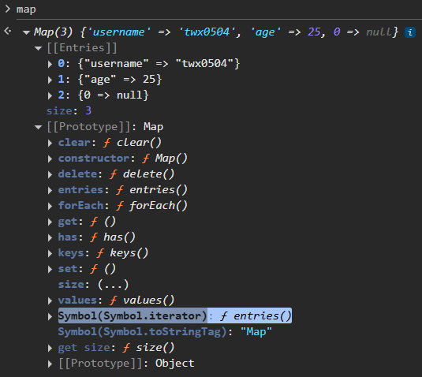

# Map

> - keys can be any data type.
> - map preserves the insertion order.
> - if a key is equal to an existing key, setting it again will override the previous value of the key.
> > - it uses SameZeroValue algorithm for key equality - NaN is treated the same, -0, 0, +0 are treated the same too.
> - Map holds strong reference to both its keys and values.


## 1.1 Creating Map

```js
// Creating a Map by passing an iterable of [key, value] pairs (each inner array represents one entry)
// new Map([ [key1, val1], [key2, val2] ]);
// new Map(iterable); // e.g., array, set, map, etc.

const set = new Set([["a", 1], ["b", 2]]);
const map = new Map(set);
```

## 1.2 Instance Properties & Methods

**Instance Property**
1. size

**Instance Methods**
1. get(key)
2. set(key, value) - note: support method chaining.

```js
const map = new Map();
map.set("A", 1).set("B", 2);

```

3. has(key)
4. delete(key)
5. clear()
6. keys()
7. values()
8. entries()
9. forEach(callback, thisArgs)


## 1.3 Map Iteration

> - Map has a Symbol.iterator property that is equivalent to Map.prototype.entries().

```js

const map = new Map([
  ["a", 1],
  ["b", 2]
]);
 
// JS internally calls Symbol.iterator() on the Map object that returns an iterator
for (const [k, v] of map) { // similar to map.entries()
    // ...
}

```




## 1.4 Map Destructuring

> - follows the array destructuring syntax since Map is an iterable.

```js

const map = new Map([
    ["a", 1],
    ["b", 2],
]);

// Entry
const [a, b] = map;
// Key & Value
const [[k1, v1], [k2, v2]] = map;
```

## 1.5 Spread Operator on Map


```js
const map1 = new Map([
    ["A", 1],
    ["B", 2],
]);

// 1. Clone a map
const newMap = new Map([...map1]); // Map(2) {'A' => 1, 'B' => 2}

// 2. Conversion
// a. map to array - especially when you want to use array method to operate on each entry.
const arr = [...map1]; // [["A", 1],["B", 2]]
// b. arr to map
const m = new Map(arr);


// 3. Merge two or more maps / entry of [k, v]
const map2 = new Map([
    ["C", 3],
    ["D", 4],
]);

const newEntry = ["E", 5];

const mergedMap = new Map([...map1, ...map2, newEntry]); // Map(5) {'A' => 1, 'B' => 2, 'C' => 3, 'D' => 4, 'E' => 5}

```