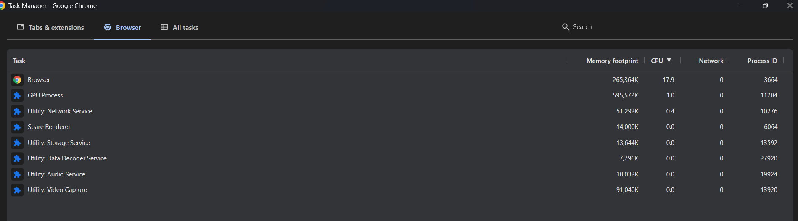

# JavaScript Execution

## 01 - Process & Threads


**Process**: 
> - An instance of running program. 
> - An independent unit that contains resources necessary to execute a program.
> - A program instance can have multiple processes spawned during execution.
> - Multiple processes can communicate among one another based on mutual agreement.
> - A process can have at least one thread.


**Thread**:
> - A smaller unit within a process that executes tasks. You can regard thread as a worker inside a process.
> - Threads within a process shares the resources.
> - If any of the threads within the process goes wrong, it can crash the entire process.
 
**Browser:**

 

> - Modern browsers, for example, Chrome, are a multiprocess , multithreaded program.
> - When browser is splitting into separate independent processes, it prevents potential cascading failure - one part failed affects other parts.

**Browser Processes:**

| Process            | Description                                                                                     |
| ------------------ | ----------------------------------------------------------------------------------------------- |
| 1. Browser         | Manages the overall browser UI (tabs, address bar, navigation) and coordinates other processes. |
| 2. **Renderer**    | Renders webpage using the Blink rendering engine and executes JS using the V8 JS engine.        |
| 3. Network Service | Manages all network-related tasks                                                                |
| 4. GPU Service     | Manages graphic-related tasks e.g., CSS transform, WebGL                                        |
| etc...             |                                                                                                 |

**Renderer:**

| Thread                 | Description                                                                                                                                                                                                     |
| ---------------------- | --------------------------------------------------------------------------------------------------------------------------------------------------------------------------------------------------------------- |
| 1. **Main Thread**     | Handles HTML, CSS, JS parsing, UI rendering (Buidling DOM / CSSOM, calculating layout, painting), and JS execution. JS execution and UI rendering is mutually exclusive, which means only one can run at a time. |
| 2. HTTP Request Thread | Manages network requests made by the page and queues their callbacks when responses are ready.                                                                                                                    |
| 3. Timer Thread        | Tracks timers (setTimeout, setInterval) and queues their callback after delay expires.                                                                                                                    |
| 4. Event Thread        | Listen for user interactions (e.g., click, keydown) or other events and queues their event handler when the event is triggered.                                                                                        |

## 02 - JavaScript

> - JavaScript is a single-threaded language.
> - It can only process one statement at a time (do one thing at a time).
> - Why is JavaScript single-threaded?
> - 1. make sure working with DOM is more predictable.
> - 2. JavaScript runs on the main thread (responsible for rendering), together with UI rendering. 
> - What happens if a task (e.g., function) takes too long and blocks the progress?
> - The webpage will freeze and become unresponsive until the task is done.
> - This is because JavaScript being single-threaded language can only do one thing at a time.
> - The rest of the task has to wait until the current task finishes.
> - Solution: Event Loop.

## 03 - Synchronous & Asynchronous Tasks

**Synchronous Task**: 
> - Task that executes immediately on the main thread and blocks further execution until it is finished.
> - A long running synchronous task can make the page freeze and unresponsive.
> - e.g., most of the code are synchronous.

**Asynchronous Task**: 
> - Task that is scheduled to be run later and placed in a queue (task queue & microtask queue) - from the perspective of currently executing synchronous task.
> - Usually, long running tasks such as timers and network requests will be handled as asynchronous task.
> - e.g., event, timers (setTimeout, setInterval), requestAnimationFrame, AJAX, MutationObserver, then() & catch() of promise, async function.


```js
// Example of Synchronous Code
// Note: The code used to create Asynchronous Tasks are executed synchronously but the callback it attached will be run asynchronously.

console.log(1);
console.log(2);
console.log(3);

function fn(){
    for (let i = 0; i <= 10; i++) {
        console.log(i);
    }
}

fn();

// Timer - The callback is executed asynchronously (scheduled to run later after 1 second)
setTimeout(()=>{
    console.log("Timeout");
}, 1000);

const p = Promise.resolve("Success"); // Immediately resolves the Promise with "Success"

// Promise - The callback is executed asynchronously (scheduled to run later after the PromiseState has settled.) 
p.then((data) => {
    console.log(data);
})
```

## 05 - Macrotask & Macrotask

> Asynchronous tasks are divided into two categories.

**Macrotasks**
> - Asynchronous tasks that are run at the beginning of every iteration of the Event Loop.
> - script tag, setTimeout, setInterval, XMLHttpRequest, events
> - **Note**: events has higher priority than timers - these macrotasks are coming from different sources (WebAPIs) and browsers may internally set priority for them.
> - Macrotasks are enqueued in the Task Queue.

**Microtasks**
> - Asynchrnous task that are run after the Call Stack is emptied, and before the next iteration of the Event Loop and rendering.
> - e.g., handlers of Promise then(), catch(), and finally(), MutationObserver, queueMicrotask, fetch   
> - Microtasks are enqueued in the Microtask Queue.

> - **note**: once in call stack, macrotask and microtask is executed synchronously.

## 06 - Event Loop

> - order of execution: synchronous code -> microtask -> rendering -> macrotask


```
INITIALIZATION:
- macrotaskQueue = []
- microtaskQueue = []
- callStack = []

Step 1: Starting program execution
- create Global Execution Context (GEC) for <script>
- push GEC into callStack

- macrotaskQueue = []
- microtaskQueue = []
- callStack = [GEC]


Event Loop:
while (true):
  1. 
    → Create an execution context (EC) of the next pending macrotask and push it into the call stack to execute.
    → if a function (fn) call is encountered
        - create new EC of the fn
        - push it into call stack and execute
        - pop the fn EC when the fn finishes
    → pop the macrotask EC when finished

  2. If a statement schedules an asynchronous task:
     → Microtask (e.g., then(), catch(), finally() of Promise, queueMicrotask, MutationObserver)
        - Enqueue the handler to microtaskQueue
     → Macrotask (e.g., timers, events)
        - Enqueue the handler to macrotaskQueue

  3. If callStack has only GEC (all synchronous code has finished):
     → While microtaskQueue is not empty:
        - Create an EC of the next microtask and push it into the callStack, execute it, then remove it
        - Repeat until microtaskQueue is empty
        - Note: During this process, more macrotasks and microtasks can be created

  4. Rendering happens after all the microtasks has completed.

  5. Repeat the event loop for the next pending macrotask


Note: The GEC is only popped out of the callStack when the entire program exits. GEC persists througout the lifetime of the program.
```
