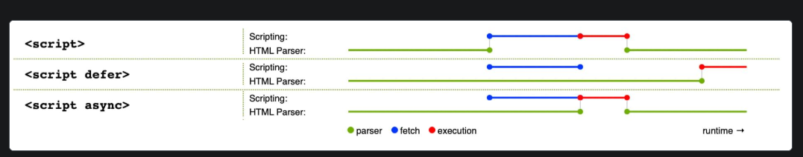

# Modules

## 01 Introduction

- As frontend projects grow in size and complexity, managing multiple scripts becomes complex.
- Main Issues:
  - 1. **Naming Conflict** between variables and functions defined in different files.
  - 2. **Script Loading Order** where one file depends on another file being loaded first.
- In earlier fixes, naming conflict was resolved by
  - 1. using IIFE to expose the required features as the global object property (`window` in the browser context).
  - 2. exposing an object
- These fixes still pollutes the global scope and still requires manual control of which files to load first.
- ES Modules was introduced to solve these problems natively.


> **To use ES Modules, you requires live server as of now because ES Modules requires server environment to work properly.**
> - To include modules in HTML file.
> - The module loading is asynchronous, similar to `<script deferred></script>`.




```html
<script type="module" src="module-path"></script>
<script type="module">
  // code
  // support import / export keyword
</script>
```
> - open HTML with live server.

## 03 Export

> - export value from a JS module.
> - export is handled before runtime.
> - two types of exports: default export & named export.
> - A module can only have one default export, but multiple named exports are allowed. 
> - export a name before the name is declared is allowed because export is only a declaration, it doesn't use the value.
>  - Temporal Dead Zone (let, const, class) has no effect on export.
> - export must exist on the top level, which means it cannot be inside blocks / functions.
```js
// #1: Default Export
// a. export default expression;
export default 1 + 1;
// b. export default functionDeclaration;
export default function(){} // Anonymous Function
export default function foo(){}
// c. export default classDeclaration;
export default class {} // Anonymous Class
export default class Person {}

// #2: Named Export
// a. export variableStatement;
export let username = "twx";
// b. export functionDeclaration; 
export function foo(){} // It must be a named function.
// c. export classDeclaration;
export class Person{} // The class must have a name.

// #3: export list - let you export multiple values at once without writing export all over the place.
export {} // This is empty list (It is not a empty object.)
export {name1, name2, name3}
export {name1 as default} // This is similar to export default
```

## 04 Static Import

> - import read-only live binding exported from another module. 
> - import is handled before runtime.
> - The imported name (value) cannot already exist in your module.
> - multiple import from the same module is allowed, but the module is only evaluated once.
> > - We cannot reassign the imported value.
> - import declarations are hoisted - the imported identifiers are available throughout the module scope.
> - The side effect (The global code of the imported module) of imported module is executed first .
> - import must exist on the top level, which means it cannot be inside blocks / functions.
> - module-name resolution:
> > 1. relative specifier (./, ../, /) are resolved relative to the current module url by default.
> > 2. The full path (including extension) should be specified for reliable resolution.
> > 3. if full path is omitted, the browser still sends the request, if the server can respond the correct content, the import will succeed.

```js
// #1: Named Import
import {name1, name2} from "module-name";

// #2: Default Import 
// - We can give the identifier (defaultExport) any name.
import defaultExport from "module-name";
// - this is the alternative.
// import {default as defaultExport} from "module-name";

// #3: Namespace Import
// - The name can be anything referring to the Namespace Object (Sealed Object - non-configuarable).
// - accessing the exported value via name.something.
// - accessing the default exported value via name.default.
import * as name from "module-name";

// #4: Side Effect Import
// - only run the module global code without importing anything.
import "module-name";

// Note: there's no wildcard import
// import * from "module-name"; // this is invalid.

```

## 05 Dynamic Import

> - dynamically imports / loads a ECMAScript Module into a potentially non-module environment.
> - return a promise.
> > - fulfilled to a module namespace object if the reference module is loaded and executed successfully.
> > - rejected with error if the path is invalid (cannot coerce to string), fetching failed, or module code throws.
> > - It doesn't require `<script>` to have `type="module"`.
> - it is executed at runtime, unlike the static `import` declaration that is evaluated before runtime.
> use `Promise.all()` to load multiple modules. 
> - import() operator looks like function, but it is a language-level keyword.

```js
import(moduleName, options);

import("./module.js").then((module)=>{
  module.foo();
}).catch((err) => {
  console.log(err);
});

```

## 06 Re-exporting

> - relay (receive and pass on) values exported from other modules without writing two separate import and export statements.

```js
// MyDefault, name1, name2 are not available inside the current module.
// - order in which they are specified do not matter.
// - the defaultExport must exist in the original module.
// - the namedExport must also exist in the original module.
// - Otherwise, SyntaxError is thrown.
export { default as MyDefault, name1, name2} from "module-name";

// comparable to:
// The only difference is that MyDefault, name1, name2 are available inside the current module.
// import { default as MyDefault, name1, name2} from "module-name";
// export {MyDefault, name1, name2};


// wild-card re-export: re-export all named exports, note that the default export is not included.
export * from "module-name";

// namespace re-export - the namespace object mod contains default.
export * as mod from "module-name";
```

## 07 Important Notes

> 1. Modules are automatically following the strict mode.
> 2. The `this` on the top-level of the module is `undefined`.

**Ensure the script can only be treated as a module.**

```js
if (typeof this !== "undefined") {
  throw new Error("Please load the script as a module.");
}
```