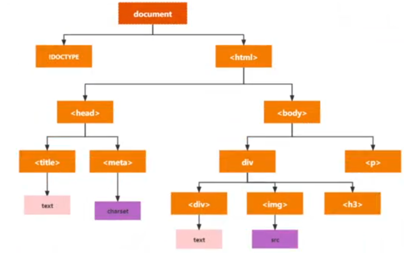

# A Comprehensive JavaScript Knowledge

[TOC]

## Introduction

### 1. The Relationship Among HTML, CSS and JavaScript

| HTML      | CSS              | JS                                                   |
| --------- | ---------------- | ---------------------------------------------------- |
| structure | styling & layout | interactions, data processing, form validation, etc. |

### 2. The Development of Js

- Brendan Eich created Js (previous name: LiveScript) in 1995
- Purpose: deal with form validation in browsers (Netscape) due to slow internet speed back then.
- Not related to Java.
- Js Design:
  - 1. learn `langugae syntax` from C.
  - 2. learn `data type and memory management` from Java.
  - 3. learn `function as first-class citizen` from Scheme.
  - 4. learn `prototype inheritance mechanism` from Self.
- mixture of Brendan Eich (Functional Programming) + Netscape (Object-Oriented Programming)
- Mozilla Firefox, and Brave are related to Brendan as well.

### 3. The Domination of JS
> Back then, Js can only be used in browsers.
> Now, with the advent of Nodejs, Js can now run outside of browsers.
- JS is the only monopoly scripting language that exists. (There's exist `VBScript`, `JScript`, but already eliminated. )
- everything related to browsers need Js.
- usage:
  - 1. form validation (the initial intention)
  - 2. Effects on webpages
  - 3. Server-side development (Node.js)
  - 4. Desktop application development (Electron)
  - 5. App (Cordova)
  - 6. Game Development (Cocos2d.js)

### 4. Frontend (Client) VS Backend (Server)

- frontend: UI, Interaction, anything users can view and interact with.
- backend: database operation, data processing, business logic...
- communication between frontend & backend: through HTTP protocol.

> Why Js as a frontend sripting language able to develop server-side applications?
> > - 2009, NodeJs - the Js runtime environment was invented.
> > - with NodeJs, Js itself can do more - able to operate database, and then do server side development.
> > - Full-stack development - Js can do both frontend and backend.

### 5. The Relationship between ECMAScript & JavaScript
> ECMAScript: https://tc39.es/ecma262/
- Nov 1996, Netscape submits JS to Ecma International (formally European Computer Manufacturers Association) to standardize JS.
- 1997, ECMAScript (JS standards) was born, serving as the foundation for the language.
- ECMAScript = standard; Js = Language.
  - ECMAScript standardizes JS.
  - JS must implement following ECMA standards.

### 6. JS Knowledge System 
> JS:
> - ECMA5 & below
> - ECMAScript 2015 (ES6) & above - A lot of new features are added. More modifications!

1. `Language Core`
- syntax
- types
- expression
- keywords
- reserved words
- operators
- global object

2. `Document Object Model (DOM)`
-  a webpage is represented as DOM tree.
-  developers can manipulate DOM tree to apply changes to the webpage through Js.
-  example: control webpage content, structure, style, etc.
-  Document: represent HTML document.
-  Object: each part / element of the webpage is an object.
-  Model: a structured representation of the webpage, indicating the relationship among elements (objects). No more plain text, developers can easily manipulate the webpage by navigating the DOM tree and get the element object.

```html
<!DOCTYPE html>
<html lang="en">
<head>
    <meta charset="UTF-8">
    <meta name="viewport" content="width=device-width, initial-scale=1.0">
    <title>Document</title>
</head>
<body>
    
</body>
</html>
```


3. `Browser Object Model (BOM)`

- represents the entire browser window and provides a set of objects to interact with the browser window.

### 7. Js Language Styles & Characteristics

- similar syntax to C language.

```js
var i = 0;
for (var i = 0; i < 10; i ++) {
  console.log(i);
}

```

- a weakly typed language: we don't need to declare variable types.

```js
/* Define Variable in Js */
var a = 1;
var b = 1.68;
var c = 'hello';
var d = true;

```

```java
/* Define Variable in Java */
int a = 1;
float b = 1.68;
String c = "hello";
boolean d = true;

```

